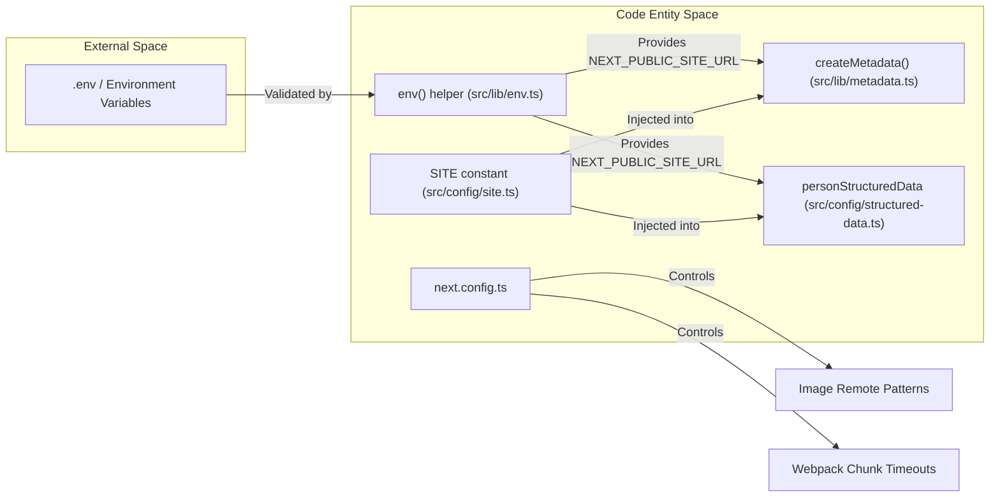
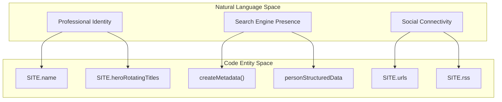

# Configuration and Environment
Relevant source files

- [.env.example](https://github.com/ravichandola/personal-branding/blob/3a440ccd/.env.example)
- [README.md](https://github.com/ravichandola/personal-branding/blob/3a440ccd/README.md?plain=1)
- [next.config.ts](https://github.com/ravichandola/personal-branding/blob/3a440ccd/next.config.ts)
- [src/config/site.ts](https://github.com/ravichandola/personal-branding/blob/3a440ccd/src/config/site.ts)
- [src/config/structured-data.ts](https://github.com/ravichandola/personal-branding/blob/3a440ccd/src/config/structured-data.ts)
- [src/lib/env.ts](https://github.com/ravichandola/personal-branding/blob/3a440ccd/src/lib/env.ts)
- [src/lib/metadata.ts](https://github.com/ravichandola/personal-branding/blob/3a440ccd/src/lib/metadata.ts)
- [tsconfig.json](https://github.com/ravichandola/personal-branding/blob/3a440ccd/tsconfig.json)

This page provides a technical reference for the configuration layers of the personal-branding platform. The system utilizes a multi-tiered approach to configuration, ranging from environment-specific variables and build-time settings to application-level constants that drive the UI and SEO.

## Environment Variables

The application relies on environment variables for sensitive credentials and infrastructure endpoints. These are documented in `.env.example`[.env.example#1-46](https://github.com/ravichandola/personal-branding/blob/3a440ccd/.env.example#L1-L46) and validated at runtime using a Zod-powered helper utility.

### Variable Categories

| Category | Variables | Purpose |
| --- | --- | --- |
| App Core | `NEXT_PUBLIC_SITE_URL`, `NODE_ENV` | Canonical URL and runtime mode. |
| Database | `DATABASE_URL` | PostgreSQL connection string (Local or Neon). |
| Auth.js | `AUTH_SECRET`, `AUTH_URL`, `GOOGLE_CLIENT_ID`, `GOOGLE_CLIENT_SECRET`, `ALLOWED_ADMIN_EMAILS` | JWT signing, OAuth, and admin access control. |
| Admin Setup | `ADMIN_BOOTSTRAP_EMAIL`, `ADMIN_BOOTSTRAP_PASSWORD` | Credentials for initial `db:seed` operation. |
| Services | `RESEND_API_KEY`, `CLOUDINARY_*`, `OPENAI_API_KEY` | External integrations for email, images, and AI. |

### Zod Validation Helper

The `env()` helper in `src/lib/env.ts` validates `process.env` against a `serverSchema`[src/lib/env.ts#5-29](https://github.com/ravichandola/personal-branding/blob/3a440ccd/src/lib/env.ts#L5-L29) It uses `safeParse` to prevent application crashes on missing variables while providing warnings in the console [src/lib/env.ts#31-36](https://github.com/ravichandola/personal-branding/blob/3a440ccd/src/lib/env.ts#L31-L36)

Sources:[.env.example#1-46](https://github.com/ravichandola/personal-branding/blob/3a440ccd/.env.example#L1-L46)[src/lib/env.ts#1-45](https://github.com/ravichandola/personal-branding/blob/3a440ccd/src/lib/env.ts#L1-L45)

## Build and Compiler Configuration

The build process is managed via `next.config.ts` and `tsconfig.json`, ensuring type safety and optimized asset handling.

### Next.js Configuration

The `nextConfig` object defines several critical behaviors:

- Image Optimization: A strict `remotePatterns` list allows external images only from trusted hosts like Cloudinary, GitHub, LinkedIn, and Medium [next.config.ts#16-35](https://github.com/ravichandola/personal-branding/blob/3a440ccd/next.config.ts#L16-L35)
- Webpack Tuning: During development, the `chunkLoadTimeout` is increased to 300,000ms to accommodate heavy re-computations of layout chunks [next.config.ts#6-15](https://github.com/ravichandola/personal-branding/blob/3a440ccd/next.config.ts#L6-L15)
- Security: The `poweredByHeader` is disabled to minimize fingerprinting [next.config.ts#4](https://github.com/ravichandola/personal-branding/blob/3a440ccd/next.config.ts#L4-L4)

### TypeScript Path Aliases

The project uses the `@/*` alias to map to the `src/` directory, simplifying imports across the deeply nested directory structure [tsconfig.json#25-29](https://github.com/ravichandola/personal-branding/blob/3a440ccd/tsconfig.json#L25-L29)

Sources:[next.config.ts#1-38](https://github.com/ravichandola/personal-branding/blob/3a440ccd/next.config.ts#L1-L38)[tsconfig.json#1-43](https://github.com/ravichandola/personal-branding/blob/3a440ccd/tsconfig.json#L1-L43)

## Application Constants (SITE Config)

Static content that defines the "persona" of the site is centralized in `src/config/site.ts`. This object, named `SITE`, serves as the single source of truth for the UI and SEO metadata.

### The SITE Object

The `SITE` constant contains:

- Identity: Name, social handles, and professional titles [src/config/site.ts#1-4](https://github.com/ravichandola/personal-branding/blob/3a440ccd/src/config/site.ts#L1-L4)
- Hero Content: A list of rotating titles used in the `HomeHero` component [src/config/site.ts#8-15](https://github.com/ravichandola/personal-branding/blob/3a440ccd/src/config/site.ts#L8-L15)
- Social & RSS: Links to LinkedIn, GitHub, and Medium RSS feeds [src/config/site.ts#17-27](https://github.com/ravichandola/personal-branding/blob/3a440ccd/src/config/site.ts#L17-L27)

For details on how these values propagate to the UI and structured data, see [Site Configuration](#9.1).

Sources:[src/config/site.ts#1-31](https://github.com/ravichandola/personal-branding/blob/3a440ccd/src/config/site.ts#L1-L31)

## Configuration Data Flow

The following diagram illustrates how configuration flows from environment variables and static config files into the application's runtime and metadata systems.

### Configuration Hierarchy

### Identity and SEO Mapping

This diagram maps the natural language identity concepts to the specific code entities that represent them.

Sources:[src/config/site.ts#1-28](https://github.com/ravichandola/personal-branding/blob/3a440ccd/src/config/site.ts#L1-L28)[src/lib/metadata.ts#6-16](https://github.com/ravichandola/personal-branding/blob/3a440ccd/src/lib/metadata.ts#L6-L16)[src/config/structured-data.ts#6-32](https://github.com/ravichandola/personal-branding/blob/3a440ccd/src/config/structured-data.ts#L6-L32)[src/lib/env.ts#42-44](https://github.com/ravichandola/personal-branding/blob/3a440ccd/src/lib/env.ts#L42-L44)

## Child Pages

- [Site Configuration](#9.1) — Documents the `SITE` constant, `personStructuredData`, and how they drive the platform's persona and SEO.