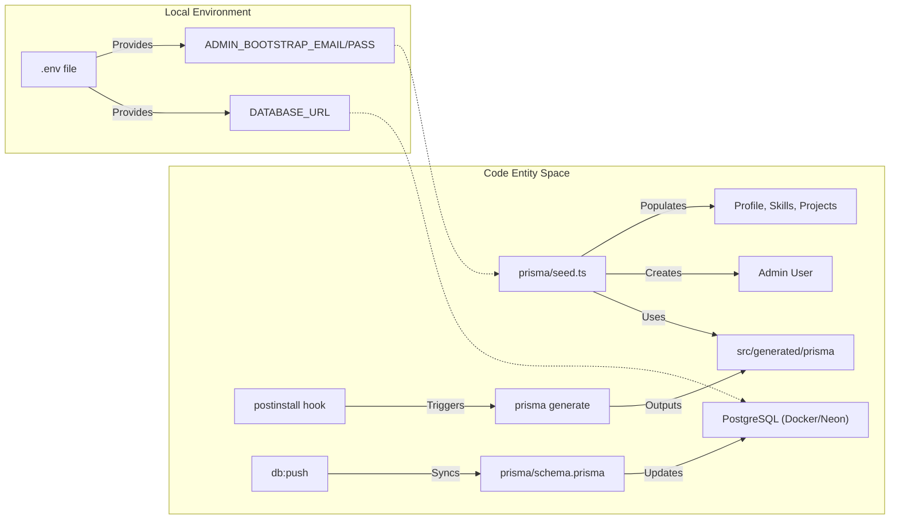
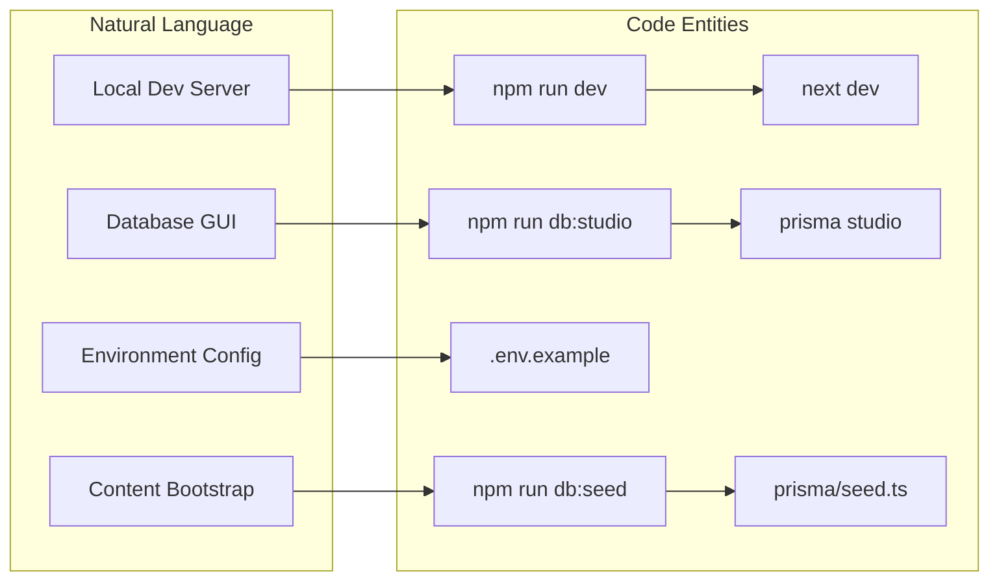

# Getting Started
Relevant source files

- [.env.example](https://github.com/ravichandola/personal-branding/blob/3a440ccd/.env.example)
- [.eslintrc.json](https://github.com/ravichandola/personal-branding/blob/3a440ccd/.eslintrc.json)
- [.gitignore](https://github.com/ravichandola/personal-branding/blob/3a440ccd/.gitignore)
- [Dockerfile](https://github.com/ravichandola/personal-branding/blob/3a440ccd/Dockerfile)
- [docker-compose.yml](https://github.com/ravichandola/personal-branding/blob/3a440ccd/docker-compose.yml)
- [package.json](https://github.com/ravichandola/personal-branding/blob/3a440ccd/package.json)
- [prisma/seed.ts](https://github.com/ravichandola/personal-branding/blob/3a440ccd/prisma/seed.ts)

This page provides a technical guide for initializing the `personal-branding` platform development environment. It covers the transition from a fresh clone to a fully functional local instance with a seeded database and active development server.

## Initial Environment Setup

The project requires Node.js 22 and a PostgreSQL instance. Configuration is managed via environment variables defined in a `.env` file, which is excluded from version control to protect secrets [[.gitignore:38-39]]().

### 1. Clone and Install

First, clone the repository and install dependencies. The project uses `npm` as its primary package manager.

```
git clone https://github.com/ravichandola/personal-branding.git
cd personal-branding
npm install
```

### 2. Configure Environment Variables

Copy the template file to create your local environment configuration:

```
cp .env.example .env
```

Key variables in `.env` include:

- `DATABASE_URL`: Connection string for PostgreSQL [[.env.example:17]]().
- `AUTH_SECRET`: A 32-character hex string for session encryption [[.env.example:20]]().
- `ADMIN_BOOTSTRAP_EMAIL` & `ADMIN_BOOTSTRAP_PASSWORD`: Credentials used by the seeding script to create the initial admin user [[.env.example:27-28]]().

### 3. Database Initialization

The project uses Prisma as its ORM. You can spin up a local PostgreSQL instance using the provided Docker configuration or use a managed provider like Neon.

Using Docker:

```
docker-compose up -d db
```

This starts a `postgres:16-alpine` container on port `5432` with the database name `ravi_brand`[[docker-compose.yml:3-10]]().

Syncing Schema:
Run the following command to push the Prisma schema to your database and generate the Prisma Client:

```
npm run db:push
```

Sources:

- [[package.json:18-18]]()
- [[docker-compose.yml:1-12]]()
- [[.env.example:1-28]]()

---

## Data Flow: Initialization Sequence

The following diagram illustrates how the system transitions from configuration to a ready state.

### System Bootstrap Flow



Sources:

- [[package.json:16-20]]()
- [[prisma/seed.ts:11-23]]()
- [[docker-compose.yml:21-21]]()

---

## Seeding the Database

The `db:seed` script is a critical step for local development as it populates the database with the initial profile data, social links, and skills required for the UI to render correctly.

### The Seed Script (`prisma/seed.ts`)

The script performs the following operations:

1. AI Configuration: Resets and creates a default `AiExtension` record with `ragEnabled: false`[[prisma/seed.ts:24-31]]().
2. Site Settings: Upserts global settings including LinkedIn and GitHub URLs [[prisma/seed.ts:33-47]]().
3. Profile Data: Deletes existing profiles and creates a new one containing the `headline`, `bio`, and `rotatingTitles` used in the Home Hero component [[prisma/seed.ts:49-90]]().
4. Skills and Socials: populates the `Skill` and `SocialLink` tables to provide data for the About and Skills pages [[prisma/seed.ts:92-168]]().

To run the seed:

```
npm run db:seed
```

Sources:

- [[package.json:20-20]]()
- [[prisma/seed.ts:1-168]]()

---

## Running the Development Server

Once the database is seeded, start the Next.js development server:

```
npm run dev
```

The application will be available at the URL specified in `NEXT_PUBLIC_SITE_URL` (default: `http://localhost:3001`) [[.env.example:4]]().

### Verification Checklist

| Step | Action | Expected Result |
| --- | --- | --- |
| Database | `npm run db:studio` | Opens Prisma Studio; verify `User` and `Profile` records exist [[package.json:23-23]](). |
| Public Site | Navigate to `/` | Home page renders with rotating titles from `prisma/seed.ts`[[prisma/seed.ts:71-78]](). |
| Admin Access | Navigate to `/admin` | Redirects to login; use `ADMIN_BOOTSTRAP` credentials [[.env.example:27-28]](). |
| Tests | `npm run test` | Vitest unit tests should pass [[package.json:10-10]](). |

---

## Build and Post-Install Logic

### Post-install Hook

The project includes a `postinstall` script: `"prisma generate"`[[package.json:16-16]](). This ensures that whenever `npm install` is run (e.g., in CI/CD or after a fresh clone), the Prisma Client is generated in `src/generated/prisma`[[.eslintrc.json:7]]().

### Docker Build

The `Dockerfile` utilizes a multi-stage build to optimize the production image:

1. deps: Installs all dependencies [[Dockerfile:1-4]]().
2. builder: Sets `NODE_ENV=production`, runs `prisma generate`, and executes `npm run build`[[Dockerfile:6-13]]().
3. runner: Copies only the necessary `.next`, `public`, and `node_modules` to a slim Alpine image [[Dockerfile:15-26]]().

### Development Environment to Code Mapping



Sources:

- [[package.json:5-23]]()
- [[Dockerfile:1-27]]()
- [[.env.example:1-46]]()