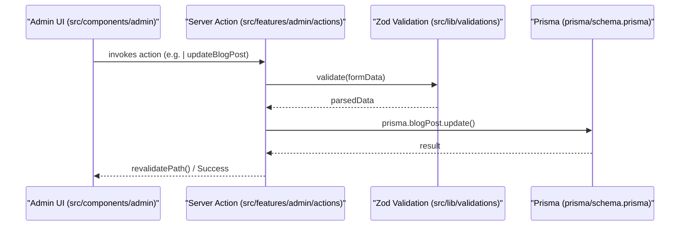

# Overview
Relevant source files

- [AGENTS.md](https://github.com/ravichandola/personal-branding/blob/3a440ccd/AGENTS.md?plain=1)
- [CLAUDE.md](https://github.com/ravichandola/personal-branding/blob/3a440ccd/CLAUDE.md?plain=1)
- [README.md](https://github.com/ravichandola/personal-branding/blob/3a440ccd/README.md?plain=1)
- [next.config.ts](https://github.com/ravichandola/personal-branding/blob/3a440ccd/next.config.ts)
- [package.json](https://github.com/ravichandola/personal-branding/blob/3a440ccd/package.json)
- [postcss.config.mjs](https://github.com/ravichandola/personal-branding/blob/3a440ccd/postcss.config.mjs)
- [public/file.svg](https://github.com/ravichandola/personal-branding/blob/3a440ccd/public/file.svg)
- [public/globe.svg](https://github.com/ravichandola/personal-branding/blob/3a440ccd/public/globe.svg)
- [src/app/globals.css](https://github.com/ravichandola/personal-branding/blob/3a440ccd/src/app/globals.css)
- [src/app/layout.tsx](https://github.com/ravichandola/personal-branding/blob/3a440ccd/src/app/layout.tsx)
- [tsconfig.json](https://github.com/ravichandola/personal-branding/blob/3a440ccd/tsconfig.json)

The personal-branding platform is a production-grade portfolio and Content Management System (CMS) scaffold designed for high-performance personal branding. Built with Next.js 15, React 19, and Prisma ORM, it provides a dual-purpose architecture: a high-speed, SEO-optimized public site for visitors and a secure, authenticated administrative dashboard for content management [README.md#1-4](https://github.com/ravichandola/personal-branding/blob/3a440ccd/README.md?plain=1#L1-L4)

The system is designed for technical professionals, featuring specialized support for MDX-based blogging, project showcases with technical categorization, and integration with external platforms like Medium [README.md#18-28](https://github.com/ravichandola/personal-branding/blob/3a440ccd/README.md?plain=1#L18-L28)

## Tech Stack at a Glance

The platform utilizes a modern, type-safe stack centered around the Next.js App Router and the Prisma ecosystem.

| Category | Technologies |
| --- | --- |
| Framework | Next.js 15 (App Router), React 19 [package.json#60-65](https://github.com/ravichandola/personal-branding/blob/3a440ccd/package.json#L60-L65) |
| Database | PostgreSQL via Prisma ORM [README.md#3](https://github.com/ravichandola/personal-branding/blob/3a440ccd/README.md?plain=1#L3-L3) |
| Authentication | NextAuth.js (Auth.js) v5 with JWT sessions [README.md#3-89](https://github.com/ravichandola/personal-branding/blob/3a440ccd/README.md?plain=1#L3-L89) |
| Styling | Tailwind CSS v4, Framer Motion, Radix UI [package.json#51-99](https://github.com/ravichandola/personal-branding/blob/3a440ccd/package.json#L51-L99) |
| Data Fetching | TanStack Query (React Query) [package.json#44](https://github.com/ravichandola/personal-branding/blob/3a440ccd/package.json#L44-L44) |
| Validation | Zod [package.json#79](https://github.com/ravichandola/personal-branding/blob/3a440ccd/package.json#L79-L79) |
| Infrastructure | Docker, GitHub Actions, Vercel [README.md#3-4](https://github.com/ravichandola/personal-branding/blob/3a440ccd/README.md?plain=1#L3-L4) |

Sources: [package.json#1-107](https://github.com/ravichandola/personal-branding/blob/3a440ccd/package.json#L1-L107)[README.md#1-4](https://github.com/ravichandola/personal-branding/blob/3a440ccd/README.md?plain=1#L1-L4)

## High-Level Architecture

The application is split into two primary route groups within the `src/app` directory: `(site)` for the public-facing portfolio and `(admin)` for the management console [README.md#81-84](https://github.com/ravichandola/personal-branding/blob/3a440ccd/README.md?plain=1#L81-L84)

### System Context Diagram

This diagram illustrates how the major subsystems and external integrations interact with the core application logic.

Sources: [README.md#81-91](https://github.com/ravichandola/personal-branding/blob/3a440ccd/README.md?plain=1#L81-L91)[src/app/layout.tsx#13-19](https://github.com/ravichandola/personal-branding/blob/3a440ccd/src/app/layout.tsx#L13-L19)

### Code Entity Space: Request Flow

This diagram maps the internal code entities and files involved in a typical data mutation flow within the Admin CMS.

Sources: [README.md#81-91](https://github.com/ravichandola/personal-branding/blob/3a440ccd/README.md?plain=1#L81-L91)[package.json#16-23](https://github.com/ravichandola/personal-branding/blob/3a440ccd/package.json#L16-L23)

## Major Subsystems

### 1. Data Layer

The data layer uses Prisma to interface with PostgreSQL. It includes robust seeding scripts for bootstrapping the environment and specialized scripts for importing content from Medium via RSS or ZIP exports [README.md#18-28](https://github.com/ravichandola/personal-branding/blob/3a440ccd/README.md?plain=1#L18-L28)

- For details, see [Database Schema](#2.1) and [Seeding and Content Ingestion](#2.2).

### 2. Public Site

The `(site)` route group handles the marketing shell. It features a responsive layout, theme toggling (light/dark), and optimized metadata for SEO. Key features include an interactive career timeline and an MDX-powered blog system [src/app/layout.tsx#35-49](https://github.com/ravichandola/personal-branding/blob/3a440ccd/src/app/layout.tsx#L35-L49)[src/app/globals.css#7-24](https://github.com/ravichandola/personal-branding/blob/3a440ccd/src/app/globals.css#L7-L24)

- For details, see [Public Site](#3).

### 3. Admin CMS

The `(admin)` route group is protected by `middleware.ts` and NextAuth.js. It allows the owner to manage projects, blog posts, skills, and site settings through a set of Server Actions that ensure type safety and data integrity [README.md#31-89](https://github.com/ravichandola/personal-branding/blob/3a440ccd/README.md?plain=1#L31-L89)

- For details, see [Admin CMS](#4).

### 4. AI & Extensibility

The platform includes an `AiExtension` model and configuration for GenAI readiness, supporting features like RAG (Retrieval-Augmented Generation) and LangGraph integration [README.md#99-101](https://github.com/ravichandola/personal-branding/blob/3a440ccd/README.md?plain=1#L99-L101)

- For details, see [AI and Extensibility](#7).

## Deeper Reading

To dive into specific areas of the codebase, follow the links below:

- [Getting Started](#1.1): Step-by-step guide for local setup, environment variables, and Docker configuration.
- [Project Structure](#1.2): Detailed tour of the repository layout and naming conventions.

Sources: [README.md#1-102](https://github.com/ravichandola/personal-branding/blob/3a440ccd/README.md?plain=1#L1-L102)[package.json#1-107](https://github.com/ravichandola/personal-branding/blob/3a440ccd/package.json#L1-L107)[src/app/layout.tsx#1-64](https://github.com/ravichandola/personal-branding/blob/3a440ccd/src/app/layout.tsx#L1-L64)