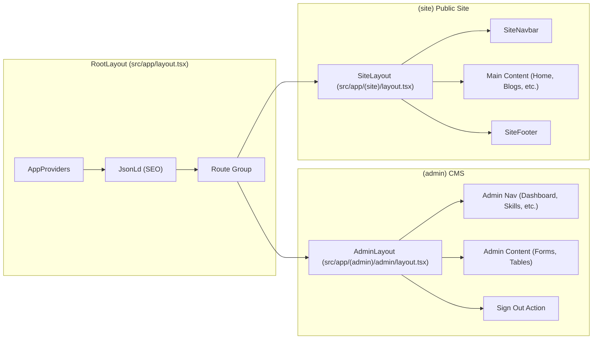
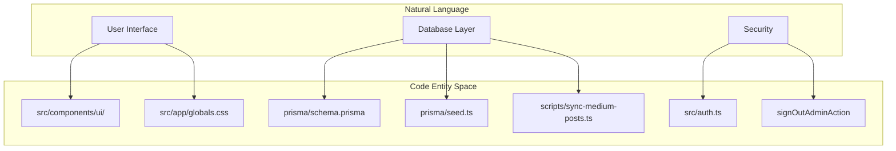

# Project Structure
Relevant source files

- [package.json](https://github.com/ravichandola/personal-branding/blob/3a440ccd/package.json)
- [src/app/(admin)/admin/layout.tsx](https://github.com/ravichandola/personal-branding/blob/3a440ccd/src/app/%28admin%29/admin/layout.tsx)
- [src/app/(site)/layout.tsx](https://github.com/ravichandola/personal-branding/blob/3a440ccd/src/app/%28site%29/layout.tsx)
- [src/app/globals.css](https://github.com/ravichandola/personal-branding/blob/3a440ccd/src/app/globals.css)
- [src/app/layout.tsx](https://github.com/ravichandola/personal-branding/blob/3a440ccd/src/app/layout.tsx)
- [src/providers/app-providers.tsx](https://github.com/ravichandola/personal-branding/blob/3a440ccd/src/providers/app-providers.tsx)

This page provides a technical tour of the repository layout and the architectural patterns used in the personal-branding platform. The codebase is built on Next.js 15 using the App Router, with a strict separation between public-facing routes, administrative management interfaces, and modular domain features.

## Repository Layout Overview

The repository follows a modern TypeScript structure where business logic is encapsulated within `src/features/` and shared infrastructure resides in `src/lib/`, `src/components/`, and `src/providers/`.

### Directory Map

| Directory | Purpose | Key Contents |
| --- | --- | --- |
| `src/app/` | Next.js App Router routes | Route groups `(site)` and `(admin)`, API routes. |
| `src/features/` | Domain-specific logic | Server actions, schemas, and complex components for specific entities. |
| `src/lib/` | Shared utilities | Prisma client, metadata helpers, auth configuration, and AI logic. |
| `src/components/` | UI Components | `ui/` (Radix primitives), `layout/` (Navbar/Footer), `seo/` (JSON-LD). |
| `src/config/` | Static Configuration | Site constants, structured data definitions, and environment validation. |
| `src/providers/` | React Context Providers | `AppProviders` wrapping QueryClient, Themes, and Session. |
| `prisma/` | Data Modeling | `schema.prisma` and the `seed.ts` bootstrap script. |
| `scripts/` | Maintenance Scripts | Medium RSS sync and ZIP export import tools. |
| `tests/` | Unit/Integration Tests | Vitest suites for components and logic. |
| `e2e/` | End-to-End Tests | Playwright specifications for full-flow validation. |

Sources:`package.json`[1-107](https://github.com/ravichandola/personal-branding/blob/3a440ccd/1-107)`src/app/layout.tsx`[1-64](https://github.com/ravichandola/personal-branding/blob/3a440ccd/1-64)`src/app/(admin)/admin/layout.tsx`[1-63](https://github.com/ravichandola/personal-branding/blob/3a440ccd/1-63)

---

## Route Architecture

The application uses Route Groups to separate the public site from the administrative dashboard. This allows for distinct layouts, styling, and middleware logic without affecting the URL structure.

### (site) - Public Facing

The `(site)` group contains the primary portfolio pages. It utilizes a layout with a `SiteNavbar` and `SiteFooter`[src/app/(site)/layout.tsx#1-24](https://github.com/ravichandola/personal-branding/blob/3a440ccd/src/app/%28site%29/layout.tsx#L1-L24)

- Analytics: Includes `AnalyticsBeacon` for custom event tracking [src/app/(site)/layout.tsx#14](https://github.com/ravichandola/personal-branding/blob/3a440ccd/src/app/%28site%29/layout.tsx#L14-L14)
- SEO: Leverages `createMetadata` for dynamic Open Graph and Twitter tags [src/app/layout.tsx#35-39](https://github.com/ravichandola/personal-branding/blob/3a440ccd/src/app/layout.tsx#L35-L39)

### (admin) - Operations Bridge

The `(admin)` group handles content management. It is protected by `auth()` and features a dedicated navigation sidebar [src/app/(admin)/admin/layout.tsx#7-16](https://github.com/ravichandola/personal-branding/blob/3a440ccd/src/app/%28admin%29/admin/layout.tsx#L7-L16)

- Layout: Uses a dark-themed "Operations Bridge" UI [src/app/(admin)/admin/layout.tsx#30-35](https://github.com/ravichandola/personal-branding/blob/3a440ccd/src/app/%28admin%29/admin/layout.tsx#L30-L35)
- Authentication: Integrates `signOutAdminAction` directly into the navigation form [src/app/(admin)/admin/layout.tsx#49-56](https://github.com/ravichandola/personal-branding/blob/3a440ccd/src/app/%28admin%29/admin/layout.tsx#L49-L56)

### Route Group Flow Diagram

Sources:`src/app/layout.tsx`[41-64](https://github.com/ravichandola/personal-branding/blob/3a440ccd/41-64)`src/app/(site)/layout.tsx`[1-24](https://github.com/ravichandola/personal-branding/blob/3a440ccd/1-24)`src/app/(admin)/admin/layout.tsx`[23-63](https://github.com/ravichandola/personal-branding/blob/3a440ccd/23-63)

---

## Domain-Driven Features

Instead of a flat structure, the application organizes complex logic into `src/features/`. Each feature module typically contains:

- Actions: Server Actions for data mutations (e.g., `src/features/admin/actions/`).
- Components: Feature-specific UI elements.
- Schemas: Zod validation objects for form handling.

This modularity ensures that the logic for the "Blog System" is decoupled from the "Experience Timeline," even though they share the same database layer.

Sources:`src/app/(admin)/admin/layout.tsx`[7-16](https://github.com/ravichandola/personal-branding/blob/3a440ccd/7-16)`package.json`[26-81](https://github.com/ravichandola/personal-branding/blob/3a440ccd/26-81)

---

## Technical Infrastructure

### Global Providers

The `AppProviders` component in `src/providers/app-providers.tsx` centralizes the application's state and UI providers:

- React Query: Managed via `QueryClient` with a 60-second stale time [src/providers/app-providers.tsx#39-51](https://github.com/ravichandola/personal-branding/blob/3a440ccd/src/providers/app-providers.tsx#L39-L51)
- Theme Management:`NextThemesProvider` handles dark/light modes with the `ravi-brand-theme` key [src/providers/app-providers.tsx#56-61](https://github.com/ravichandola/personal-branding/blob/3a440ccd/src/providers/app-providers.tsx#L56-L61)
- Toasts:`Sonner` is used for global notifications [src/providers/app-providers.tsx#63](https://github.com/ravichandola/personal-branding/blob/3a440ccd/src/providers/app-providers.tsx#L63-L63)
- Auth:`SessionProviderWrapper` provides session context to client components [src/providers/app-providers.tsx#54](https://github.com/ravichandola/personal-branding/blob/3a440ccd/src/providers/app-providers.tsx#L54-L54)

### Styling and Theming

The project uses Tailwind CSS 4 with custom variables defined in `src/app/globals.css`.

- Fonts:`Space Grotesk` (Sans) and `JetBrains Mono` (Mono) are loaded via `next/font/google` and injected as CSS variables [src/app/layout.tsx#23-33](https://github.com/ravichandola/personal-branding/blob/3a440ccd/src/app/layout.tsx#L23-L33)
- Utility Classes: Custom utilities like `glass-panel` and `fm-surface` provide consistent UI patterns across the site [src/app/globals.css#81-95](https://github.com/ravichandola/personal-branding/blob/3a440ccd/src/app/globals.css#L81-L95)

### Code Entity Association

Sources:`src/app/globals.css`[1-96](https://github.com/ravichandola/personal-branding/blob/3a440ccd/1-96)`src/app/layout.tsx`[23-33](https://github.com/ravichandola/personal-branding/blob/3a440ccd/23-33)`src/providers/app-providers.tsx`[38-71](https://github.com/ravichandola/personal-branding/blob/3a440ccd/38-71)`package.json`[16-23](https://github.com/ravichandola/personal-branding/blob/3a440ccd/16-23)

---

## Naming Conventions

- Server Actions: Suffix with `Action` (e.g., `submitContactAction`, `signOutAdminAction`).
- Route Groups: Wrapped in parentheses (e.g., `(site)`, `(admin)`).
- Components: PascalCase (e.g., `SiteNavbar.tsx`).
- Utilities: camelCase (e.g., `createMetadata.ts`).
- Tests: Suffix with `.test.ts` or `.test.tsx` for Vitest, and `.spec.ts` for Playwright.

Sources:`package.json`[10-15](https://github.com/ravichandola/personal-branding/blob/3a440ccd/10-15)`src/app/(admin)/admin/layout.tsx`[5](https://github.com/ravichandola/personal-branding/blob/3a440ccd/5)