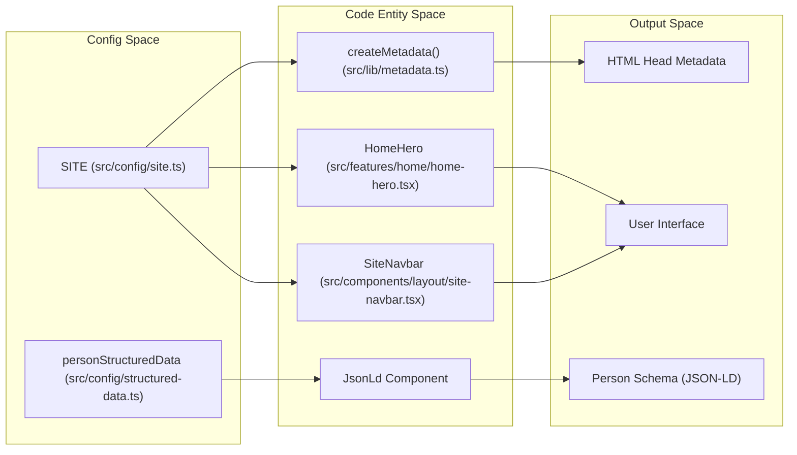
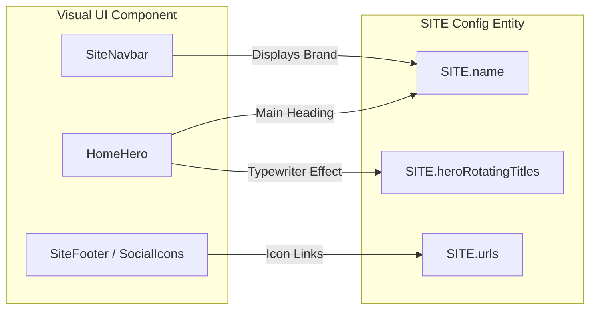

# Site Configuration
Relevant source files

- [src/components/layout/site-navbar.tsx](https://github.com/ravichandola/personal-branding/blob/3a440ccd/src/components/layout/site-navbar.tsx)
- [src/config/site.ts](https://github.com/ravichandola/personal-branding/blob/3a440ccd/src/config/site.ts)
- [src/config/structured-data.ts](https://github.com/ravichandola/personal-branding/blob/3a440ccd/src/config/structured-data.ts)
- [src/features/home/home-hero.tsx](https://github.com/ravichandola/personal-branding/blob/3a440ccd/src/features/home/home-hero.tsx)
- [src/lib/metadata.ts](https://github.com/ravichandola/personal-branding/blob/3a440ccd/src/lib/metadata.ts)

The site configuration system centralizes identity, social links, and SEO metadata across the platform. By utilizing a single source of truth in the `config/` directory, the application ensures consistency between UI components (like the Navbar and Hero), search engine metadata, and structured JSON-LD data.

## Core Configuration Object

The primary configuration resides in `src/config/site.ts`. It defines the `SITE` constant, which contains the personal branding details used throughout the application.

### The `SITE` Constant

The `SITE` object is typed as `SiteConfig` and serves as the primary data provider for identity-related strings [src/config/site.ts#1-28](https://github.com/ravichandola/personal-branding/blob/3a440ccd/src/config/site.ts#L1-L28)

| Property | Description |
| --- | --- |
| `name` | The full name of the individual ("Ravi Chandola"). |
| `handle` | Social media handle (e.g., "@ravichandola"). |
| `title` | Default SEO title string including key specializations. |
| `description` | Comprehensive bio used for meta descriptions and "About" sections. |
| `heroRotatingTitles` | An array of strings used for the typewriter/rotating effect in the Home Hero. |
| `urls` | Object containing links to LinkedIn, Medium, and GitHub. |
| `rss.medium` | The RSS feed URL used by the blog ingestion engine. |

Sources:[src/config/site.ts#1-31](https://github.com/ravichandola/personal-branding/blob/3a440ccd/src/config/site.ts#L1-L31)

## Structured Data (JSON-LD)

To improve Search Engine Optimization (SEO), the site generates a "Person" schema based on the [Schema.org](https://schema.org) vocabulary. This is defined in `src/config/structured-data.ts`.

### `personStructuredData`

This object maps values from the `SITE` configuration into a JSON-LD format that search engines use to understand the entity behind the website [src/config/structured-data.ts#6-32](https://github.com/ravichandola/personal-branding/blob/3a440ccd/src/config/structured-data.ts#L6-L32)

- Context & Type: Set to `https://schema.org` and `Person`.
- Identity: Pulls `name` and `description` directly from `SITE`[src/config/structured-data.ts#9-31](https://github.com/ravichandola/personal-branding/blob/3a440ccd/src/config/structured-data.ts#L9-L31)
- Social Proof: The `sameAs` array aggregates all social URLs from `SITE.urls` to establish authority [src/config/structured-data.ts#12-17](https://github.com/ravichandola/personal-branding/blob/3a440ccd/src/config/structured-data.ts#L12-L17)
- Expertise: The `knowsAbout` array explicitly lists technical competencies such as "Playwright", "LangGraph", and "Generative AI" [src/config/structured-data.ts#18-30](https://github.com/ravichandola/personal-branding/blob/3a440ccd/src/config/structured-data.ts#L18-L30)

Sources:[src/config/structured-data.ts#1-33](https://github.com/ravichandola/personal-branding/blob/3a440ccd/src/config/structured-data.ts#L1-L33)

## Data Propagation and Flow

The values defined in the configuration files propagate through the system via three main channels: Metadata generation, Layout components, and Feature-specific components.

### Configuration Propagation Diagram

This diagram illustrates how the `SITE` constant serves as the single source of truth for various system outputs.

"Site Configuration Data Flow"

Sources:[src/config/site.ts#1-28](https://github.com/ravichandola/personal-branding/blob/3a440ccd/src/config/site.ts#L1-L28)[src/lib/metadata.ts#6-16](https://github.com/ravichandola/personal-branding/blob/3a440ccd/src/lib/metadata.ts#L6-L16)[src/features/home/home-hero.tsx#24-53](https://github.com/ravichandola/personal-branding/blob/3a440ccd/src/features/home/home-hero.tsx#L24-L53)[src/components/layout/site-navbar.tsx#49-64](https://github.com/ravichandola/personal-branding/blob/3a440ccd/src/components/layout/site-navbar.tsx#L49-L64)

### 1. Metadata Generation

The `createMetadata` function in `src/lib/metadata.ts` constructs the Next.js `Metadata` object. While it allows for overrides, it defaults to values derived from the configuration [src/lib/metadata.ts#6-63](https://github.com/ravichandola/personal-branding/blob/3a440ccd/src/lib/metadata.ts#L6-L63)

- OpenGraph: Uses `SITE.name` for the `siteName` property [src/lib/metadata.ts#38](https://github.com/ravichandola/personal-branding/blob/3a440ccd/src/lib/metadata.ts#L38-L38)
- Twitter: Sets the card type to `summary_large_image` and uses standard description fallbacks [src/lib/metadata.ts#49-58](https://github.com/ravichandola/personal-branding/blob/3a440ccd/src/lib/metadata.ts#L49-L58)

### 2. Home Hero Component

The `HomeHero` component utilizes `SITE.heroRotatingTitles` to drive its animation logic [src/features/home/home-hero.tsx#52-53](https://github.com/ravichandola/personal-branding/blob/3a440ccd/src/features/home/home-hero.tsx#L52-L53)

- It uses `React.useState` and `window.setInterval` to cycle through the titles every 4200ms [src/features/home/home-hero.tsx#55-69](https://github.com/ravichandola/personal-branding/blob/3a440ccd/src/features/home/home-hero.tsx#L55-L69)
- The `SITE.name` is rendered as the primary `h1` heading [src/features/home/home-hero.tsx#108-110](https://github.com/ravichandola/personal-branding/blob/3a440ccd/src/features/home/home-hero.tsx#L108-L110)

### 3. Site Navbar

The `SiteNavbar` component renders the brand identity in the top-left corner. It explicitly renders "Ravi Chandola" (from the site identity) and a hardcoded subtitle focused on "Automation architecture · GenAI · Legal tech" [src/components/layout/site-navbar.tsx#53-57](https://github.com/ravichandola/personal-branding/blob/3a440ccd/src/components/layout/site-navbar.tsx#L53-L57)

Sources:[src/lib/metadata.ts#1-63](https://github.com/ravichandola/personal-branding/blob/3a440ccd/src/lib/metadata.ts#L1-L63)[src/features/home/home-hero.tsx#1-110](https://github.com/ravichandola/personal-branding/blob/3a440ccd/src/features/home/home-hero.tsx#L1-L110)[src/components/layout/site-navbar.tsx#47-64](https://github.com/ravichandola/personal-branding/blob/3a440ccd/src/components/layout/site-navbar.tsx#L47-L64)

## UI Entity Mapping

This diagram bridges the visual components of the site to the specific configuration keys that populate them.

"UI to Configuration Mapping"

Sources:[src/config/site.ts#1-28](https://github.com/ravichandola/personal-branding/blob/3a440ccd/src/config/site.ts#L1-L28)[src/components/layout/site-navbar.tsx#57](https://github.com/ravichandola/personal-branding/blob/3a440ccd/src/components/layout/site-navbar.tsx#L57-L57)[src/features/home/home-hero.tsx#52-53](https://github.com/ravichandola/personal-branding/blob/3a440ccd/src/features/home/home-hero.tsx#L52-L53)[src/features/home/home-hero.tsx#109](https://github.com/ravichandola/personal-branding/blob/3a440ccd/src/features/home/home-hero.tsx#L109-L109)