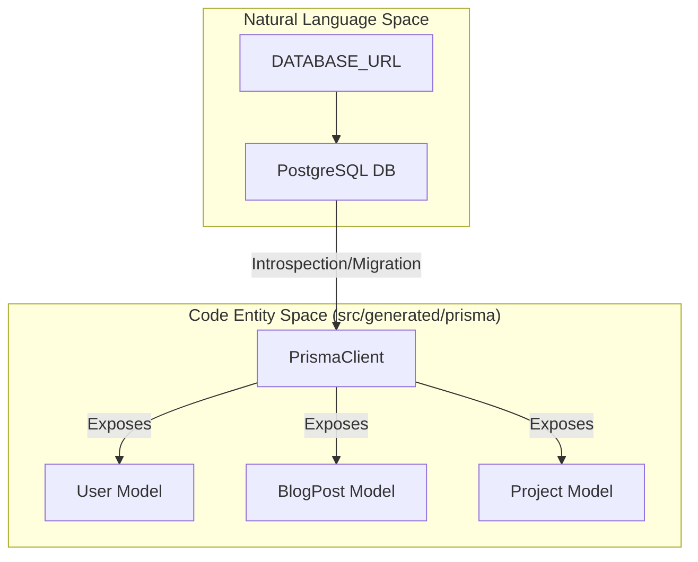
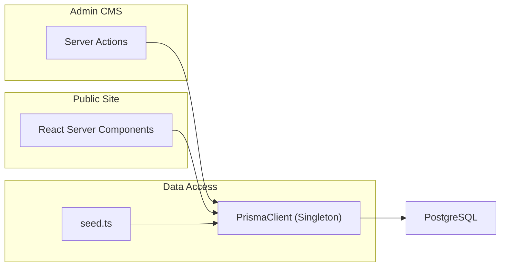

# Data Layer
Relevant source files

- [prisma/migrations/20260514000000_init/migration.sql](https://github.com/ravichandola/personal-branding/blob/3a440ccd/prisma/migrations/20260514000000_init/migration.sql)
- [prisma/migrations/20260516120000_testimonial_recommendation_fields/migration.sql](https://github.com/ravichandola/personal-branding/blob/3a440ccd/prisma/migrations/20260516120000_testimonial_recommendation_fields/migration.sql)
- [prisma/migrations/migration_lock.toml](https://github.com/ravichandola/personal-branding/blob/3a440ccd/prisma/migrations/migration_lock.toml)
- [prisma/schema.prisma](https://github.com/ravichandola/personal-branding/blob/3a440ccd/prisma/schema.prisma)
- [prisma/seed.ts](https://github.com/ravichandola/personal-branding/blob/3a440ccd/prisma/seed.ts)
- [src/features/about/recommendations-section.tsx](https://github.com/ravichandola/personal-branding/blob/3a440ccd/src/features/about/recommendations-section.tsx)

The data layer of the personal-branding platform is built on PostgreSQL and managed via Prisma ORM. It handles everything from core professional identity (profiles, experience, skills) to content management (blog posts, projects) and operational telemetry (analytics, rate limiting).

## Database Infrastructure

The system uses a standard PostgreSQL provider defined in the datasource block of the schema [prisma/schema.prisma#9-12](https://github.com/ravichandola/personal-branding/blob/3a440ccd/prisma/schema.prisma#L9-L12) The Prisma Client is configured to generate its artifacts into a custom directory at `src/generated/prisma`[prisma/schema.prisma#4-7](https://github.com/ravichandola/personal-branding/blob/3a440ccd/prisma/schema.prisma#L4-L7)

### Data Flow Overview

The following diagram illustrates how data flows from raw storage to the application entities.

Diagram: Data Storage to Code Entity Mapping

Sources:[prisma/schema.prisma#4-12](https://github.com/ravichandola/personal-branding/blob/3a440ccd/prisma/schema.prisma#L4-L12)[prisma/seed.ts#4-9](https://github.com/ravichandola/personal-branding/blob/3a440ccd/prisma/seed.ts#L4-L9)

---

## Schema Design

The schema is divided into several functional domains:

- Identity & Auth:`User`, `Account`, `Session`, and `VerificationToken` models support NextAuth.js integration [prisma/schema.prisma#40-93](https://github.com/ravichandola/personal-branding/blob/3a440ccd/prisma/schema.prisma#L40-L93)
- Professional Portfolio:`Profile`, `Experience`, `Skill`, and `Testimonial` store the core CV data [prisma/schema.prisma#95-293](https://github.com/ravichandola/personal-branding/blob/3a440ccd/prisma/schema.prisma#L95-L293)
- Content:`BlogPost` and `Project` models include support for MDX content and categorization [prisma/schema.prisma#176-262](https://github.com/ravichandola/personal-branding/blob/3a440ccd/prisma/schema.prisma#L176-L262)
- System & AI:`Settings`, `AiExtension`, and `AnalyticsEvent` handle global configuration and future AI capabilities [prisma/schema.prisma#314-343](https://github.com/ravichandola/personal-branding/blob/3a440ccd/prisma/schema.prisma#L314-L343)

For a field-level reference of all models, enums, and indexes, see [Database Schema (#2.1)].

Sources:[prisma/schema.prisma#1-350](https://github.com/ravichandola/personal-branding/blob/3a440ccd/prisma/schema.prisma#L1-L350)

---

## Migrations and Versioning

Migrations are managed through the Prisma Migrate CLI. The initial state was established in the `init` migration [prisma/migrations/20260514000000_init/migration.sql#1-250](https://github.com/ravichandola/personal-branding/blob/3a440ccd/prisma/migrations/20260514000000_init/migration.sql#L1-L250) with subsequent updates adding specialized fields, such as LinkedIn-style recommendation metadata to the `Testimonial` model [prisma/migrations/20260516120000_testimonial_recommendation_fields/migration.sql#1-4](https://github.com/ravichandola/personal-branding/blob/3a440ccd/prisma/migrations/20260516120000_testimonial_recommendation_fields/migration.sql#L1-L4)

Sources:[prisma/migrations/20260514000000_init/migration.sql#1-20](https://github.com/ravichandola/personal-branding/blob/3a440ccd/prisma/migrations/20260514000000_init/migration.sql#L1-L20)[prisma/migrations/20260516120000_testimonial_recommendation_fields/migration.sql#1-4](https://github.com/ravichandola/personal-branding/blob/3a440ccd/prisma/migrations/20260516120000_testimonial_recommendation_fields/migration.sql#L1-L4)

---

## Seeding and Ingestion

The platform includes a robust seeding engine and multiple ingestion scripts to populate the database from external sources.

- Bootstrap Seeding: The `prisma/seed.ts` script initializes the admin user, global site settings, and core professional profile data [prisma/seed.ts#11-90](https://github.com/ravichandola/personal-branding/blob/3a440ccd/prisma/seed.ts#L11-L90)
- Content Ingestion: Specialized scripts handle importing content from Medium via RSS feeds (`sync-medium-posts.ts`) or ZIP exports (`import-medium-export.ts`).

For details on the HTML-to-Markdown pipeline and how to run these scripts, see [Seeding and Content Ingestion (#2.2)].

Sources:[prisma/seed.ts#1-123](https://github.com/ravichandola/personal-branding/blob/3a440ccd/prisma/seed.ts#L1-L123)

---

## Operational Architecture

The application interacts with the database primarily through Server Actions and the Prisma Client.

Diagram: System Interaction Map

### Key Models and Enums

| Category | Entities | Enums |
| --- | --- | --- |
| Auth | `User`, `Account`, `Session` | `UserRole` |
| Content | `BlogPost`, `Project`, `Category`, `Tag` | `ProjectCategoryCode` |
| Professional | `Experience`, `Skill`, `Testimonial` | `SkillBucket` |
| Operational | `Contact`, `Settings`, `AiExtension` | `ContactStatus` |

Sources:[prisma/schema.prisma#14-38](https://github.com/ravichandola/personal-branding/blob/3a440ccd/prisma/schema.prisma#L14-L38)[prisma/schema.prisma#40-343](https://github.com/ravichandola/personal-branding/blob/3a440ccd/prisma/schema.prisma#L40-L343)