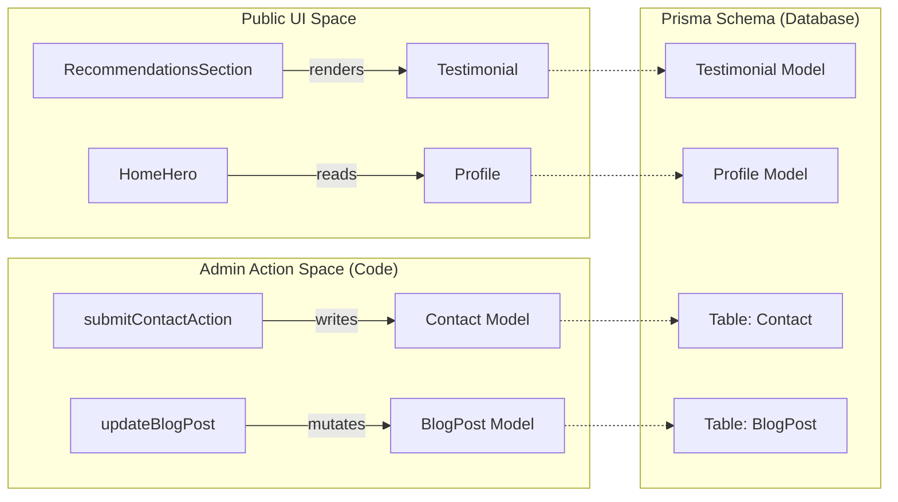

# Database Schema
Relevant source files

- [prisma/migrations/20260514000000_init/migration.sql](https://github.com/ravichandola/personal-branding/blob/3a440ccd/prisma/migrations/20260514000000_init/migration.sql)
- [prisma/migrations/20260515120000_home_spotlight/migration.sql](https://github.com/ravichandola/personal-branding/blob/3a440ccd/prisma/migrations/20260515120000_home_spotlight/migration.sql)
- [prisma/migrations/20260516120000_testimonial_recommendation_fields/migration.sql](https://github.com/ravichandola/personal-branding/blob/3a440ccd/prisma/migrations/20260516120000_testimonial_recommendation_fields/migration.sql)
- [prisma/migrations/migration_lock.toml](https://github.com/ravichandola/personal-branding/blob/3a440ccd/prisma/migrations/migration_lock.toml)
- [prisma/schema.prisma](https://github.com/ravichandola/personal-branding/blob/3a440ccd/prisma/schema.prisma)
- [src/app/(admin)/admin/site/page.tsx](https://github.com/ravichandola/personal-branding/blob/3a440ccd/src/app/%28admin%29/admin/site/page.tsx)
- [src/features/about/recommendations-section.tsx](https://github.com/ravichandola/personal-branding/blob/3a440ccd/src/features/about/recommendations-section.tsx)

The personal-branding platform utilizes a PostgreSQL database managed via Prisma ORM. The schema is designed to support a multi-tenant-ready structure (though currently focused on a single professional profile) with comprehensive support for content management, authentication, and system telemetry.

## Core Data Architecture

The system's data layer is defined in `prisma/schema.prisma`[prisma/schema.prisma#1-321](https://github.com/ravichandola/personal-branding/blob/3a440ccd/prisma/schema.prisma#L1-L321) It uses a combination of relational tables for content (Blogs, Projects, Experience) and specialized tables for system state (Settings, RateLimiter, AiExtension).

### Entity Relationship Overview

The following diagram illustrates how core content entities relate to one another within the `postgresql` datasource [prisma/schema.prisma#9-12](https://github.com/ravichandola/personal-branding/blob/3a440ccd/prisma/schema.prisma#L9-L12)

Diagram: Content Entity Relationships

Sources:[prisma/schema.prisma#40-262](https://github.com/ravichandola/personal-branding/blob/3a440ccd/prisma/schema.prisma#L40-L262)[prisma/migrations/20260514000000_init/migration.sql#14-200](https://github.com/ravichandola/personal-branding/blob/3a440ccd/prisma/migrations/20260514000000_init/migration.sql#L14-L200)

---

## Authentication and User Management

The schema implements the standard NextAuth.js (Auth.js) pattern for credential and OAuth-based authentication [prisma/schema.prisma#40-93](https://github.com/ravichandola/personal-branding/blob/3a440ccd/prisma/schema.prisma#L40-L93)

| Model | Purpose | Key Fields |
| --- | --- | --- |
| `User` | Primary identity record | `email`, `passwordHash`, `role`[prisma/schema.prisma#40-54](https://github.com/ravichandola/personal-branding/blob/3a440ccd/prisma/schema.prisma#L40-L54) |
| `Account` | Linked OAuth providers | `provider`, `providerAccountId`[prisma/schema.prisma#56-74](https://github.com/ravichandola/personal-branding/blob/3a440ccd/prisma/schema.prisma#L56-L74) |
| `Session` | Active client sessions | `sessionToken`, `expires`[prisma/schema.prisma#76-85](https://github.com/ravichandola/personal-branding/blob/3a440ccd/prisma/schema.prisma#L76-L85) |
| `VerificationToken` | Email verification/Password reset | `identifier`, `token`[prisma/schema.prisma#87-93](https://github.com/ravichandola/personal-branding/blob/3a440ccd/prisma/schema.prisma#L87-L93) |

Enums:

- `UserRole`: Defines access levels (`ADMIN`, `EDITOR`) [prisma/schema.prisma#14-17](https://github.com/ravichandola/personal-branding/blob/3a440ccd/prisma/schema.prisma#L14-L17)

Sources:[prisma/schema.prisma#14-93](https://github.com/ravichandola/personal-branding/blob/3a440ccd/prisma/schema.prisma#L14-L93)[prisma/migrations/20260514000000_init/migration.sql#2-61](https://github.com/ravichandola/personal-branding/blob/3a440ccd/prisma/migrations/20260514000000_init/migration.sql#L2-L61)

---

## Content Models

### Profile and Socials

The `Profile` model stores the central "Person" metadata used for SEO and the Hero section [prisma/schema.prisma#95-116](https://github.com/ravichandola/personal-branding/blob/3a440ccd/prisma/schema.prisma#L95-L116)

- Dynamic Content: `rotatingTitles` (String array) fuels the typewriter effect in the UI [prisma/schema.prisma#100](https://github.com/ravichandola/personal-branding/blob/3a440ccd/prisma/schema.prisma#L100-L100)
- Stats: Fields like `statsYears` and `statsAutomationRuns` provide data for the "About" page counters [prisma/schema.prisma#108-112](https://github.com/ravichandola/personal-branding/blob/3a440ccd/prisma/schema.prisma#L108-L112)

### Experience and Skills

Used to render the career timeline and proficiency bars.

- `Experience`: Includes `achievements` and `technologies` as string arrays for flexible list rendering [prisma/schema.prisma#153-154](https://github.com/ravichandola/personal-branding/blob/3a440ccd/prisma/schema.prisma#L153-L154)
- `Skill`: Categorized by `SkillBucket` enum (e.g., `AI_ML`, `DEVOPS`) [prisma/schema.prisma#19-28](https://github.com/ravichandola/personal-branding/blob/3a440ccd/prisma/schema.prisma#L19-L28)

### Blog and Projects

Both models support MDX content and complex categorization.

- `BlogPost`: Uses many-to-many relationships via `BlogOnCategory` and `BlogOnTag`[prisma/schema.prisma#205-225](https://github.com/ravichandola/personal-branding/blob/3a440ccd/prisma/schema.prisma#L205-L225)
- `Project`: Linked to `ProjectCategoryCode` (AI, AUTOMATION, etc.) via `ProjectOnCategory`[prisma/schema.prisma#254-262](https://github.com/ravichandola/personal-branding/blob/3a440ccd/prisma/schema.prisma#L254-L262)

Diagram: Code Entity to Schema Mapping
This diagram bridges the `Next.js` Server Actions and UI components to their respective Prisma models.

Sources:[src/features/about/recommendations-section.tsx#19-25](https://github.com/ravichandola/personal-branding/blob/3a440ccd/src/features/about/recommendations-section.tsx#L19-L25)[prisma/schema.prisma#176-203](https://github.com/ravichandola/personal-branding/blob/3a440ccd/prisma/schema.prisma#L176-L203)[prisma/schema.prisma#295-310](https://github.com/ravichandola/personal-branding/blob/3a440ccd/prisma/schema.prisma#L295-L310)

---

## Specialized Models

### HomeSpotlight

A curated list of "pinned" highlights displayed on the homepage.

- Fields: `narrative` (detailed story), `projectSlug` (optional link to a Project record) [prisma/schema.prisma#118-131](https://github.com/ravichandola/personal-branding/blob/3a440ccd/prisma/schema.prisma#L118-L131)
- Indexes: Optimized for retrieval by `published` status and `sortOrder`[prisma/schema.prisma#130](https://github.com/ravichandola/personal-branding/blob/3a440ccd/prisma/schema.prisma#L130-L130)

### Testimonial

Stores recommendations, often imported from LinkedIn.

- Extended Fields: Includes `relationship` (e.g., "Managed Ravi directly") and `writtenAt` to mimic professional social proof structures [prisma/schema.prisma#289-292](https://github.com/ravichandola/personal-branding/blob/3a440ccd/prisma/schema.prisma#L289-L292)
- Migration: These fields were added via a dedicated migration [prisma/migrations/20260516120000_testimonial_recommendation_fields/migration.sql#1-4](https://github.com/ravichandola/personal-branding/blob/3a440ccd/prisma/migrations/20260516120000_testimonial_recommendation_fields/migration.sql#L1-L4)

### AiExtension

Configuration for AI-driven features, stored in the `AiExtension` model [prisma/schema.prisma#312-321](https://github.com/ravichandola/personal-branding/blob/3a440ccd/prisma/schema.prisma#L312-L321)

- RAG Configuration: `ragEnabled` (Boolean), `vectorProvider`, and `embeddingModel` settings.
- Analytics: `dualWriteEnabled` for tracking data across multiple providers.

### Analytics and Rate Limiting

- `AnalyticsEvent`: Captures client-side events with a JSON `metadata` blob for flexibility [prisma/schema.prisma#304-310](https://github.com/ravichandola/personal-branding/blob/3a440ccd/prisma/schema.prisma#L304-L310)
- `RateLimiter`: Key-value store for sliding-window rate limiting (e.g., for the Contact form) [prisma/schema.prisma#297-302](https://github.com/ravichandola/personal-branding/blob/3a440ccd/prisma/schema.prisma#L297-L302)

---

## Database Indexes

Prisma indexes are strategically placed to ensure performant queries for the public site:

- Search/Filtering: `BlogPost` is indexed on `[published, featured]` and `[publishedAt]`[prisma/schema.prisma#201-202](https://github.com/ravichandola/personal-branding/blob/3a440ccd/prisma/schema.prisma#L201-L202)
- Ordering: `Experience`, `Skill`, and `HomeSpotlight` all utilize `sortOrder` indexes [prisma/schema.prisma#130-275](https://github.com/ravichandola/personal-branding/blob/3a440ccd/prisma/schema.prisma#L130-L275)
- Uniqueness: Slugs for `BlogPost`, `Project`, `Category`, and `Tag` are enforced as unique to prevent routing collisions [prisma/schema.prisma#164-229](https://github.com/ravichandola/personal-branding/blob/3a440ccd/prisma/schema.prisma#L164-L229)

Sources:[prisma/schema.prisma#1-321](https://github.com/ravichandola/personal-branding/blob/3a440ccd/prisma/schema.prisma#L1-L321)[prisma/migrations/20260515120000_home_spotlight/migration.sql#1-18](https://github.com/ravichandola/personal-branding/blob/3a440ccd/prisma/migrations/20260515120000_home_spotlight/migration.sql#L1-L18)