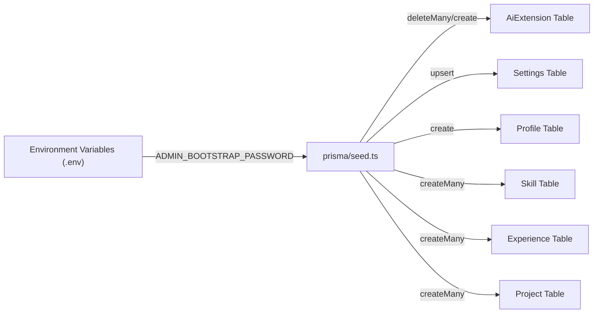
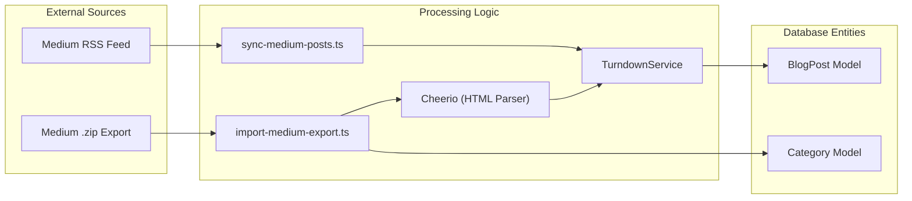

# Seeding and Content Ingestion
Relevant source files

- [prisma/seed.ts](https://github.com/ravichandola/personal-branding/blob/3a440ccd/prisma/seed.ts)
- [scripts/import-medium-export.ts](https://github.com/ravichandola/personal-branding/blob/3a440ccd/scripts/import-medium-export.ts)
- [scripts/sync-medium-posts.ts](https://github.com/ravichandola/personal-branding/blob/3a440ccd/scripts/sync-medium-posts.ts)
- [src/app/(admin)/admin/experience/page.tsx](https://github.com/ravichandola/personal-branding/blob/3a440ccd/src/app/%28admin%29/admin/experience/page.tsx)
- [src/lib/external-content.ts](https://github.com/ravichandola/personal-branding/blob/3a440ccd/src/lib/external-content.ts)

This page documents the mechanisms used to populate the `personal-branding` platform with data. It covers the initial database bootstrap process and the specialized pipelines for ingesting external content from Medium via RSS feeds and ZIP archive exports.

## 1. Database Bootstrapping (prisma/seed.ts)

The `prisma/seed.ts` script is the primary entry point for initializing a fresh database instance. It handles the creation of administrative credentials, global site settings, and the initial portfolio content (profile, skills, experience, and projects).

### 1.1. Core Bootstrap Logic

The script utilizes the `PrismaClient` to perform `upsert` and `create` operations. It prioritizes environment variables for sensitive data like the admin email and password [prisma/seed.ts#12-22](https://github.com/ravichandola/personal-branding/blob/3a440ccd/prisma/seed.ts#L12-L22)

1. AI Extension: Initializes the `AiExtension` model with RAG (Retrieval-Augmented Generation) disabled by default [prisma/seed.ts#24-31](https://github.com/ravichandola/personal-branding/blob/3a440ccd/prisma/seed.ts#L24-L31)
2. Global Settings: Configures `Settings` including LinkedIn, Medium, and GitHub URLs [prisma/seed.ts#33-47](https://github.com/ravichandola/personal-branding/blob/3a440ccd/prisma/seed.ts#L33-L47)
3. Profile & Socials: Populates the `Profile` model with the primary bio, headline, and portfolio statistics [prisma/seed.ts#49-90](https://github.com/ravichandola/personal-branding/blob/3a440ccd/prisma/seed.ts#L49-L90)
4. Taxonomy & Content: Seeds `Skill` buckets (e.g., `AUTOMATION`, `FRONTEND`) and `Project` entries with their respective categories [prisma/seed.ts#125-168](https://github.com/ravichandola/personal-branding/blob/3a440ccd/prisma/seed.ts#L125-L168)

### 1.2. Bootstrap Data Flow

The following diagram illustrates how the seed script interacts with the environment and the database.

Seed Script Execution Flow

Sources:[prisma/seed.ts#1-123](https://github.com/ravichandola/personal-branding/blob/3a440ccd/prisma/seed.ts#L1-L123)

---

## 2. Medium Content Ingestion

The platform provides two specialized scripts for ingesting blog content from Medium. Both scripts share a common transformation pipeline that converts Medium's HTML structure into Markdown suitable for the `BlogPost` model.

### 2.1. RSS Synchronization (sync-medium-posts.ts)

This script is intended for regular updates. It fetches the latest posts from a Medium RSS feed (typically the last 10 items) and upserts them into the database [scripts/sync-medium-posts.ts#7-12](https://github.com/ravichandola/personal-branding/blob/3a440ccd/scripts/sync-medium-posts.ts#L7-L12)

- RSS Parsing: Uses `rss-parser` to extract `content:encoded` (full HTML) and `pubDate`[scripts/sync-medium-posts.ts#68-75](https://github.com/ravichandola/personal-branding/blob/3a440ccd/scripts/sync-medium-posts.ts#L68-L75)
- Slug Extraction: Generates a unique slug from the Medium URL [scripts/sync-medium-posts.ts#28-38](https://github.com/ravichandola/personal-branding/blob/3a440ccd/scripts/sync-medium-posts.ts#L28-L38)
- Metadata Generation: Estimates reading time based on word count (approx. 200 wpm) [scripts/sync-medium-posts.ts#51-54](https://github.com/ravichandola/personal-branding/blob/3a440ccd/scripts/sync-medium-posts.ts#L51-L54)

### 2.2. Archive Import (import-medium-export.ts)

For bulk historical imports, this script processes the `.zip` export provided by Medium. It includes an automated classification engine to categorize posts into predefined topics [scripts/import-medium-export.ts#1-10](https://github.com/ravichandola/personal-branding/blob/3a440ccd/scripts/import-medium-export.ts#L1-L10)

- ZIP Processing: Uses `adm-zip` to iterate through the `posts/` directory of the archive [scripts/import-medium-export.ts#124-134](https://github.com/ravichandola/personal-branding/blob/3a440ccd/scripts/import-medium-export.ts#L124-L134)
- Topic Classification: The `classifyTopic` function uses regex patterns to assign posts to `gen-ai`, `javascript`, `java`, `git`, or `other` based on the content of the title and body [scripts/import-medium-export.ts#37-65](https://github.com/ravichandola/personal-branding/blob/3a440ccd/scripts/import-medium-export.ts#L37-L65)
- HTML Extraction: Uses `cheerio` to target specific Medium export selectors like `h1.p-name` and `section[data-field=body]`[scripts/import-medium-export.ts#151-177](https://github.com/ravichandola/personal-branding/blob/3a440ccd/scripts/import-medium-export.ts#L151-L177)

### 2.3. Ingestion Pipeline Components

| Component | Responsibility | Implementation |
| --- | --- | --- |
| HTML to MD | Converts Medium HTML to Markdown | `TurndownService`[scripts/import-medium-export.ts#89-97](https://github.com/ravichandola/personal-branding/blob/3a440ccd/scripts/import-medium-export.ts#L89-L97) |
| Sanitization | Removes scripts, styles, and iframes | `td.remove(['script', 'style', 'iframe'])`[scripts/sync-medium-posts.ts#62](https://github.com/ravichandola/personal-branding/blob/3a440ccd/scripts/sync-medium-posts.ts#L62-L62) |
| Slug Logic | Normalizes canonical URLs into DB keys | `slugFromCanonical`[scripts/import-medium-export.ts#67-76](https://github.com/ravichandola/personal-branding/blob/3a440ccd/scripts/import-medium-export.ts#L67-L76) |
| Excerpting | Generates 280-character summaries | `stripTags` + slicing [scripts/sync-medium-posts.ts#101-106](https://github.com/ravichandola/personal-branding/blob/3a440ccd/scripts/sync-medium-posts.ts#L101-L106) |

Ingestion Pipeline Architecture

Sources:[scripts/sync-medium-posts.ts#14-64](https://github.com/ravichandola/personal-branding/blob/3a440ccd/scripts/sync-medium-posts.ts#L14-L64)[scripts/import-medium-export.ts#15-112](https://github.com/ravichandola/personal-branding/blob/3a440ccd/scripts/import-medium-export.ts#L15-L112)

---

## 3. Transformation Utilities

The `src/lib/external-content.ts` utility file provides helper functions to handle inconsistencies in imported content.

### 3.1. Duplicate Excerpt Removal

Medium exports often include the subtitle/excerpt as the first paragraph of the body. To avoid redundancy in the `MediumPostLayout` (which renders the excerpt in the hero section), `mediumMdxBodyWithoutDuplicateExcerpt` identifies and strips this prefix if it matches the stored excerpt [src/lib/external-content.ts#20-37](https://github.com/ravichandola/personal-branding/blob/3a440ccd/src/lib/external-content.ts#L20-L37)

### 3.2. URL Normalization

The `isMediumArticleUrl` function validates if a given URL belongs to the Medium domain, ensuring that the frontend can switch to the appropriate layout for embedded content [src/lib/external-content.ts#2-12](https://github.com/ravichandola/personal-branding/blob/3a440ccd/src/lib/external-content.ts#L2-L12)

Sources:[src/lib/external-content.ts#1-54](https://github.com/ravichandola/personal-branding/blob/3a440ccd/src/lib/external-content.ts#L1-L54)