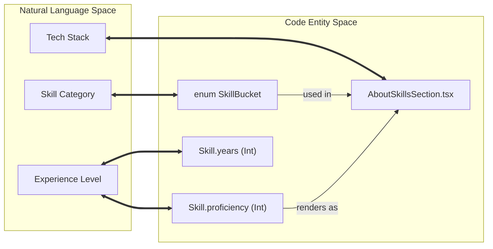

# About, Experience, and Skills Pages
Relevant source files

- [prisma/migrations/20260516120000_testimonial_recommendation_fields/migration.sql](https://github.com/ravichandola/personal-branding/blob/3a440ccd/prisma/migrations/20260516120000_testimonial_recommendation_fields/migration.sql)
- [prisma/schema.prisma](https://github.com/ravichandola/personal-branding/blob/3a440ccd/prisma/schema.prisma)
- [src/app/(site)/about/page.tsx](https://github.com/ravichandola/personal-branding/blob/3a440ccd/src/app/%28site%29/about/page.tsx)
- [src/app/(site)/experience/page.tsx](https://github.com/ravichandola/personal-branding/blob/3a440ccd/src/app/%28site%29/experience/page.tsx)
- [src/app/(site)/skills/page.tsx](https://github.com/ravichandola/personal-branding/blob/3a440ccd/src/app/%28site%29/skills/page.tsx)
- [src/features/about/about-skills-section.tsx](https://github.com/ravichandola/personal-branding/blob/3a440ccd/src/features/about/about-skills-section.tsx)
- [src/features/about/recommendations-section.tsx](https://github.com/ravichandola/personal-branding/blob/3a440ccd/src/features/about/recommendations-section.tsx)
- [src/features/about/summary-typewriter.tsx](https://github.com/ravichandola/personal-branding/blob/3a440ccd/src/features/about/summary-typewriter.tsx)
- [src/features/experience/experience-timeline.tsx](https://github.com/ravichandola/personal-branding/blob/3a440ccd/src/features/experience/experience-timeline.tsx)

This section documents the primary content pages of the public site that showcase the professional profile, career history, and technical capabilities. These pages leverage a mix of server-side data fetching via Prisma and interactive client-side components for animations.

## About Page

The `/about` page serves as the central hub for the professional biography, core focus areas, and social proof through recommendations. It is implemented as a dynamic server component that fetches data from the `Profile`, `Testimonial`, and `Skill` models.

### Implementation Details

- Route: `src/app/(site)/about/page.tsx`[src/app/(site)/about/page.tsx#49](https://github.com/ravichandola/personal-branding/blob/3a440ccd/src/app/%28site%29/about/page.tsx#L49-L49)
- Data Fetching: The page uses `prisma.profile.findFirst` for the bio, `prisma.testimonial.findMany` for recommendations, and `prisma.skill.findMany` for the skills section [src/app/(site)/about/page.tsx#57-76](https://github.com/ravichandola/personal-branding/blob/3a440ccd/src/app/%28site%29/about/page.tsx#L57-L76)
- Dynamic Rendering: The page is marked as `force-dynamic` to ensure content updates (like new testimonials) are reflected without a full site rebuild [src/app/(site)/about/page.tsx#47](https://github.com/ravichandola/personal-branding/blob/3a440ccd/src/app/%28site%29/about/page.tsx#L47-L47)

### Summary Typewriter

The bio section uses the `SummaryTypewriter` component to create an engaging reading experience.

- Logic: It splits the bio into paragraphs and then into words [src/features/about/summary-typewriter.tsx#13-19](https://github.com/ravichandola/personal-branding/blob/3a440ccd/src/features/about/summary-typewriter.tsx#L13-L19) It iterates through words using a `setInterval` (28ms per word) to simulate typing [src/features/about/summary-typewriter.tsx#9](https://github.com/ravichandola/personal-branding/blob/3a440ccd/src/features/about/summary-typewriter.tsx#L9-L9)
- Accessibility: It respects the `useReducedMotion` hook; if a user has "Reduce Motion" enabled, the component skips the animation and renders the full text immediately [src/features/about/summary-typewriter.tsx#68-73](https://github.com/ravichandola/personal-branding/blob/3a440ccd/src/features/about/summary-typewriter.tsx#L68-L73)

### Recommendations (Social Proof)

The `RecommendationsSection` displays testimonials from the `Testimonial` model.

- Fields: Displays author, role, relationship (e.g., "Managed Ravi directly"), and the date written [src/features/about/recommendations-section.tsx#71-95](https://github.com/ravichandola/personal-branding/blob/3a440ccd/src/features/about/recommendations-section.tsx#L71-L95)
- Formatting: Dates are formatted using `Intl.DateTimeFormat`[src/features/about/recommendations-section.tsx#10-17](https://github.com/ravichandola/personal-branding/blob/3a440ccd/src/features/about/recommendations-section.tsx#L10-L17)

Sources:

- `src/app/(site)/about/page.tsx`
- `src/features/about/summary-typewriter.tsx`
- `src/features/about/recommendations-section.tsx`
- `prisma/schema.prisma`

---

## Experience Page

The `/experience` page provides a chronological timeline of career roles. It visualizes the `Experience` model data using a vertical spine and card-based layout.

### Experience Timeline Component

The `ExperienceTimeline` component transforms raw database records into a stylized list.

- Sorting: Data is fetched sorted by `sortOrder` (ascending) and `startDate` (descending) [src/app/(site)/experience/page.tsx#19-21](https://github.com/ravichandola/personal-branding/blob/3a440ccd/src/app/%28site%29/experience/page.tsx#L19-L21)
- Visual Indicators:

- A "Current" badge is displayed if `endDate` is null [src/features/experience/experience-timeline.tsx#95-99](https://github.com/ravichandola/personal-branding/blob/3a440ccd/src/features/experience/experience-timeline.tsx#L95-L99)
- A vertical gradient "spine" connects the timeline items [src/features/experience/experience-timeline.tsx#36-49](https://github.com/ravichandola/personal-branding/blob/3a440ccd/src/features/experience/experience-timeline.tsx#L36-L49)
- Content: Each card displays the company, location, role, summary, bulleted achievements, and a technology stack using `Badge` components [src/features/experience/experience-timeline.tsx#81-138](https://github.com/ravichandola/personal-branding/blob/3a440ccd/src/features/experience/experience-timeline.tsx#L81-L138)

### Data Flow: Database to Timeline

The following diagram illustrates how career data moves from the PostgreSQL database through the Prisma ORM into the React components.

Experience Data Flow

Sources:

- `src/app/(site)/experience/page.tsx`
- `src/features/experience/experience-timeline.tsx`
- `prisma/schema.prisma`

---

## Skills Page and Section

While the site contains a `/skills` route, it is configured as a permanent redirect to the `#about-skills` anchor on the About page to maintain a single-page flow for profile details.

### Implementation Details

- Redirect: `src/app/(site)/skills/page.tsx` uses `permanentRedirect("/about")`[src/app/(site)/skills/page.tsx#5](https://github.com/ravichandola/personal-branding/blob/3a440ccd/src/app/%28site%29/skills/page.tsx#L5-L5)
- Section Component: `AboutSkillsSection` in `src/features/about/about-skills-section.tsx`.

### Skill Categories and Proficiency

Skills are grouped by the `SkillBucket` enum defined in the Prisma schema.

- Buckets: Includes `FRONTEND`, `BACKEND`, `AI_ML`, `AUTOMATION`, `DEVOPS`, `CLOUD`, `DATABASES`, and `ARCHITECTURE`[prisma/schema.prisma#19-28](https://github.com/ravichandola/personal-branding/blob/3a440ccd/prisma/schema.prisma#L19-L28)
- Categorization: The component uses `reduce` to group the flat array of skills into a `Record<SkillBucket, Skill[]>` for rendering [src/features/about/about-skills-section.tsx#22-26](https://github.com/ravichandola/personal-branding/blob/3a440ccd/src/features/about/about-skills-section.tsx#L22-L26)
- Proficiency Bars: Each skill renders a horizontal progress bar where the width is controlled by the `proficiency` percentage (0-100) [src/features/about/about-skills-section.tsx#105-112](https://github.com/ravichandola/personal-branding/blob/3a440ccd/src/features/about/about-skills-section.tsx#L105-L112)

### Code Entity Association

The following diagram bridges the logical "Skill Bucket" concept to the specific code entities that handle them.

Skills System Mapping

### Table: Skill Bucket Labels

| Enum Value | UI Label |
| --- | --- |
| `FRONTEND` | Frontend |
| `BACKEND` | Backend |
| `AI_ML` | AI / ML |
| `AUTOMATION` | Automation |
| `DEVOPS` | DevOps |
| `ARCHITECTURE` | Architecture |

Sources:

- `src/app/(site)/skills/page.tsx`
- `src/features/about/about-skills-section.tsx`
- `prisma/schema.prisma:19-28`
- `prisma/schema.prisma:264-276`