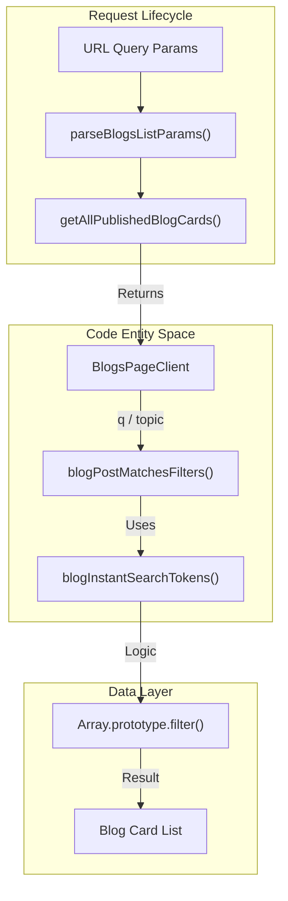
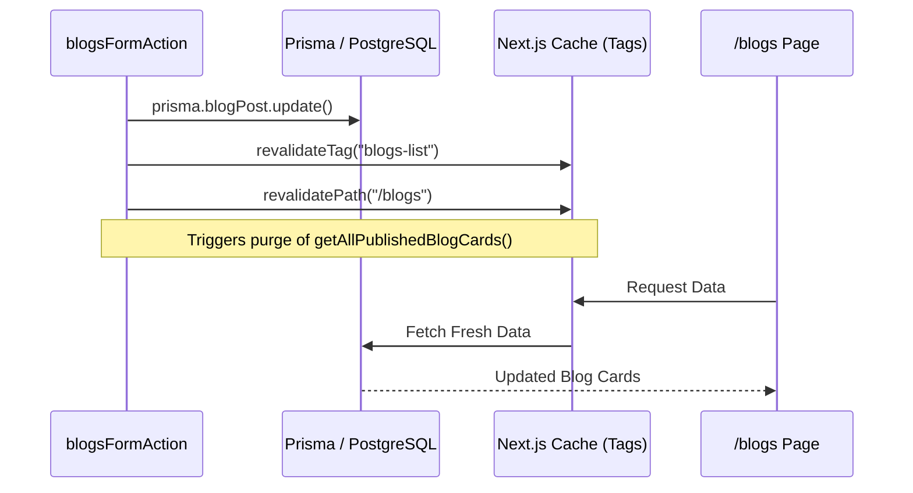

# Blog System
Relevant source files

- [src/app/(admin)/admin/page.tsx](https://github.com/ravichandola/personal-branding/blob/3a440ccd/src/app/%28admin%29/admin/page.tsx)
- [src/app/(site)/blogs/[slug]/page.tsx](https://github.com/ravichandola/personal-branding/blob/3a440ccd/src/app/%28site%29/blogs/%5Bslug%5D/page.tsx)
- [src/app/(site)/blogs/page.tsx](https://github.com/ravichandola/personal-branding/blob/3a440ccd/src/app/%28site%29/blogs/page.tsx)
- [src/features/admin/actions/blogs.ts](https://github.com/ravichandola/personal-branding/blob/3a440ccd/src/features/admin/actions/blogs.ts)
- [src/features/blog/blogs-page-client.tsx](https://github.com/ravichandola/personal-branding/blob/3a440ccd/src/features/blog/blogs-page-client.tsx)
- [src/features/blog/mdx-content.tsx](https://github.com/ravichandola/personal-branding/blob/3a440ccd/src/features/blog/mdx-content.tsx)
- [src/features/blog/medium-post-layout.tsx](https://github.com/ravichandola/personal-branding/blob/3a440ccd/src/features/blog/medium-post-layout.tsx)
- [src/lib/blogs-list-data.ts](https://github.com/ravichandola/personal-branding/blob/3a440ccd/src/lib/blogs-list-data.ts)
- [src/lib/blogs-list.ts](https://github.com/ravichandola/personal-branding/blob/3a440ccd/src/lib/blogs-list.ts)

The Blog System provides a high-performance, searchable interface for long-form content. It supports both native MDX articles and canonical Medium posts, utilizing a multi-layered caching strategy to ensure sub-second page loads while maintaining instant client-side interactivity.

## Listing Page and Search Logic

The `/blogs` listing page implements a hybrid search architecture. Initial parameters are parsed on the server, while filtering and pagination are handled on the client for immediate feedback.

### Data Flow and Tokenization

1. Server-Side Fetching: The page retrieves all published blog cards via `getAllPublishedBlogCards`[src/app/(site)/blogs/page.tsx#12](https://github.com/ravichandola/personal-branding/blob/3a440ccd/src/app/%28site%29/blogs/page.tsx#L12-L12) This function uses `unstable_cache` with the tag `blogs-list` to ensure fast retrieval [src/lib/blogs-list-data.ts#30-41](https://github.com/ravichandola/personal-branding/blob/3a440ccd/src/lib/blogs-list-data.ts#L30-L41)
2. Parameter Parsing: Incoming query parameters (`q`, `topic`, `page`) are normalized by `parseBlogsListParams`[src/lib/blogs-list.ts#33-56](https://github.com/ravichandola/personal-branding/blob/3a440ccd/src/lib/blogs-list.ts#L33-L56)
3. Tokenization:

- Server-side: `blogSearchTokens` splits queries into up to 6 tokens for potential Prisma filtering [src/lib/blogs-list.ts#61-68](https://github.com/ravichandola/personal-branding/blob/3a440ccd/src/lib/blogs-list.ts#L61-L68)
- Client-side: `blogInstantSearchTokens` facilitates real-time substring matching across titles and excerpts [src/lib/blogs-list.ts#117-125](https://github.com/ravichandola/personal-branding/blob/3a440ccd/src/lib/blogs-list.ts#L117-L125)
4. Client-Side Filtering: The `BlogsPageClient` component uses `useMemo` to filter the `allPosts` array whenever the query `q` or `topic` changes [src/features/blog/blogs-page-client.tsx#78-81](https://github.com/ravichandola/personal-branding/blob/3a440ccd/src/features/blog/blogs-page-client.tsx#L78-L81)

### Blog Search Entity Map

This diagram maps the logical search flow to the specific functions and components responsible for execution.

Title: Blog Search Implementation Flow

Sources: [src/app/(site)/blogs/page.tsx#5-27](https://github.com/ravichandola/personal-branding/blob/3a440ccd/src/app/%28site%29/blogs/page.tsx#L5-L27)[src/lib/blogs-list.ts#33-145](https://github.com/ravichandola/personal-branding/blob/3a440ccd/src/lib/blogs-list.ts#L33-L145)[src/features/blog/blogs-page-client.tsx#78-81](https://github.com/ravichandola/personal-branding/blob/3a440ccd/src/features/blog/blogs-page-client.tsx#L78-L81)

## Blog Detail Rendering

The detail page at `/blogs/[slug]` dynamically switches rendering strategies based on the article's source.

### MDX Rendering

For native articles, the system uses `next-mdx-remote` via the `MdxArticle` component [src/features/blog/mdx-content.tsx#16-38](https://github.com/ravichandola/personal-branding/blob/3a440ccd/src/features/blog/mdx-content.tsx#L16-L38) It includes:

- remark-gfm: Support for GitHub Flavored Markdown [src/features/blog/mdx-content.tsx#28](https://github.com/ravichandola/personal-branding/blob/3a440ccd/src/features/blog/mdx-content.tsx#L28-L28)
- rehype-pretty-code: Syntax highlighting using the `github-dark` theme [src/features/blog/mdx-content.tsx#31](https://github.com/ravichandola/personal-branding/blob/3a440ccd/src/features/blog/mdx-content.tsx#L31-L31)
- rehype-slug: Automatic ID generation for headings [src/features/blog/mdx-content.tsx#30](https://github.com/ravichandola/personal-branding/blob/3a440ccd/src/features/blog/mdx-content.tsx#L30-L30)

### Medium Integration

If a post has a `canonicalUrl` pointing to Medium, it is rendered using `MediumPostLayout` [src/app/(site)/blogs/[slug]/page.tsx#L33-L43](https://github.com/ravichandola/personal-branding/blob/3a440ccd/src/app/%28site%29/blogs/%5Bslug%5D/page.tsx#L33-L43).

- Layout Styling: Uses a serif font stack and Medium-branded green accents (`#1a8917`) to mimic the original reading experience [src/features/blog/medium-post-layout.tsx#39-64](https://github.com/ravichandola/personal-branding/blob/3a440ccd/src/features/blog/medium-post-layout.tsx#L39-L64)
- Content Cleanup: The `mediumMdxBodyWithoutDuplicateExcerpt` utility removes redundant lead paragraphs that often appear in RSS imports [src/features/blog/medium-post-layout.tsx#67](https://github.com/ravichandola/personal-branding/blob/3a440ccd/src/features/blog/medium-post-layout.tsx#L67-L67)

Sources: [src/app/(site)/blogs/[slug]/page.tsx#L22-L70](https://github.com/ravichandola/personal-branding/blob/3a440ccd/src/app/%28site%29/blogs/%5Bslug%5D/page.tsx#L22-L70), [src/features/blog/mdx-content.tsx#1-38](https://github.com/ravichandola/personal-branding/blob/3a440ccd/src/features/blog/mdx-content.tsx#L1-L38)[src/features/blog/medium-post-layout.tsx#12-72](https://github.com/ravichandola/personal-branding/blob/3a440ccd/src/features/blog/medium-post-layout.tsx#L12-L72)

## Caching and Revalidation

The system employs a dual-cache strategy to balance performance with data freshness.

| Layer | Implementation | Invalidation Trigger |
| --- | --- | --- |
| Listing Cache | `unstable_cache` with `BLOGS_LIST_CACHE_TAG`[src/lib/blogs-list-data.ts#30-41](https://github.com/ravichandola/personal-branding/blob/3a440ccd/src/lib/blogs-list-data.ts#L30-L41) | Admin actions (create/update/delete) call `revalidateTag`[src/features/admin/actions/blogs.ts#113](https://github.com/ravichandola/personal-branding/blob/3a440ccd/src/features/admin/actions/blogs.ts#L113-L113) |
| Page Cache | Next.js Segment Config `revalidate = 300`[src/app/(site)/blogs/page.tsx#34](https://github.com/ravichandola/personal-branding/blob/3a440ccd/src/app/%28site%29/blogs/page.tsx#L34-L34) | Time-based (5 minutes) |
| Detail ISR | `revalidate = 3600` [src/app/(site)/blogs/[slug]/page.tsx#L20](https://github.com/ravichandola/personal-branding/blob/3a440ccd/src/app/%28site%29/blogs/%5Bslug%5D/page.tsx#L20-L20) | Time-based (1 hour) or manual `revalidatePath` [src/features/admin/actions/blogs.ts#111](https://github.com/ravichandola/personal-branding/blob/3a440ccd/src/features/admin/actions/blogs.ts#L111-L111) |

### Cache Invalidation Sequence

This diagram shows how administrative changes propagate to the public site.

Title: Admin Mutation and Cache Revalidation

Sources: [src/features/admin/actions/blogs.ts#59-179](https://github.com/ravichandola/personal-branding/blob/3a440ccd/src/features/admin/actions/blogs.ts#L59-L179)[src/lib/blogs-list-data.ts#9-45](https://github.com/ravichandola/personal-branding/blob/3a440ccd/src/lib/blogs-list-data.ts#L9-L45)[src/app/(site)/blogs/page.tsx#12-34](https://github.com/ravichandola/personal-branding/blob/3a440ccd/src/app/%28site%29/blogs/page.tsx#L12-L34)

## Data Models and Types

### BlogPost Selection

The system uses a specific selection object `blogPostListSelect` to minimize the payload for the listing page, excluding heavy `content` fields while including category relations [src/lib/blogs-list.ts#96-110](https://github.com/ravichandola/personal-branding/blob/3a440ccd/src/lib/blogs-list.ts#L96-L110)

### Topic Slugs

Topics are restricted to a fixed set defined in `BLOG_TOPIC_SLUGS`:

- `gen-ai`
- `java`
- `javascript`
- `git`
- `other`[src/lib/blogs-list.ts#3-11](https://github.com/ravichandola/personal-branding/blob/3a440ccd/src/lib/blogs-list.ts#L3-L11)

Sources: [src/lib/blogs-list.ts#3-114](https://github.com/ravichandola/personal-branding/blob/3a440ccd/src/lib/blogs-list.ts#L3-L114)[src/lib/blogs-list-data.ts#13-23](https://github.com/ravichandola/personal-branding/blob/3a440ccd/src/lib/blogs-list-data.ts#L13-L23)