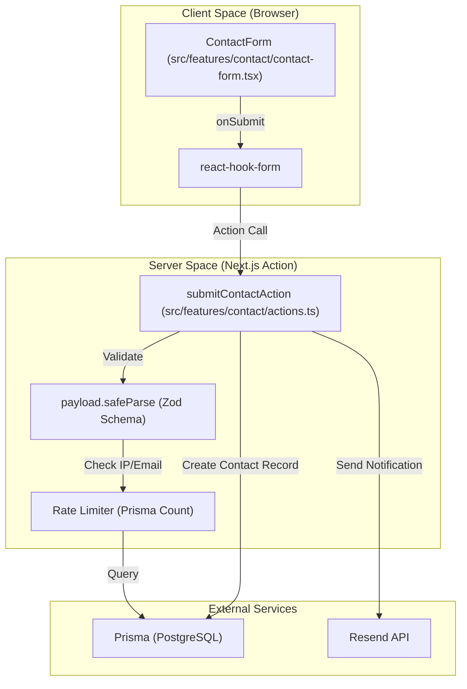
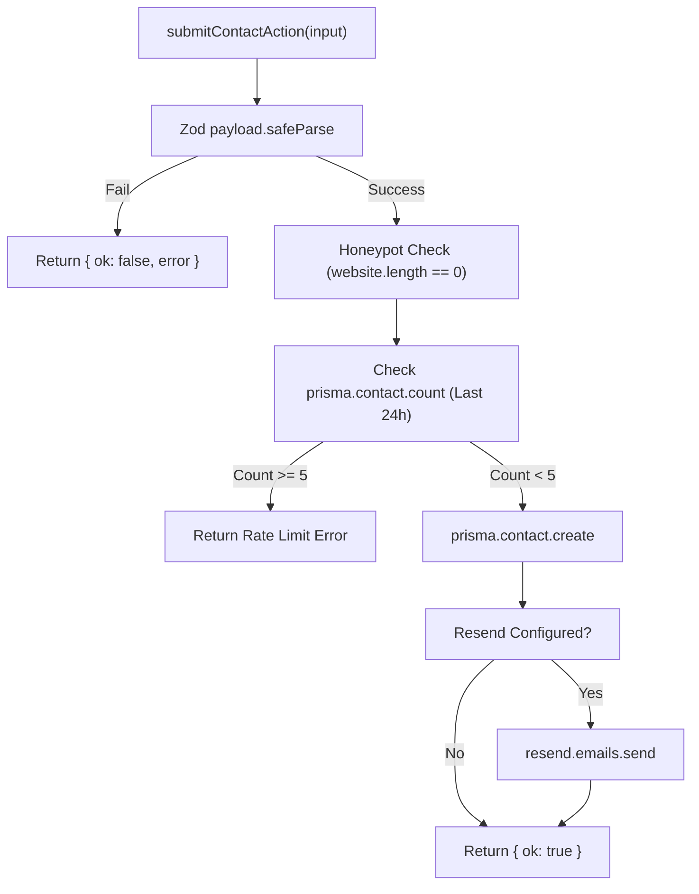

# Contact Page
Relevant source files

- [src/app/(site)/contact/page.tsx](https://github.com/ravichandola/personal-branding/blob/3a440ccd/src/app/%28site%29/contact/page.tsx)
- [src/app/(site)/projects/page.tsx](https://github.com/ravichandola/personal-branding/blob/3a440ccd/src/app/%28site%29/projects/page.tsx)
- [src/features/contact/actions.ts](https://github.com/ravichandola/personal-branding/blob/3a440ccd/src/features/contact/actions.ts)
- [src/features/contact/contact-form.tsx](https://github.com/ravichandola/personal-branding/blob/3a440ccd/src/features/contact/contact-form.tsx)

The Contact Page provides a public-facing interface for users to send inquiries, project requests, or collaborations. It is designed with a focus on high signal-to-noise ratios through strict input validation, honeypot spam prevention, and rate limiting.

## Implementation Overview

The contact system is composed of a Next.js page, a client-side form component using `react-hook-form`, and a server action that handles data persistence and email notifications.

### Data Flow: Contact Submission

This diagram maps the flow from the user interaction in the `ContactForm` to the backend processing in `submitContactAction`.

Sources:

- [src/app/(site)/contact/page.tsx#1-60](https://github.com/ravichandola/personal-branding/blob/3a440ccd/src/app/%28site%29/contact/page.tsx#L1-L60)
- [src/features/contact/contact-form.tsx#11-59](https://github.com/ravichandola/personal-branding/blob/3a440ccd/src/features/contact/contact-form.tsx#L11-L59)
- [src/features/contact/actions.ts#22-94](https://github.com/ravichandola/personal-branding/blob/3a440ccd/src/features/contact/actions.ts#L22-L94)

---

## ContactForm Component

The `ContactForm` is a client-side component [src/features/contact/contact-form.tsx#29](https://github.com/ravichandola/personal-branding/blob/3a440ccd/src/features/contact/contact-form.tsx#L29-L29) that utilizes `react-hook-form` for state management and local validation.

### Key Features

- Honeypot Field: A hidden input field named `website` is included in the form [src/features/contact/contact-form.tsx#66-73](https://github.com/ravichandola/personal-branding/blob/3a440ccd/src/features/contact/contact-form.tsx#L66-L73) If this field is populated (typically by automated bots), the server action will fail validation because the Zod schema requires its length to be exactly 0 [src/features/contact/actions.ts#17](https://github.com/ravichandola/personal-branding/blob/3a440ccd/src/features/contact/actions.ts#L17-L17)
- Validation Rules:

- Name: Minimum 2 characters [src/features/contact/contact-form.tsx#89](https://github.com/ravichandola/personal-branding/blob/3a440ccd/src/features/contact/contact-form.tsx#L89-L89)
- Email: Must be a valid email format [src/features/contact/contact-form.tsx#102](https://github.com/ravichandola/personal-branding/blob/3a440ccd/src/features/contact/contact-form.tsx#L102-L102)
- Message: Minimum 20 characters to ensure "signal stays clean" [src/features/contact/contact-form.tsx#148-154](https://github.com/ravichandola/personal-branding/blob/3a440ccd/src/features/contact/contact-form.tsx#L148-L154)
- Submission State: The "Send message" button is disabled during the transition using `form.formState.isSubmitting`[src/features/contact/contact-form.tsx#159-165](https://github.com/ravichandola/personal-branding/blob/3a440ccd/src/features/contact/contact-form.tsx#L159-L165)

Sources:

- [src/features/contact/contact-form.tsx#14-21](https://github.com/ravichandola/personal-branding/blob/3a440ccd/src/features/contact/contact-form.tsx#L14-L21)
- [src/features/contact/contact-form.tsx#66-73](https://github.com/ravichandola/personal-branding/blob/3a440ccd/src/features/contact/contact-form.tsx#L66-L73)
- [src/features/contact/contact-form.tsx#81-155](https://github.com/ravichandola/personal-branding/blob/3a440ccd/src/features/contact/contact-form.tsx#L81-L155)

---

## Server-Side Processing

The `submitContactAction` function [src/features/contact/actions.ts#22](https://github.com/ravichandola/personal-branding/blob/3a440ccd/src/features/contact/actions.ts#L22-L22) executes the business logic for processing a message.

### Validation and Security

1. Zod Parsing: The input is parsed against a strict schema [src/features/contact/actions.ts#11-18](https://github.com/ravichandola/personal-branding/blob/3a440ccd/src/features/contact/actions.ts#L11-L18)
2. IP Hashing: To protect user privacy while allowing rate limiting, the source IP address is retrieved from headers (e.g., `x-forwarded-for`) and hashed using SHA-256 before storage [src/features/contact/actions.ts#39-44](https://github.com/ravichandola/personal-branding/blob/3a440ccd/src/features/contact/actions.ts#L39-L44)
3. Rate Limiting: The system checks the database for existing contact records from the same email address within the last 24 hours [src/features/contact/actions.ts#46-51](https://github.com/ravichandola/personal-branding/blob/3a440ccd/src/features/contact/actions.ts#L46-L51) If the count is $\ge 5$, the request is rejected [src/features/contact/actions.ts#53-59](https://github.com/ravichandola/personal-branding/blob/3a440ccd/src/features/contact/actions.ts#L53-L59)

### Persistence and Notification

The action performs two primary side effects:

- Database Record: Creates a new entry in the `Contact` table via `prisma.contact.create`[src/features/contact/actions.ts#61-67](https://github.com/ravichandola/personal-branding/blob/3a440ccd/src/features/contact/actions.ts#L61-L67)
- Email Alert: If `RESEND_API_KEY` and a notification email are configured in environment variables, it uses the `Resend` client to send a text-based summary of the message to the site owner [src/features/contact/actions.ts#69-84](https://github.com/ravichandola/personal-branding/blob/3a440ccd/src/features/contact/actions.ts#L69-L84)

### Logic Flow Diagram

Sources:

- [src/features/contact/actions.ts#11-18](https://github.com/ravichandola/personal-branding/blob/3a440ccd/src/features/contact/actions.ts#L11-L18)
- [src/features/contact/actions.ts#46-59](https://github.com/ravichandola/personal-branding/blob/3a440ccd/src/features/contact/actions.ts#L46-L59)
- [src/features/contact/actions.ts#61-67](https://github.com/ravichandola/personal-branding/blob/3a440ccd/src/features/contact/actions.ts#L61-L67)
- [src/features/contact/actions.ts#76-84](https://github.com/ravichandola/personal-branding/blob/3a440ccd/src/features/contact/actions.ts#L76-L84)

---

## Configuration

The contact system relies on several environment variables for its notification feature:

| Variable | Purpose |
| --- | --- |
| `RESEND_API_KEY` | API key for the Resend email service. |
| `CONTACT_NOTIFY_EMAIL` | The destination email address for new contact alerts. |
| `RESEND_FROM_EMAIL` | The verified sender address in Resend. |

Sources:

- [src/features/contact/actions.ts#69-74](https://github.com/ravichandola/personal-branding/blob/3a440ccd/src/features/contact/actions.ts#L69-L74)