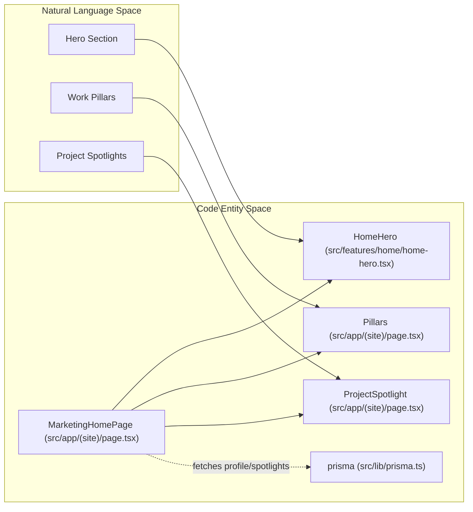
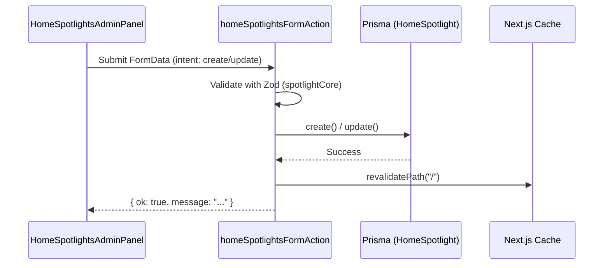

# Home Page and Hero
Relevant source files

- [src/app/(admin)/admin/skills/page.tsx](https://github.com/ravichandola/personal-branding/blob/3a440ccd/src/app/%28admin%29/admin/skills/page.tsx)
- [src/app/(admin)/admin/spotlights/page.tsx](https://github.com/ravichandola/personal-branding/blob/3a440ccd/src/app/%28admin%29/admin/spotlights/page.tsx)
- [src/app/(site)/page.tsx](https://github.com/ravichandola/personal-branding/blob/3a440ccd/src/app/%28site%29/page.tsx)
- [src/features/admin/actions/home-spotlights.ts](https://github.com/ravichandola/personal-branding/blob/3a440ccd/src/features/admin/actions/home-spotlights.ts)
- [src/features/admin/actions/skills.ts](https://github.com/ravichandola/personal-branding/blob/3a440ccd/src/features/admin/actions/skills.ts)
- [src/features/admin/home-spotlights-admin.tsx](https://github.com/ravichandola/personal-branding/blob/3a440ccd/src/features/admin/home-spotlights-admin.tsx)
- [src/features/home/home-hero.tsx](https://github.com/ravichandola/personal-branding/blob/3a440ccd/src/features/home/home-hero.tsx)

The Home Page serves as the primary entry point for the personal branding platform. It integrates dynamic content from the database (via Prisma) with high-fidelity animations (via Framer Motion) to present a professional summary, core work pillars, and featured project spotlights.

## HomeHero Component

The `HomeHero` component is the visual centerpiece of the home page. It handles the presentation of the user's identity, rotating professional titles, and core focus areas.

### Rotating Titles

The component implements a title rotation effect that cycles through a list of professional roles every 4.2 seconds `<FileRef file-url="https://github.com/ravichandola/personal-branding/blob/3a440ccd/src/features/home/home-hero.tsx#L64-L66" min=64 max=66 file-path="src/features/home/home-hero.tsx">Hii</FileRef>`.

- Data Source: It uses `heroTitles` passed as a prop, falling back to `SITE.heroRotatingTitles` from the static configuration `<FileRef file-url="https://github.com/ravichandola/personal-branding/blob/3a440ccd/src/features/home/home-hero.tsx#L52-L53" min=52 max=53 file-path="src/features/home/home-hero.tsx">Hii</FileRef>`.
- Animation: Titles are wrapped in a `motion.div` that triggers a vertical slide and fade animation whenever the `role` changes `<FileRef file-url="https://github.com/ravichandola/personal-branding/blob/3a440ccd/src/features/home/home-hero.tsx#L112-L125" min=112 max=125 file-path="src/features/home/home-hero.tsx">Hii</FileRef>`.

### Focus Areas and CTAs

A static array named `FOCUS` defines the primary technical domains (e.g., LangGraph, Playwright) displayed with associated `lucide-react` icons `<FileRef file-url="https://github.com/ravichandola/personal-branding/blob/3a440ccd/src/features/home/home-hero.tsx#L26-L43" min=26 max=43 file-path="src/features/home/home-hero.tsx">Hii</FileRef>`. The hero also provides primary navigation triggers:

- Browse projects: Links to `/projects``<FileRef file-url="https://github.com/ravichandola/personal-branding/blob/3a440ccd/src/features/home/home-hero.tsx#L142-L145" min=142 max=145 file-path="src/features/home/home-hero.tsx">Hii</FileRef>`.
- Articles: Links to `/blogs``<FileRef file-url="https://github.com/ravichandola/personal-branding/blob/3a440ccd/src/features/home/home-hero.tsx#L148-L151" min=148 max=151 file-path="src/features/home/home-hero.tsx">Hii</FileRef>`.
- Contact: A secondary underline link to `/contact``<FileRef file-url="https://github.com/ravichandola/personal-branding/blob/3a440ccd/src/features/home/home-hero.tsx#L155-L165" min=155 max=165 file-path="src/features/home/home-hero.tsx">Hii</FileRef>`.

### Portrait Card

The right side of the hero features a portrait card with a gradient border and shadow effects. It dynamically renders the user's avatar if `portraitUrl` is provided, otherwise defaulting to a placeholder `<FileRef file-url="https://github.com/ravichandola/personal-branding/blob/3a440ccd/src/features/home/home-hero.tsx#L174-L184" min=174 max=184 file-path="src/features/home/home-hero.tsx">Hii</FileRef>`.

Sources:

- `src/features/home/home-hero.tsx`
- `src/config/site.ts`

---

## Home Page Data Flow

The `MarketingHomePage` is a Next.js Server Component that fetches data from the PostgreSQL database to populate the hero and spotlight sections.

### Data Acquisition

The page performs a parallel fetch using `Promise.all` to retrieve the latest `Profile` and the top 3 published `HomeSpotlight` entries `<FileRef file-url="https://github.com/ravichandola/personal-branding/blob/3a440ccd/src/app/%28site%29/page.tsx#L72-L79" min=72 max=79 file-path="src/app/(site)/page.tsx">Hii</FileRef>`.

| Entity | Purpose | Fallback |
| --- | --- | --- |
| `Profile` | Provides `avatarUrl` and `rotatingTitles`. | `DEFAULT_HOME_PORTRAIT` and `SITE.heroRotatingTitles``<FileRef file-url="https://github.com/ravichandola/personal-branding/blob/3a440ccd/src/app/%28site%29/page.tsx#L30-L85" min=30 max=85 file-path="src/app/(site)/page.tsx">Hii</FileRef>`. |
| `HomeSpotlight` | Provides featured project cards. | `STATIC_SPOTLIGHTS` array `<FileRef file-url="https://github.com/ravichandola/personal-branding/blob/3a440ccd/src/app/%28site%29/page.tsx#L39-L64" min=39 max=64 file-path="src/app/(site)/page.tsx">Hii</FileRef>`. |

### Implementation Diagram: Component Hierarchy

This diagram maps the natural language sections of the Home Page to their corresponding code entities.

Title: Home Page Component Architecture

Sources:

- `src/app/(site)/page.tsx`
- `src/features/home/home-hero.tsx`

---

## Home Spotlight Feature

The Spotlight system allows the administrator to pin specific projects or narratives to the home page.

### Data Structure

Each spotlight item consists of a `title`, a short `summary` for the card face, a longer `narrative` for detail, and an optional `projectSlug``<FileRef file-url="https://github.com/ravichandola/personal-branding/blob/3a440ccd/src/app/%28site%29/page.tsx#L22-L27" min=22 max=27 file-path="src/app/(site)/page.tsx">Hii</FileRef>`. If a `projectSlug` is provided, the card links directly to the corresponding project detail page `<FileRef file-url="https://github.com/ravichandola/personal-branding/blob/3a440ccd/src/features/admin/home-spotlights-admin.tsx#L66-L67" min=66 max=67 file-path="src/features/admin/home-spotlights-admin.tsx">Hii</FileRef>`.

### Admin Management

Spotlights are managed via the `HomeSpotlightsAdminPanel`.

- Server Actions: Mutations are handled by `homeSpotlightsFormAction`, which routes to either `createHomeSpotlightAction` or `updateHomeSpotlightAction``<FileRef file-url="https://github.com/ravichandola/personal-branding/blob/3a440ccd/src/features/admin/actions/home-spotlights.ts#L35-L42" min=35 max=42 file-path="src/features/admin/actions/home-spotlights.ts">Hii</FileRef>`.
- Validation: Inputs are validated using Zod (`spotlightCore` schema) `<FileRef file-url="https://github.com/ravichandola/personal-branding/blob/3a440ccd/src/features/admin/actions/home-spotlights.ts#L21-L27" min=21 max=27 file-path="src/features/admin/actions/home-spotlights.ts">Hii</FileRef>`.
- Revalidation: Upon successful mutation, `revalidatePath("/")` is called to purge the Next.js Data Cache for the home page `<FileRef file-url="https://github.com/ravichandola/personal-branding/blob/3a440ccd/src/features/admin/actions/home-spotlights.ts#L80-L81" min=80 max=81 file-path="src/features/admin/actions/home-spotlights.ts">Hii</FileRef>`.

Title: Spotlight Mutation Flow

Sources:

- `src/app/(site)/page.tsx`
- `src/features/admin/home-spotlights-admin.tsx`
- `src/features/admin/actions/home-spotlights.ts`
- `src/app/(admin)/admin/spotlights/page.tsx`

---

## Work Pillars

The `Pillars` component (internal to the home page file) defines the "How I work" section. It uses a hardcoded array of objects describing the core professional values: Test Architecture, AI & Agents, Regulated Stacks, Writing & Teaching, and Production Posture `<FileRef file-url="https://github.com/ravichandola/personal-branding/blob/3a440ccd/src/app/%28site%29/page.tsx#L118-L155" min=118 max=155 file-path="src/app/(site)/page.tsx">Hii</FileRef>`.

Each pillar is rendered with:

- A `Badge` component for the category `<FileRef file-url="https://github.com/ravichandola/personal-branding/blob/3a440ccd/src/app/%28site%29/page.tsx#L126-L126" min=126  file-path="src/app/(site)/page.tsx">Hii</FileRef>`.
- A `lucide-react` icon `<FileRef file-url="https://github.com/ravichandola/personal-branding/blob/3a440ccd/src/app/%28site%29/page.tsx#L127-L127" min=127  file-path="src/app/(site)/page.tsx">Hii</FileRef>`.
- A title and descriptive body text `<FileRef file-url="https://github.com/ravichandola/personal-branding/blob/3a440ccd/src/app/%28site%29/page.tsx#L128-L129" min=128 max=129 file-path="src/app/(site)/page.tsx">Hii</FileRef>`.

The section uses a `sectionPanel` utility class for consistent glassmorphism styling across the site `<FileRef file-url="https://github.com/ravichandola/personal-branding/blob/3a440ccd/src/app/%28site%29/page.tsx#L32-L33" min=32 max=33 file-path="src/app/(site)/page.tsx">Hii</FileRef>`.

Sources:

- `src/app/(site)/page.tsx`