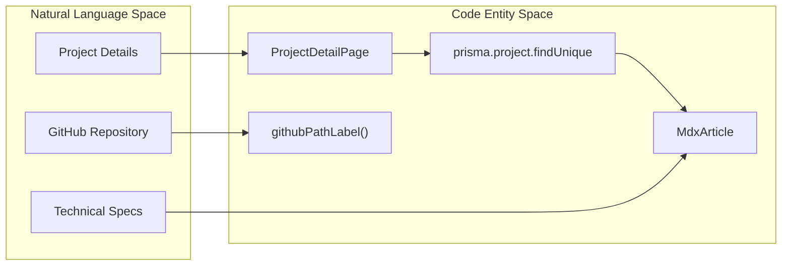
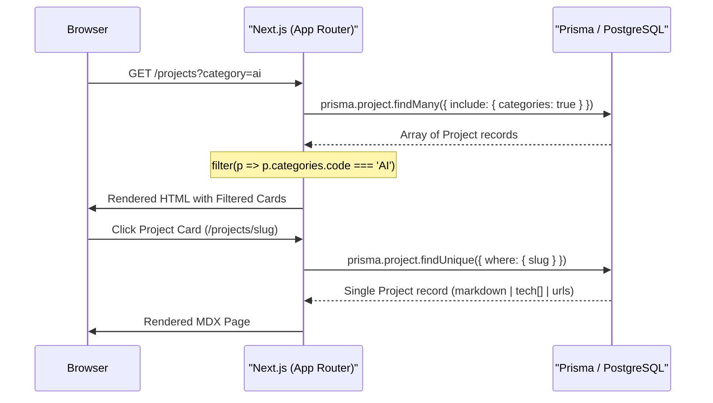

# Projects Catalogue
Relevant source files

- [src/app/(site)/contact/page.tsx](https://github.com/ravichandola/personal-branding/blob/3a440ccd/src/app/%28site%29/contact/page.tsx)
- [src/app/(site)/projects/[slug]/page.tsx](https://github.com/ravichandola/personal-branding/blob/3a440ccd/src/app/%28site%29/projects/%5Bslug%5D/page.tsx)
- [src/app/(site)/projects/page.tsx](https://github.com/ravichandola/personal-branding/blob/3a440ccd/src/app/%28site%29/projects/page.tsx)
- [src/features/blog/medium-post-layout.tsx](https://github.com/ravichandola/personal-branding/blob/3a440ccd/src/features/blog/medium-post-layout.tsx)
- [src/lib/external-content.ts](https://github.com/ravichandola/personal-branding/blob/3a440ccd/src/lib/external-content.ts)

The Projects Catalogue serves as the central showcase for technical work, providing a filtered listing interface and deep-dive detail pages for individual repositories and applications. It integrates directly with the Prisma-backed PostgreSQL database to render content authored in the Admin CMS.

## 1. Project Listing Page (`/projects`)

The listing page implements a category-based filtering system using URL search parameters. It fetches all published projects and organizes them into a responsive grid.

### 1.1 Category Filtering

Filtering is managed via the `FILTERS` constant [src/app/(site)/projects/page.tsx#13-22](https://github.com/ravichandola/personal-branding/blob/3a440ccd/src/app/%28site%29/projects/page.tsx#L13-L22) The interface uses a set of filter chips that append a `?category=` query parameter to the URL [src/app/(site)/projects/page.tsx#108-130](https://github.com/ravichandola/personal-branding/blob/3a440ccd/src/app/%28site%29/projects/page.tsx#L108-L130)

Supported Categories:

- `ALL` (Default)
- `AI`
- `AUTOMATION`
- `REACT`
- `BACKEND`
- `PERFORMANCE`
- `OCR`
- `LANGGRAPH`

### 1.2 Data Fetching and Logic

The page is a Server Component that interacts with `prisma.project`[src/app/(site)/projects/page.tsx#50-56](https://github.com/ravichandola/personal-branding/blob/3a440ccd/src/app/%28site%29/projects/page.tsx#L50-L56) It performs an in-memory filter of the fetched results based on the `active` category derived from `searchParams`[src/app/(site)/projects/page.tsx#47-63](https://github.com/ravichandola/personal-branding/blob/3a440ccd/src/app/%28site%29/projects/page.tsx#L47-L63)

### 1.3 Project Cards

Each project is rendered within a `Link` component pointing to `/projects/[slug]`[src/app/(site)/projects/page.tsx#166-168](https://github.com/ravichandola/personal-branding/blob/3a440ccd/src/app/%28site%29/projects/page.tsx#L166-L168) Cards display an excerpt generated by the `excerptSnippet` helper, which falls back to the main description if no explicit excerpt is provided [src/app/(site)/projects/page.tsx#32-40](https://github.com/ravichandola/personal-branding/blob/3a440ccd/src/app/%28site%29/projects/page.tsx#L32-L40)

Project Listing Data Flow

| Component/Entity | Role | File Reference |
| --- | --- | --- |
| `ProjectsPage` | Main entry point; handles `searchParams` and Prisma fetching. | [src/app/(site)/projects/page.tsx#42-46](https://github.com/ravichandola/personal-branding/blob/3a440ccd/src/app/%28site%29/projects/page.tsx#L42-L46) |
| `prisma.project` | Database model containing `published`, `slug`, and `categories`. | [src/app/(site)/projects/page.tsx#50-53](https://github.com/ravichandola/personal-branding/blob/3a440ccd/src/app/%28site%29/projects/page.tsx#L50-L53) |
| `FILTERS` | Array of valid category strings used for UI chips. | [src/app/(site)/projects/page.tsx#13-22](https://github.com/ravichandola/personal-branding/blob/3a440ccd/src/app/%28site%29/projects/page.tsx#L13-L22) |
| `githubPathLabel` | Utility to extract `user/repo` from GitHub URLs for UI badges. | [src/lib/external-content.ts#40-53](https://github.com/ravichandola/personal-branding/blob/3a440ccd/src/lib/external-content.ts#L40-L53) |

Sources: [src/app/(site)/projects/page.tsx#1-170](https://github.com/ravichandola/personal-branding/blob/3a440ccd/src/app/%28site%29/projects/page.tsx#L1-L170)[src/lib/external-content.ts#39-54](https://github.com/ravichandola/personal-branding/blob/3a440ccd/src/lib/external-content.ts#L39-L54)

---

## 2. Project Detail Page (`/projects/[slug]`)

The detail page provides a full-width view of a specific project, rendering rich text content via MDX and providing direct links to external resources.

### 2.1 Content Rendering

The page uses the `MdxArticle` component to parse and render the `project.markdown` field stored in the database [src/app/(site)/projects/[slug]/page.tsx#L78](https://github.com/ravichandola/personal-branding/blob/3a440ccd/src/app/%28site%29/projects/%5Bslug%5D/page.tsx#L78-L78). This allows for technical documentation to include code blocks, headers, and formatted lists.

### 2.2 External Links and Tech Badges

The header section dynamically renders action buttons and metadata badges:

- GitHub Link: Uses `githubPathLabel` to show the repository path (e.g., "user/repo") directly on the button [src/app/(site)/projects/[slug]/page.tsx#L37-L50](https://github.com/ravichandola/personal-branding/blob/3a440ccd/src/app/%28site%29/projects/%5Bslug%5D/page.tsx#L37-L50).
- Live Demo: Renders an external link icon if a `liveUrl` is present [src/app/(site)/projects/[slug]/page.tsx#L51-L61](https://github.com/ravichandola/personal-branding/blob/3a440ccd/src/app/%28site%29/projects/%5Bslug%5D/page.tsx#L51-L61).
- Tech Stack: Iterates through the `project.tech` string array to display individual technology badges [src/app/(site)/projects/[slug]/page.tsx#L65-L76](https://github.com/ravichandola/personal-branding/blob/3a440ccd/src/app/%28site%29/projects/%5Bslug%5D/page.tsx#L65-L76).

### 2.3 Dynamic Routing

The page is configured with `export const dynamic = "force-dynamic"` to ensure that updates made in the Admin CMS are reflected immediately without requiring a full site rebuild [src/app/(site)/projects/[slug]/page.tsx#L83](https://github.com/ravichandola/personal-branding/blob/3a440ccd/src/app/%28site%29/projects/%5Bslug%5D/page.tsx#L83-L83).

Project Detail Structure

Sources: [src/app/(site)/projects/[slug]/page.tsx#L1-L84](https://github.com/ravichandola/personal-branding/blob/3a440ccd/src/app/%28site%29/projects/%5Bslug%5D/page.tsx#L1-L84), [src/features/blog/mdx-content.tsx#1-10](https://github.com/ravichandola/personal-branding/blob/3a440ccd/src/features/blog/mdx-content.tsx#L1-L10) (referenced via import)

---

## 3. Data Relationships and Logic

The relationship between projects and categories is managed through a join table logic within the Prisma schema.

### 3.1 ProjectOnCategory Relation

In the database, projects are linked to categories via the `categories` relation. During the fetch in `ProjectsPage`, this relation is included to allow filtering by `categoryCode`[src/app/(site)/projects/page.tsx#53-62](https://github.com/ravichandola/personal-branding/blob/3a440ccd/src/app/%28site%29/projects/page.tsx#L53-L62)

### 3.2 URL Utility: githubPathLabel

The `githubPathLabel` function is a critical utility for the Projects Catalogue. It parses a standard GitHub URL and returns a truncated string for UI display.

- Input:`https://github.com/ravichandola/personal-branding`
- Output:`ravichandola/personal-branding`[src/lib/external-content.ts#47](https://github.com/ravichandola/personal-branding/blob/3a440ccd/src/lib/external-content.ts#L47-L47)

System Interaction Diagram

Sources: [src/app/(site)/projects/page.tsx#42-63](https://github.com/ravichandola/personal-branding/blob/3a440ccd/src/app/%28site%29/projects/page.tsx#L42-L63)[src/app/(site)/projects/[slug]/page.tsx#L9-L19](https://github.com/ravichandola/personal-branding/blob/3a440ccd/src/app/%28site%29/projects/%5Bslug%5D/page.tsx#L9-L19), [src/lib/external-content.ts#39-54](https://github.com/ravichandola/personal-branding/blob/3a440ccd/src/lib/external-content.ts#L39-L54)