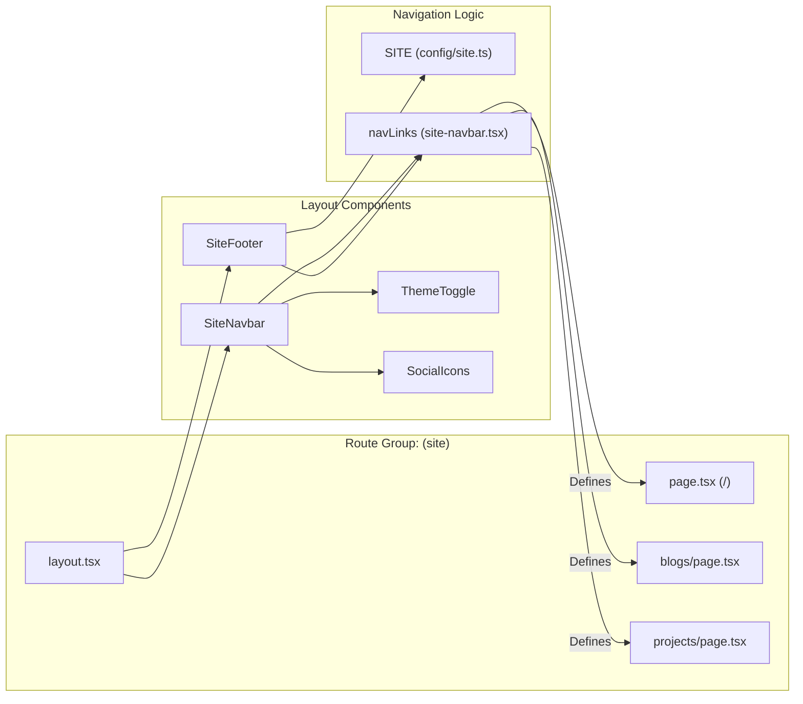
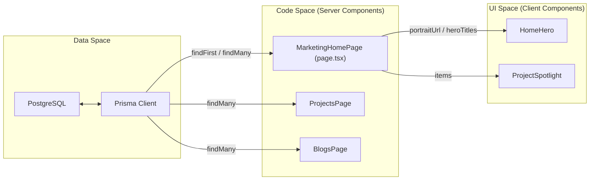

# Public Site
Relevant source files

- [src/app/(site)/layout.tsx](https://github.com/ravichandola/personal-branding/blob/3a440ccd/src/app/%28site%29/layout.tsx)
- [src/app/(site)/page.tsx](https://github.com/ravichandola/personal-branding/blob/3a440ccd/src/app/%28site%29/page.tsx)
- [src/components/layout/site-footer.tsx](https://github.com/ravichandola/personal-branding/blob/3a440ccd/src/components/layout/site-footer.tsx)
- [src/components/layout/site-navbar.tsx](https://github.com/ravichandola/personal-branding/blob/3a440ccd/src/components/layout/site-navbar.tsx)
- [src/components/layout/social-icons.tsx](https://github.com/ravichandola/personal-branding/blob/3a440ccd/src/components/layout/social-icons.tsx)
- [src/components/layout/theme-toggle.tsx](https://github.com/ravichandola/personal-branding/blob/3a440ccd/src/components/layout/theme-toggle.tsx)

The public site is the primary user-facing interface of the personal-branding platform. It is implemented within the `(site)` route group in the Next.js App Router, providing a unified layout and consistent navigation for all marketing and content pages.

### Navigation and Layout

The site-wide structure is defined in `src/app/(site)/layout.tsx`[src/app/(site)/layout.tsx#1-25](https://github.com/ravichandola/personal-branding/blob/3a440ccd/src/app/%28site%29/layout.tsx#L1-L25) which wraps all public routes with the `SiteNavbar` and `SiteFooter`.

- SiteNavbar: Provides primary navigation links (Home, About, Experience, Projects, Blogs, Contact), social icons, and a theme toggle [src/components/layout/site-navbar.tsx#17-24](https://github.com/ravichandola/personal-branding/blob/3a440ccd/src/components/layout/site-navbar.tsx#L17-L24) It includes a mobile-responsive overlay powered by `framer-motion`[src/components/layout/site-navbar.tsx#135-168](https://github.com/ravichandola/personal-branding/blob/3a440ccd/src/components/layout/site-navbar.tsx#L135-L168)
- SiteFooter: Displays quick links, site descriptions, and secondary calls to action [src/components/layout/site-footer.tsx#13-16](https://github.com/ravichandola/personal-branding/blob/3a440ccd/src/components/layout/site-footer.tsx#L13-L16)
- Analytics: The `AnalyticsBeacon` component is embedded in the layout to track page views and interactions [src/app/(site)/layout.tsx#14](https://github.com/ravichandola/personal-branding/blob/3a440ccd/src/app/%28site%29/layout.tsx#L14-L14)

### High-Level Route Mapping

| Route | Description | Primary Components |
| --- | --- | --- |
| `/` | Landing page with Hero and Spotlights | `HomeHero`, `ProjectSpotlight`, `Pillars` |
| `/about` | Biography, testimonials, and core skills | `AboutBio`, `TestimonialGrid` |
| `/experience` | Career timeline and professional history | `ExperienceTimeline` |
| `/projects` | Filterable catalogue of technical work | `ProjectCard`, `CategoryFilters` |
| `/blogs` | Searchable blog posts and Medium syncs | `BlogList`, `SearchInput` |
| `/contact` | Lead generation and contact form | `ContactForm` |

Sources: [src/app/(site)/layout.tsx#1-25](https://github.com/ravichandola/personal-branding/blob/3a440ccd/src/app/%28site%29/layout.tsx#L1-L25)[src/components/layout/site-navbar.tsx#17-24](https://github.com/ravichandola/personal-branding/blob/3a440ccd/src/components/layout/site-navbar.tsx#L17-L24)[src/app/(site)/page.tsx#66-116](https://github.com/ravichandola/personal-branding/blob/3a440ccd/src/app/%28site%29/page.tsx#L66-L116)

## Code Entity Map: Navigation & Layout

This diagram bridges the visual site structure to the specific React components and configuration objects that drive them.

Sources: [src/components/layout/site-navbar.tsx#17-24](https://github.com/ravichandola/personal-branding/blob/3a440ccd/src/components/layout/site-navbar.tsx#L17-L24)[src/components/layout/site-footer.tsx#7-10](https://github.com/ravichandola/personal-branding/blob/3a440ccd/src/components/layout/site-footer.tsx#L7-L10)[src/app/(site)/layout.tsx#7-20](https://github.com/ravichandola/personal-branding/blob/3a440ccd/src/app/%28site%29/layout.tsx#L7-L20)

---

## 3.1 Home Page and Hero

The landing page serves as the entry point, featuring a dynamic `HomeHero` component. It utilizes `framer-motion` for rotating job titles and presents "Pillars" of work philosophy. It also fetches "Spotlight" items from the database to highlight specific projects.

For details, see [Home Page and Hero](#3.1).

Sources: [src/app/(site)/page.tsx#66-116](https://github.com/ravichandola/personal-branding/blob/3a440ccd/src/app/%28site%29/page.tsx#L66-L116)[src/features/home/home-hero.tsx#1-10](https://github.com/ravichandola/personal-branding/blob/3a440ccd/src/features/home/home-hero.tsx#L1-L10)

## 3.2 About, Experience, and Skills Pages

These pages provide a deep dive into professional background.

- About: Combines a personal narrative with social proof via testimonials.
- Experience: Uses an `ExperienceTimeline` to show career progression.
- Skills: Categorizes technical proficiency into `SkillBucket` enums (e.g., Frontend, Backend, AI).

For details, see [About, Experience, and Skills Pages](#3.2).

Sources: [src/components/layout/site-navbar.tsx#19-20](https://github.com/ravichandola/personal-branding/blob/3a440ccd/src/components/layout/site-navbar.tsx#L19-L20)

## 3.3 Projects Catalogue

The projects section is a filterable portfolio. It supports multiple categories such as `AI`, `AUTOMATION`, and `PERFORMANCE`. Each project detail page renders MDX content and displays associated tech badges.

For details, see [Projects Catalogue](#3.3).

Sources: [src/app/(site)/page.tsx#39-64](https://github.com/ravichandola/personal-branding/blob/3a440ccd/src/app/%28site%29/page.tsx#L39-L64)[src/components/layout/site-navbar.tsx#21](https://github.com/ravichandola/personal-branding/blob/3a440ccd/src/components/layout/site-navbar.tsx#L21-L21)

## 3.4 Blog System

The blog system handles both local MDX files and synced Medium articles. It features a robust search mechanism with tokenization and topic filtering to help users navigate technical content.

For details, see [Blog System](#3.4).

Sources: [src/components/layout/site-navbar.tsx#22](https://github.com/ravichandola/personal-branding/blob/3a440ccd/src/components/layout/site-navbar.tsx#L22-L22)

## 3.5 Contact Page

The contact page contains a Zod-validated form. Submissions are handled via a Next.js Server Action (`submitContactAction`) which persists the message to Prisma and sends a notification via Resend. It includes a "honeypot" field to prevent automated spam.

For details, see [Contact Page](#3.5).

Sources: [src/components/layout/site-navbar.tsx#23](https://github.com/ravichandola/personal-branding/blob/3a440ccd/src/components/layout/site-navbar.tsx#L23-L23)[src/components/layout/site-footer.tsx#66-77](https://github.com/ravichandola/personal-branding/blob/3a440ccd/src/components/layout/site-footer.tsx#L66-L77)

## Data Flow: Public Page Rendering

The following diagram illustrates how the public site fetches data from the Prisma layer to populate the UI.

Sources: [src/app/(site)/page.tsx#72-94](https://github.com/ravichandola/personal-branding/blob/3a440ccd/src/app/%28site%29/page.tsx#L72-L94)[src/lib/prisma.ts#1-10](https://github.com/ravichandola/personal-branding/blob/3a440ccd/src/lib/prisma.ts#L1-L10)