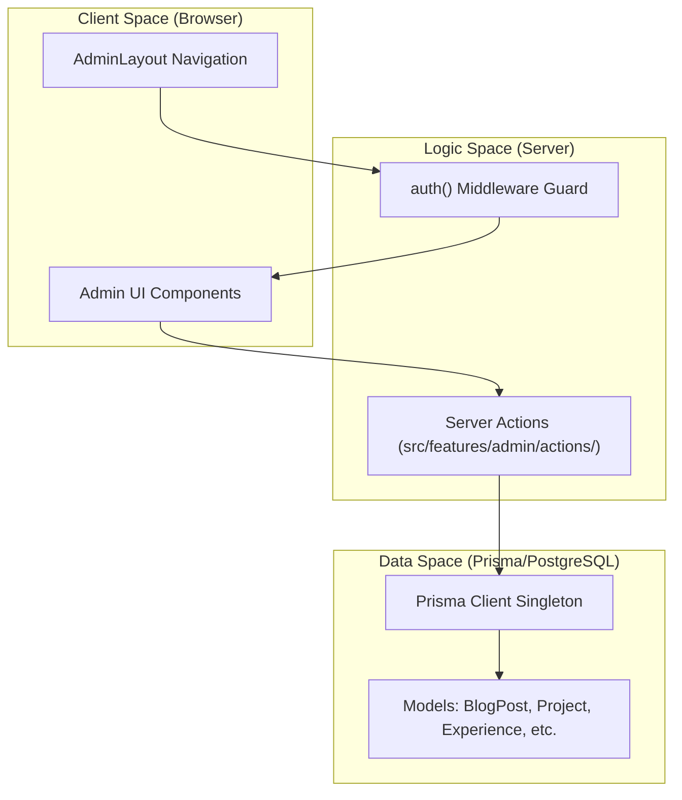
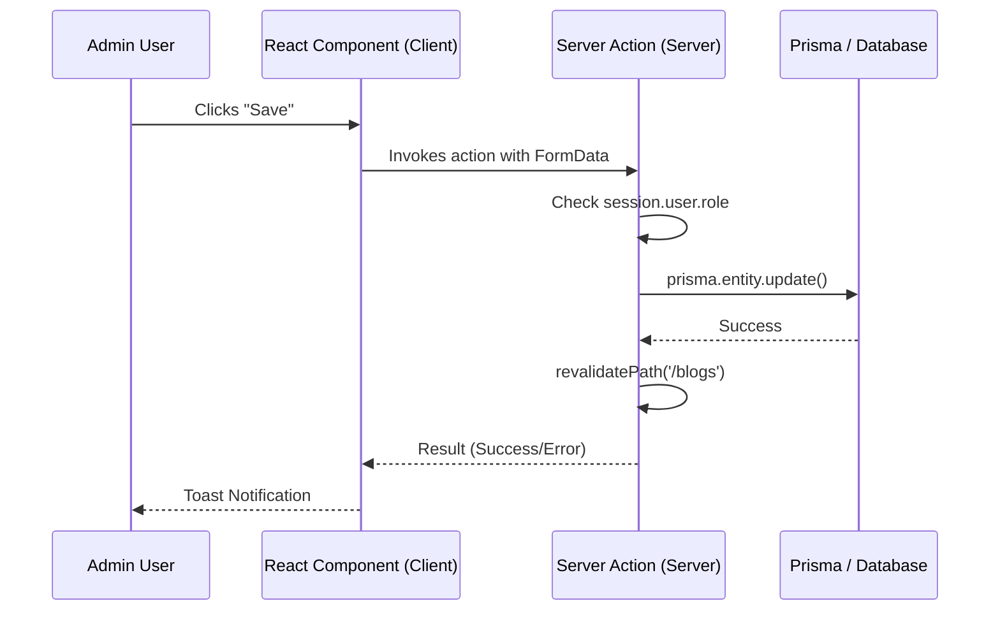

# Admin CMS
Relevant source files

- [src/app/(admin)/admin/layout.tsx](https://github.com/ravichandola/personal-branding/blob/3a440ccd/src/app/%28admin%29/admin/layout.tsx)
- [src/app/(admin)/admin/page.tsx](https://github.com/ravichandola/personal-branding/blob/3a440ccd/src/app/%28admin%29/admin/page.tsx)
- [src/features/blog/mdx-content.tsx](https://github.com/ravichandola/personal-branding/blob/3a440ccd/src/features/blog/mdx-content.tsx)
- [src/lib/admin-action-errors.ts](https://github.com/ravichandola/personal-branding/blob/3a440ccd/src/lib/admin-action-errors.ts)
- [src/lib/admin-path.ts](https://github.com/ravichandola/personal-branding/blob/3a440ccd/src/lib/admin-path.ts)

The Admin CMS is a password-protected route group (`/admin`) designed for managing the site's content, monitoring system health, and handling inquiries. It functions as an "Operations Bridge," providing a centralized dashboard to oversee the PostgreSQL database state, authentication configurations, and analytics.

The CMS is built using Next.js Server Actions for all data mutations, ensuring a secure, server-side execution path that bypasses the need for traditional REST or GraphQL API endpoints for administrative tasks.

### Operations Bridge Dashboard

The primary entry point is the `AdminDashboard`[src/app/(admin)/admin/page.tsx#16](https://github.com/ravichandola/personal-branding/blob/3a440ccd/src/app/%28admin%29/admin/page.tsx#L16-L16) It serves as a diagnostic hub that displays:

- Database Connectivity: Real-time status of the connection to the host defined in `DATABASE_URL`[src/app/(admin)/admin/page.tsx#20](https://github.com/ravichandola/personal-branding/blob/3a440ccd/src/app/%28admin%29/admin/page.tsx#L20-L20)
- Content Statistics: Aggregate counts for published blogs, projects, new contacts, and analytics events [src/app/(admin)/admin/page.tsx#38-70](https://github.com/ravichandola/personal-branding/blob/3a440ccd/src/app/%28admin%29/admin/page.tsx#L38-L70)
- Configuration Guardrails: Warnings if `AUTH_URL` and `NEXT_PUBLIC_SITE_URL` origins mismatch, which can lead to session failures during Server Action execution [src/app/(admin)/admin/page.tsx#178-183](https://github.com/ravichandola/personal-branding/blob/3a440ccd/src/app/%28admin%29/admin/page.tsx#L178-L183)

### Navigation and Layout

The admin interface uses a persistent sidebar/header navigation defined in the `AdminLayout`[src/app/(admin)/admin/layout.tsx#18-22](https://github.com/ravichandola/personal-branding/blob/3a440ccd/src/app/%28admin%29/admin/layout.tsx#L18-L22) This layout enforces authentication checks and provides links to the various management modules.

| Link | Destination | Purpose |
| --- | --- | --- |
| Dashboard | `/admin` | System health and content overview |
| Site & profile | `/admin/site` | Manage `Profile` and `Settings` models |
| Experience | `/admin/experience` | Career timeline management |
| Skills | `/admin/skills` | Technical skill categories and proficiency |
| Contacts | `/admin/contacts` | Inbox for form submissions |
| Blogs | `/admin/blogs` | Create and edit MDX blog posts |
| Home spotlights | `/admin/spotlights` | Pin specific projects to the home page |
| Projects | `/admin/projects` | Portfolio item management |

Sources:

- [src/app/(admin)/admin/layout.tsx#7-16](https://github.com/ravichandola/personal-branding/blob/3a440ccd/src/app/%28admin%29/admin/layout.tsx#L7-L16)
- [src/app/(admin)/admin/page.tsx#115-125](https://github.com/ravichandola/personal-branding/blob/3a440ccd/src/app/%28admin%29/admin/page.tsx#L115-L125)

---

### System Architecture Overview

The following diagram illustrates the relationship between the Admin UI, the security layer, and the underlying data persistence.

Admin CMS Entity Map

Sources:

- [src/app/(admin)/admin/layout.tsx#23-27](https://github.com/ravichandola/personal-branding/blob/3a440ccd/src/app/%28admin%29/admin/layout.tsx#L23-L27)
- [src/lib/admin-path.ts#1-4](https://github.com/ravichandola/personal-branding/blob/3a440ccd/src/lib/admin-path.ts#L1-L4)

---

### Mutation Pattern: Server Actions

All content changes in the CMS follow a standardized Server Action pattern. Instead of `fetch` calls to API routes, the UI components invoke asynchronous functions that run exclusively on the server.

1. Authorization: Actions verify the session using `auth()` before proceeding.
2. Validation: Input data is typically validated using Zod schemas.
3. Persistence: The action interacts with the `prisma` client to update the database.
4. Revalidation: Actions call `revalidatePath` or `revalidateTag` to purge the Next.js Data Cache, ensuring the public site reflects changes immediately.

Mutation Flow

Sources:

- [src/app/(admin)/admin/page.tsx#91-95](https://github.com/ravichandola/personal-branding/blob/3a440ccd/src/app/%28admin%29/admin/page.tsx#L91-L95)
- [src/features/admin/sign-out-action.ts#5](https://github.com/ravichandola/personal-branding/blob/3a440ccd/src/features/admin/sign-out-action.ts#L5-L5) (Example of Action usage in layout)

---

### Sub-topic Overviews

#### [Authentication and Authorization](#4.1)

Access to the `/admin` route group (excluding `/admin/login`) is restricted via middleware and session checks. The system uses NextAuth.js with a Credentials provider for secure login and role-based access control.
For details, see [Authentication and Authorization](#4.1).

#### [Content Management Actions](#4.2)

This section documents the specific Server Actions used to mutate site content, including complex operations like slug generation for blogs, Cloudinary image uploads for avatars, and category mapping for projects.
For details, see [Content Management Actions](#4.2).

#### [Admin UI Components](#4.3)

A tour of the specialized React components used within the admin panel, such as the `MdxArticle` renderer for blog previews and the various form controllers for site settings and career experience.
For details, see [Admin UI Components](#4.3).

Sources:

- [src/lib/admin-path.ts#2-4](https://github.com/ravichandola/personal-branding/blob/3a440ccd/src/lib/admin-path.ts#L2-L4)
- [src/features/blog/mdx-content.tsx#16-19](https://github.com/ravichandola/personal-branding/blob/3a440ccd/src/features/blog/mdx-content.tsx#L16-L19)
- [src/lib/admin-action-errors.ts#2-12](https://github.com/ravichandola/personal-branding/blob/3a440ccd/src/lib/admin-action-errors.ts#L2-L12)