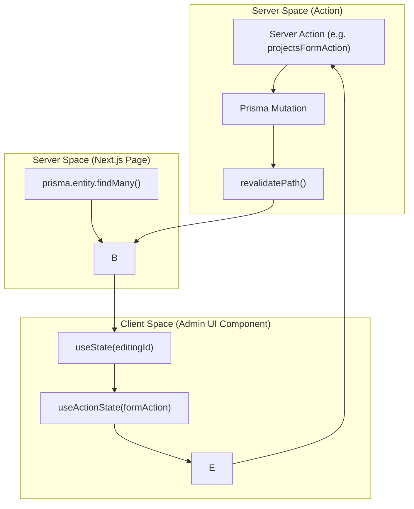

# Admin UI Components
Relevant source files

- [src/app/(admin)/admin/blogs/page.tsx](https://github.com/ravichandola/personal-branding/blob/3a440ccd/src/app/%28admin%29/admin/blogs/page.tsx)
- [src/app/(admin)/admin/contacts/page.tsx](https://github.com/ravichandola/personal-branding/blob/3a440ccd/src/app/%28admin%29/admin/contacts/page.tsx)
- [src/app/(admin)/admin/projects/page.tsx](https://github.com/ravichandola/personal-branding/blob/3a440ccd/src/app/%28admin%29/admin/projects/page.tsx)
- [src/features/admin/blogs-admin.tsx](https://github.com/ravichandola/personal-branding/blob/3a440ccd/src/features/admin/blogs-admin.tsx)
- [src/features/admin/contacts-panel.tsx](https://github.com/ravichandola/personal-branding/blob/3a440ccd/src/features/admin/contacts-panel.tsx)
- [src/features/admin/experience-admin.tsx](https://github.com/ravichandola/personal-branding/blob/3a440ccd/src/features/admin/experience-admin.tsx)
- [src/features/admin/profile-avatar-section.tsx](https://github.com/ravichandola/personal-branding/blob/3a440ccd/src/features/admin/profile-avatar-section.tsx)
- [src/features/admin/projects-admin.tsx](https://github.com/ravichandola/personal-branding/blob/3a440ccd/src/features/admin/projects-admin.tsx)
- [src/features/admin/site-settings-forms.tsx](https://github.com/ravichandola/personal-branding/blob/3a440ccd/src/features/admin/site-settings-forms.tsx)
- [src/features/admin/skills-admin.tsx](https://github.com/ravichandola/personal-branding/blob/3a440ccd/src/features/admin/skills-admin.tsx)

The Admin UI components form the management interface of the personal-branding platform. These components are located within the `(admin)` route group and leverage React Client Components to handle form state, optimistic updates, and interactive data management. They communicate with the database exclusively through Server Actions.

## Overview of Component Architecture

All admin panels follow a consistent pattern:

1. Server Page: Fetches data using Prisma and passes it as props to the Client Component [src/app/(admin)/admin/blogs/page.tsx#11-36](https://github.com/ravichandola/personal-branding/blob/3a440ccd/src/app/%28admin%29/admin/blogs/page.tsx#L11-L36)
2. Admin Panel (Client): Manages local state for editing (e.g., `editingId`), handles form submissions via `useActionState`, and triggers UI refreshes using `router.refresh()`[src/features/admin/blogs-admin.tsx#28-54](https://github.com/ravichandola/personal-branding/blob/3a440ccd/src/features/admin/blogs-admin.tsx#L28-L54)
3. Mutation: Uses specific Server Actions for CRUD operations, ensuring type safety and revalidation [src/features/admin/actions/blogs#1-13](https://github.com/ravichandola/personal-branding/blob/3a440ccd/src/features/admin/actions/blogs#L1-L13)

### Data Flow Pattern

Title: Admin Component Mutation Lifecycle

Sources:[src/features/admin/projects-admin.tsx#43-60](https://github.com/ravichandola/personal-branding/blob/3a440ccd/src/features/admin/projects-admin.tsx#L43-L60)[src/app/(admin)/admin/projects/page.tsx#8-44](https://github.com/ravichandola/personal-branding/blob/3a440ccd/src/app/%28admin%29/admin/projects/page.tsx#L8-L44)

---

## Core Admin Components

### BlogsAdminPanel

Manages the integration with Medium articles. It allows administrators to provide a Medium URL, which the system then uses to generate previews for the public site [src/features/admin/blogs-admin.tsx#55-62](https://github.com/ravichandola/personal-branding/blob/3a440ccd/src/features/admin/blogs-admin.tsx#L55-L62)

- Key State: `editingId` tracks which post is currently being modified in the form [src/features/admin/blogs-admin.tsx#28-29](https://github.com/ravichandola/personal-branding/blob/3a440ccd/src/features/admin/blogs-admin.tsx#L28-L29)
- Fields: Title, Medium URL, Slug (optional), Excerpt, and visibility toggles (`published`, `featured`) [src/features/admin/blogs-admin.tsx#76-145](https://github.com/ravichandola/personal-branding/blob/3a440ccd/src/features/admin/blogs-admin.tsx#L76-L145)
- Sources: [src/features/admin/blogs-admin.tsx#1-54](https://github.com/ravichandola/personal-branding/blob/3a440ccd/src/features/admin/blogs-admin.tsx#L1-L54)[src/app/(admin)/admin/blogs/page.tsx#1-40](https://github.com/ravichandola/personal-branding/blob/3a440ccd/src/app/%28admin%29/admin/blogs/page.tsx#L1-L40)

### ProjectsAdminPanel

Handles the portfolio of technical projects. A unique requirement for this component is the mandatory `githubUrl`[src/features/admin/projects-admin.tsx#78-81](https://github.com/ravichandola/personal-branding/blob/3a440ccd/src/features/admin/projects-admin.tsx#L78-L81)

- Category Management: Uses a checkbox grid mapped to the `ProjectCategoryCode` enum (AI, AUTOMATION, REACT, etc.) [src/features/admin/projects-admin.tsx#184-200](https://github.com/ravichandola/personal-branding/blob/3a440ccd/src/features/admin/projects-admin.tsx#L184-L200)
- Markdown Support: Provides a textarea for "Extra markdown" to supplement the project description on detail pages [src/features/admin/projects-admin.tsx#156-166](https://github.com/ravichandola/personal-branding/blob/3a440ccd/src/features/admin/projects-admin.tsx#L156-L166)
- Sources: [src/features/admin/projects-admin.tsx#16-41](https://github.com/ravichandola/personal-branding/blob/3a440ccd/src/features/admin/projects-admin.tsx#L16-L41)[src/features/admin/projects-admin.tsx#83-130](https://github.com/ravichandola/personal-branding/blob/3a440ccd/src/features/admin/projects-admin.tsx#L83-L130)

### ExperienceAdminPanel

Powers the career timeline on the `/experience` page. Entries are ordered by a `sortOrder` field where lower values appear first [src/features/admin/experience-admin.tsx#72-76](https://github.com/ravichandola/personal-branding/blob/3a440ccd/src/features/admin/experience-admin.tsx#L72-L76)

- Date Handling: Includes a helper `toDateInputValue` to format JavaScript Dates for HTML5 date inputs [src/features/admin/experience-admin.tsx#28-33](https://github.com/ravichandola/personal-branding/blob/3a440ccd/src/features/admin/experience-admin.tsx#L28-L33)
- Rich Content: Supports multi-line inputs for `achievements` (converted to bullets) and `technologies` (comma-separated) [src/features/admin/experience-admin.tsx#181-215](https://github.com/ravichandola/personal-branding/blob/3a440ccd/src/features/admin/experience-admin.tsx#L181-L215)
- Sources: [src/features/admin/experience-admin.tsx#15-26](https://github.com/ravichandola/personal-branding/blob/3a440ccd/src/features/admin/experience-admin.tsx#L15-L26)[src/features/admin/experience-admin.tsx#83-167](https://github.com/ravichandola/personal-branding/blob/3a440ccd/src/features/admin/experience-admin.tsx#L83-L167)

### SkillsAdminPanel

Manages technical competencies grouped by `SkillBucket` (e.g., FRONTEND, AI_ML, DEVOPS) [src/features/admin/skills-admin.tsx#26-35](https://github.com/ravichandola/personal-branding/blob/3a440ccd/src/features/admin/skills-admin.tsx#L26-L35)

- Proficiency Tracking: Includes a numeric field (0–100) and an optional "Years" field to quantify experience [src/features/admin/skills-admin.tsx#116-140](https://github.com/ravichandola/personal-branding/blob/3a440ccd/src/features/admin/skills-admin.tsx#L116-L140)
- Sources: [src/features/admin/skills-admin.tsx#16-24](https://github.com/ravichandola/personal-branding/blob/3a440ccd/src/features/admin/skills-admin.tsx#L16-L24)[src/features/admin/skills-admin.tsx#101-113](https://github.com/ravichandola/personal-branding/blob/3a440ccd/src/features/admin/skills-admin.tsx#L101-L113)

---

## Specialized Management Panels

### ContactsPanel

An inbox-style interface for managing inbound messages from the public contact form.

- Status Triage: Messages can be moved through statuses: `NEW`, `IN_PROGRESS`, `RESOLVED`, or `SPAM`[src/features/admin/contacts-panel.tsx#24-29](https://github.com/ravichandola/personal-branding/blob/3a440ccd/src/features/admin/contacts-panel.tsx#L24-L29)
- Metrics: Displays a summary strip with counts for each status bucket [src/features/admin/contacts-panel.tsx#79-93](https://github.com/ravichandola/personal-branding/blob/3a440ccd/src/features/admin/contacts-panel.tsx#L79-L93)
- Direct Action: Includes a "Reply in email" button that generates a `mailto:` link with the subject pre-filled [src/features/admin/contacts-panel.tsx#170-174](https://github.com/ravichandola/personal-branding/blob/3a440ccd/src/features/admin/contacts-panel.tsx#L170-L174)
- Sources: [src/features/admin/contacts-panel.tsx#13-22](https://github.com/ravichandola/personal-branding/blob/3a440ccd/src/features/admin/contacts-panel.tsx#L13-L22)[src/features/admin/contacts-panel.tsx#148-186](https://github.com/ravichandola/personal-branding/blob/3a440ccd/src/features/admin/contacts-panel.tsx#L148-L186)

### SiteSettingsForms

A multi-section form for global configuration, mapping primarily to the `Profile` and `Settings` Prisma models [src/features/admin/site-settings-forms.tsx#81-88](https://github.com/ravichandola/personal-branding/blob/3a440ccd/src/features/admin/site-settings-forms.tsx#L81-L88)

- Profile Section: Manages the bio, rotating hero titles, and the "Metric Strip" (e.g., Years of Experience, Projects completed) [src/features/admin/site-settings-forms.tsx#103-210](https://github.com/ravichandola/personal-branding/blob/3a440ccd/src/features/admin/site-settings-forms.tsx#L103-L210)
- Site Settings: Manages SEO metadata (metaTitle, metaDescription) and social URLs [src/features/admin/site-settings-forms.tsx#47-60](https://github.com/ravichandola/personal-branding/blob/3a440ccd/src/features/admin/site-settings-forms.tsx#L47-L60)
- Sources: [src/features/admin/site-settings-forms.tsx#17-45](https://github.com/ravichandola/personal-branding/blob/3a440ccd/src/features/admin/site-settings-forms.tsx#L17-L45)[src/features/admin/site-settings-forms.tsx#65-80](https://github.com/ravichandola/personal-branding/blob/3a440ccd/src/features/admin/site-settings-forms.tsx#L65-L80)

### ProfileAvatarSection

A specialized sub-component within Site Settings for managing the user's portrait.

- Dual-Mode Upload:

1. Direct URL: Accepts any image URL (e.g., LinkedIn media) [src/features/admin/profile-avatar-section.tsx#75-83](https://github.com/ravichandola/personal-branding/blob/3a440ccd/src/features/admin/profile-avatar-section.tsx#L75-L83)
2. Cloudinary: If `CLOUDINARY_API_KEY` is configured, it enables a file picker for direct uploads [src/features/admin/profile-avatar-section.tsx#92-123](https://github.com/ravichandola/personal-branding/blob/3a440ccd/src/features/admin/profile-avatar-section.tsx#L92-L123)
- Sources: [src/features/admin/profile-avatar-section.tsx#11-23](https://github.com/ravichandola/personal-branding/blob/3a440ccd/src/features/admin/profile-avatar-section.tsx#L11-L23)[src/features/admin/profile-avatar-section.tsx#29-48](https://github.com/ravichandola/personal-branding/blob/3a440ccd/src/features/admin/profile-avatar-section.tsx#L29-L48)

---

## Implementation Details

### Component Relationship Map

Title: Admin UI Entity Relationships

Sources:[src/features/admin/site-settings-forms.tsx#15](https://github.com/ravichandola/personal-branding/blob/3a440ccd/src/features/admin/site-settings-forms.tsx#L15-L15)[src/features/admin/projects-admin.tsx#14](https://github.com/ravichandola/personal-branding/blob/3a440ccd/src/features/admin/projects-admin.tsx#L14-L14)[src/features/admin/contacts-panel.tsx#11](https://github.com/ravichandola/personal-branding/blob/3a440ccd/src/features/admin/contacts-panel.tsx#L11-L11)

### Form Submission Logic

All components utilize the `useActionState` hook (formerly `useFormState`) to manage the transition between idle, pending, and success/error states of the Server Actions [src/features/admin/experience-admin.tsx#44-47](https://github.com/ravichandola/personal-branding/blob/3a440ccd/src/features/admin/experience-admin.tsx#L44-L47)

| Component | Primary Action | Target Model |
| --- | --- | --- |
| `BlogsAdminPanel` | `blogsFormAction` | `BlogPost` |
| `ProjectsAdminPanel` | `projectsFormAction` | `Project` |
| `ExperienceAdminPanel` | `experienceFormAction` | `Experience` |
| `SkillsAdminPanel` | `skillsFormAction` | `Skill` |
| `ContactsPanel` | `updateContactStatusAction` | `Contact` |
| `SiteSettingsForms` | `saveAdminProfileAction` | `Profile` |

Sources:[src/features/admin/actions/blogs#10-13](https://github.com/ravichandola/personal-branding/blob/3a440ccd/src/features/admin/actions/blogs#L10-L13)[src/features/admin/actions/projects#11-13](https://github.com/ravichandola/personal-branding/blob/3a440ccd/src/features/admin/actions/projects#L11-L13)[src/features/admin/actions/experience#10-13](https://github.com/ravichandola/personal-branding/blob/3a440ccd/src/features/admin/actions/experience#L10-L13)[src/features/admin/actions/skills#10-13](https://github.com/ravichandola/personal-branding/blob/3a440ccd/src/features/admin/actions/skills#L10-L13)[src/features/admin/actions/contacts#7-10](https://github.com/ravichandola/personal-branding/blob/3a440ccd/src/features/admin/actions/contacts#L7-L10)[src/features/admin/actions/site-settings#10-14](https://github.com/ravichandola/personal-branding/blob/3a440ccd/src/features/admin/actions/site-settings#L10-L14)