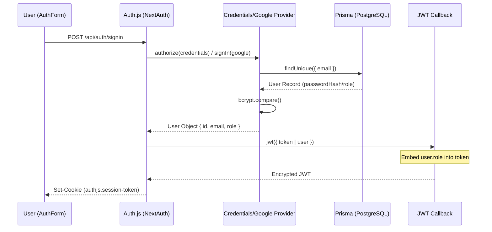
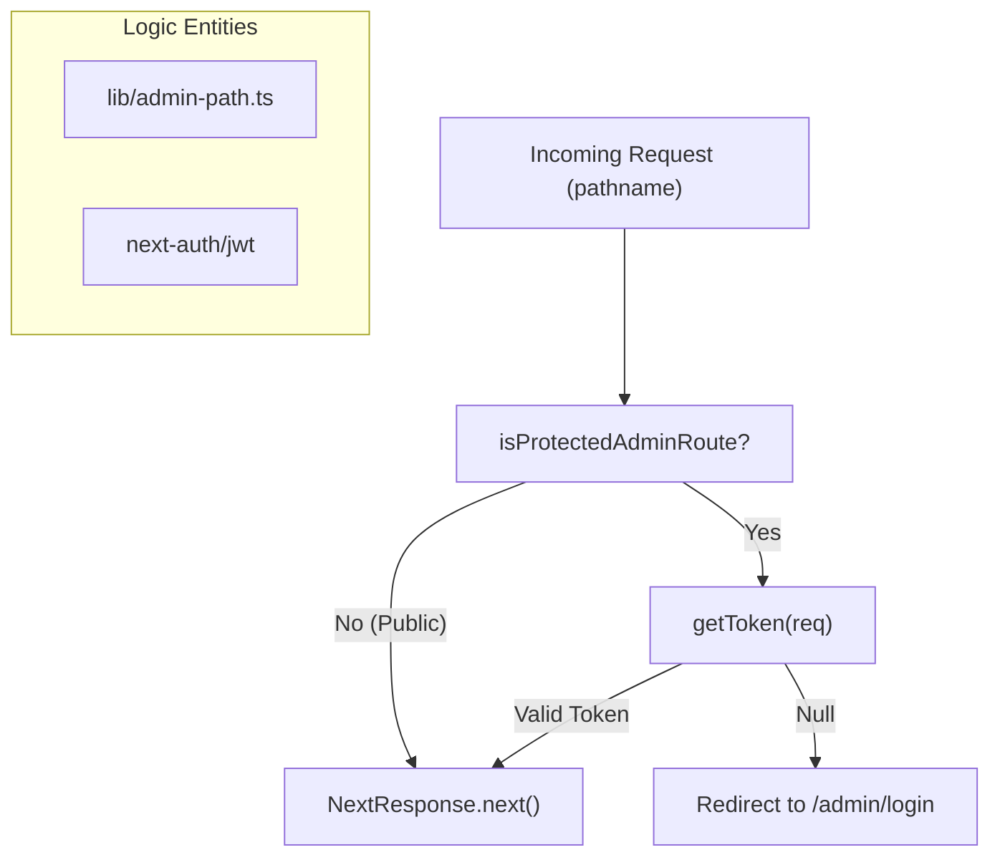

# Authentication and Authorization
Relevant source files

- [src/app/(admin)/admin/login/page.tsx](https://github.com/ravichandola/personal-branding/blob/3a440ccd/src/app/%28admin%29/admin/login/page.tsx)
- [src/app/api/auth/[...nextauth]/route.ts](https://github.com/ravichandola/personal-branding/blob/3a440ccd/src/app/api/auth/%5B...nextauth%5D/route.ts)
- [src/auth.config.ts](https://github.com/ravichandola/personal-branding/blob/3a440ccd/src/auth.config.ts)
- [src/auth.ts](https://github.com/ravichandola/personal-branding/blob/3a440ccd/src/auth.ts)
- [src/components/layout/session-provider.tsx](https://github.com/ravichandola/personal-branding/blob/3a440ccd/src/components/layout/session-provider.tsx)
- [src/features/admin/login-form.tsx](https://github.com/ravichandola/personal-branding/blob/3a440ccd/src/features/admin/login-form.tsx)
- [src/features/admin/sign-out-action.ts](https://github.com/ravichandola/personal-branding/blob/3a440ccd/src/features/admin/sign-out-action.ts)
- [src/middleware.ts](https://github.com/ravichandola/personal-branding/blob/3a440ccd/src/middleware.ts)

This section details the security architecture of the personal-branding platform. The system utilizes Auth.js (NextAuth.js) v5 to manage identity and access control, specifically protecting the `/admin` route group while maintaining public access to the portfolio site.

## Core Authentication Architecture

The platform implements a hybrid authentication strategy supporting both OAuth 2.0 and traditional credentials. The architecture is built on the `PrismaAdapter` to persist user sessions and account data in the PostgreSQL database.

### Auth.js Configuration

The configuration is split into two main files to support Edge-compatible middleware and standard Node.js environments:

1. `src/auth.config.ts`: Contains environment-agnostic settings such as session strategies, callbacks, and basic route protection logic [src/auth.config.ts#7-56](https://github.com/ravichandola/personal-branding/blob/3a440ccd/src/auth.config.ts#L7-L56)
2. `src/auth.ts`: Extends the base config with concrete providers (Google, Credentials) and the `PrismaAdapter`[src/auth.ts#15-98](https://github.com/ravichandola/personal-branding/blob/3a440ccd/src/auth.ts#L15-L98)

### Identity Providers

| Provider | Implementation Detail | Purpose |
| --- | --- | --- |
| Google OAuth | Configured via `GoogleProvider`. Includes an `adminAllowlist` check [src/auth.config.ts#40-52](https://github.com/ravichandola/personal-branding/blob/3a440ccd/src/auth.config.ts#L40-L52) | Primary login for operators and editors. |
| Credentials | Uses `bcryptjs` for hash verification and `zod` for input validation [src/auth.ts#37-77](https://github.com/ravichandola/personal-branding/blob/3a440ccd/src/auth.ts#L37-L77) | "Break-glass" admin access using email/password. |

### Authentication Data Flow

The following diagram illustrates the flow from a login request to a signed JWT session.

Authentication and Session Flow

Sources: [src/auth.ts#43-77](https://github.com/ravichandola/personal-branding/blob/3a440ccd/src/auth.ts#L43-L77)[src/auth.ts#83-94](https://github.com/ravichandola/personal-branding/blob/3a440ccd/src/auth.ts#L83-L94)[src/features/admin/login-form.tsx#47-62](https://github.com/ravichandola/personal-branding/blob/3a440ccd/src/features/admin/login-form.tsx#L47-L62)

## Authorization and Role Management

The system distinguishes between public visitors and authenticated administrators using a role-based access control (RBAC) mechanism embedded within the JWT.

### Role Embedding

During the authentication lifecycle, the `jwt` callback extracts the `role` (e.g., `ADMIN`, `EDITOR`) from the database user record and persists it into the token [src/auth.ts#84-87](https://github.com/ravichandola/personal-branding/blob/3a440ccd/src/auth.ts#L84-L87) The `session` callback then makes this role available to the client and server components by mapping `token.role` to `session.user.role`[src/auth.config.ts#31-38](https://github.com/ravichandola/personal-branding/blob/3a440ccd/src/auth.config.ts#L31-L38)

### Route Guarding (Middleware)

Access control is enforced at the edge via `src/middleware.ts`. The middleware uses a matcher to intercept all requests under `/admin/:path*`[src/middleware.ts#31-33](https://github.com/ravichandola/personal-branding/blob/3a440ccd/src/middleware.ts#L31-L33)

Middleware Guard Logic

Sources: [src/middleware.ts#7-29](https://github.com/ravichandola/personal-branding/blob/3a440ccd/src/middleware.ts#L7-L29)[src/auth.config.ts#19-29](https://github.com/ravichandola/personal-branding/blob/3a440ccd/src/auth.config.ts#L19-L29)

## Implementation Details

### Credentials Provider

The credentials provider performs strict validation using `zod` before querying the database. It specifically checks for the existence of a `passwordHash` to prevent unauthorized login attempts against OAuth-only accounts [src/auth.ts#57-59](https://github.com/ravichandola/personal-branding/blob/3a440ccd/src/auth.ts#L57-L59)

### Google OAuth Allowlist

To prevent arbitrary Google users from accessing the admin panel, the `signIn` callback references an `ALLOWED_ADMIN_EMAILS` environment variable [src/auth.config.ts#3-5](https://github.com/ravichandola/personal-branding/blob/3a440ccd/src/auth.config.ts#L3-L5) If the list is empty, it allows first-time bootstrap in production, but otherwise strictly enforces the allowlist [src/auth.config.ts#44-49](https://github.com/ravichandola/personal-branding/blob/3a440ccd/src/auth.config.ts#L44-L49)

### Login and Sign-out Flows

- Login: Handled by the `AuthForm` component, which uses `signIn` from `next-auth/react`. It supports both a redirect-based Google flow and a manual credential submission with error handling [src/features/admin/login-form.tsx#10-67](https://github.com/ravichandola/personal-branding/blob/3a440ccd/src/features/admin/login-form.tsx#L10-L67)
- Sign-out: Executed via the `signOutAdminAction` server action, which triggers the Auth.js `signOut` function and redirects the user back to the login page [src/features/admin/sign-out-action.ts#5-7](https://github.com/ravichandola/personal-branding/blob/3a440ccd/src/features/admin/sign-out-action.ts#L5-L7)

### Session Provider

The `SessionProviderWrapper` is a client component that wraps the application (within `AppProviders`), enabling the use of the `useSession` hook throughout the UI [src/components/layout/session-provider.tsx#7-9](https://github.com/ravichandola/personal-branding/blob/3a440ccd/src/components/layout/session-provider.tsx#L7-L9)

| Function/Entity | File Path | Role |
| --- | --- | --- |
| `auth()` | `src/auth.ts` | Server-side session retrieval. |
| `middleware()` | `src/middleware.ts` | Edge-level route protection. |
| `authorize()` | `src/auth.ts` | Credentials verification logic. |
| `jwt()` | `src/auth.ts` | Token augmentation with user roles. |
| `AuthForm` | `src/features/admin/login-form.tsx` | UI for authentication. |

Sources: [src/auth.ts#15-20](https://github.com/ravichandola/personal-branding/blob/3a440ccd/src/auth.ts#L15-L20)[src/middleware.ts#7-29](https://github.com/ravichandola/personal-branding/blob/3a440ccd/src/middleware.ts#L7-L29)[src/auth.ts#43-77](https://github.com/ravichandola/personal-branding/blob/3a440ccd/src/auth.ts#L43-L77)[src/auth.ts#83-94](https://github.com/ravichandola/personal-branding/blob/3a440ccd/src/auth.ts#L83-L94)[src/features/admin/login-form.tsx#10-67](https://github.com/ravichandola/personal-branding/blob/3a440ccd/src/features/admin/login-form.tsx#L10-L67)