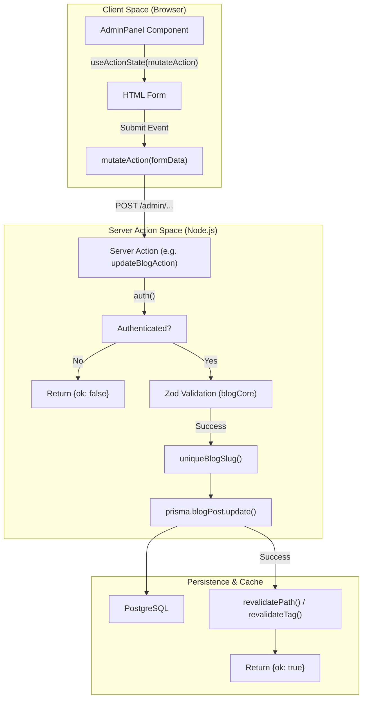
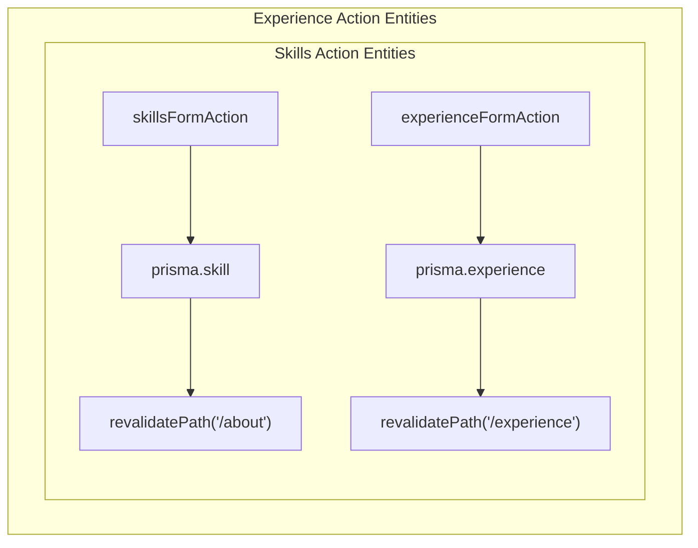

# Content Management Actions
Relevant source files

- [src/app/(admin)/admin/skills/page.tsx](https://github.com/ravichandola/personal-branding/blob/3a440ccd/src/app/%28admin%29/admin/skills/page.tsx)
- [src/app/(site)/blogs/[slug]/page.tsx](https://github.com/ravichandola/personal-branding/blob/3a440ccd/src/app/%28site%29/blogs/%5Bslug%5D/page.tsx)
- [src/features/admin/actions/blogs.ts](https://github.com/ravichandola/personal-branding/blob/3a440ccd/src/features/admin/actions/blogs.ts)
- [src/features/admin/actions/contacts.ts](https://github.com/ravichandola/personal-branding/blob/3a440ccd/src/features/admin/actions/contacts.ts)
- [src/features/admin/actions/experience.ts](https://github.com/ravichandola/personal-branding/blob/3a440ccd/src/features/admin/actions/experience.ts)
- [src/features/admin/actions/projects.ts](https://github.com/ravichandola/personal-branding/blob/3a440ccd/src/features/admin/actions/projects.ts)
- [src/features/admin/actions/site-settings.ts](https://github.com/ravichandola/personal-branding/blob/3a440ccd/src/features/admin/actions/site-settings.ts)
- [src/features/admin/actions/skills.ts](https://github.com/ravichandola/personal-branding/blob/3a440ccd/src/features/admin/actions/skills.ts)
- [src/features/admin/actions/upload-avatar.ts](https://github.com/ravichandola/personal-branding/blob/3a440ccd/src/features/admin/actions/upload-avatar.ts)
- [src/features/admin/home-spotlights-admin.tsx](https://github.com/ravichandola/personal-branding/blob/3a440ccd/src/features/admin/home-spotlights-admin.tsx)
- [src/features/blog/blogs-page-client.tsx](https://github.com/ravichandola/personal-branding/blob/3a440ccd/src/features/blog/blogs-page-client.tsx)
- [src/lib/cloudinary-server.ts](https://github.com/ravichandola/personal-branding/blob/3a440ccd/src/lib/cloudinary-server.ts)

This page documents the Server Actions responsible for content mutations within the Admin CMS. These actions handle data validation, persistence via Prisma, cache revalidation, and external service integrations (e.g., Cloudinary).

## Overview

All administrative mutations are implemented as Next.js Server Actions located in `src/features/admin/actions/`. They follow a consistent pattern:

1. Authentication Check: Verifying the session via `auth()`[src/features/admin/actions/blogs.ts#72-73](https://github.com/ravichandola/personal-branding/blob/3a440ccd/src/features/admin/actions/blogs.ts#L72-L73)
2. Validation: Using `zod` schemas to validate `FormData`[src/features/admin/actions/blogs.ts#75-87](https://github.com/ravichandola/personal-branding/blob/3a440ccd/src/features/admin/actions/blogs.ts#L75-L87)
3. Data Transformation: Handling slugs, date parsing, and content stubs [src/features/admin/actions/blogs.ts#91-94](https://github.com/ravichandola/personal-branding/blob/3a440ccd/src/features/admin/actions/blogs.ts#L91-L94)
4. Persistence: Executing Prisma operations [src/features/admin/actions/blogs.ts#97-109](https://github.com/ravichandola/personal-branding/blob/3a440ccd/src/features/admin/actions/blogs.ts#L97-L109)
5. Revalidation: Purging Next.js data caches and tags to reflect changes immediately [src/features/admin/actions/blogs.ts#110-113](https://github.com/ravichandola/personal-branding/blob/3a440ccd/src/features/admin/actions/blogs.ts#L110-L113)

### Data Flow: Admin UI to Database

The following diagram illustrates the flow of a content update from the React client to the PostgreSQL database.

Mutation Data Flow

Sources:[src/features/admin/actions/blogs.ts#59-118](https://github.com/ravichandola/personal-branding/blob/3a440ccd/src/features/admin/actions/blogs.ts#L59-L118)[src/features/admin/home-spotlights-admin.tsx#36-46](https://github.com/ravichandola/personal-branding/blob/3a440ccd/src/features/admin/home-spotlights-admin.tsx#L36-L46)

---

## Blog Actions

Blog actions manage `BlogPost` entities. A key feature is the enforcement of slug uniqueness and the generation of content stubs for Medium-hosted articles.

### Slug Uniqueness

The `uniqueBlogSlug` function ensures no two posts share the same URL identifier. It takes a base string, converts it to a URL-friendly format using `slugify`, and appends an incrementing integer if a collision is detected in the database [src/features/admin/actions/blogs.ts#23-34](https://github.com/ravichandola/personal-branding/blob/3a440ccd/src/features/admin/actions/blogs.ts#L23-L34)

### Core Logic

- Create/Update: Validates the `mediumUrl` to ensure it is a valid Medium link [src/features/admin/actions/blogs.ts#56](https://github.com/ravichandola/personal-branding/blob/3a440ccd/src/features/admin/actions/blogs.ts#L56-L56) If valid, it generates a "stub" content string pointing to the external article [src/features/admin/actions/blogs.ts#36-38](https://github.com/ravichandola/personal-branding/blob/3a440ccd/src/features/admin/actions/blogs.ts#L36-L38)
- Revalidation: Uses `revalidateTag(BLOGS_LIST_CACHE_TAG)` to update the public blog listing and `revalidatePath` for specific detail pages [src/features/admin/actions/blogs.ts#110-113](https://github.com/ravichandola/personal-branding/blob/3a440ccd/src/features/admin/actions/blogs.ts#L110-L113)

| Function | Intent | File |
| --- | --- | --- |
| `blogsFormAction` | Entry point for Create/Update | [src/features/admin/actions/blogs.ts#59](https://github.com/ravichandola/personal-branding/blob/3a440ccd/src/features/admin/actions/blogs.ts#L59-L59) |
| `createBlogAction` | Persistence of new posts | [src/features/admin/actions/blogs.ts#68](https://github.com/ravichandola/personal-branding/blob/3a440ccd/src/features/admin/actions/blogs.ts#L68-L68) |
| `updateBlogAction` | Modification of existing posts | [src/features/admin/actions/blogs.ts#120](https://github.com/ravichandola/personal-branding/blob/3a440ccd/src/features/admin/actions/blogs.ts#L120-L120) |
| `deleteBlogAction` | Removal and cache purging | [src/features/admin/actions/blogs.ts#181](https://github.com/ravichandola/personal-branding/blob/3a440ccd/src/features/admin/actions/blogs.ts#L181-L181) |

Sources:[src/features/admin/actions/blogs.ts#1-203](https://github.com/ravichandola/personal-branding/blob/3a440ccd/src/features/admin/actions/blogs.ts#L1-L203)

---

## Experience and Skills Actions

These actions manage the professional timeline and technical proficiency data shown on the "About" and "Experience" pages.

### Experience Logic

Experience entries require strict date parsing. The `parseDateInput` helper converts `YYYY-MM-DD` strings from the form into JavaScript `Date` objects, validating that end dates do not precede start dates [src/features/admin/actions/experience.ts#24-44](https://github.com/ravichandola/personal-branding/blob/3a440ccd/src/features/admin/actions/experience.ts#L24-L44) Achievements and technologies are split from textareas into arrays using `splitLines` and `splitTech`[src/features/admin/actions/experience.ts#46-64](https://github.com/ravichandola/personal-branding/blob/3a440ccd/src/features/admin/actions/experience.ts#L46-L64)

### Skills Logic

Skills are categorized by `SkillBucket` (an enum). The action validates `proficiency` (0-100) and `years` of experience [src/features/admin/actions/skills.ts#15-19](https://github.com/ravichandola/personal-branding/blob/3a440ccd/src/features/admin/actions/skills.ts#L15-L19) It also generates unique slugs for skill detail filtering [src/features/admin/actions/skills.ts#39-49](https://github.com/ravichandola/personal-branding/blob/3a440ccd/src/features/admin/actions/skills.ts#L39-L49)

Entity Management Mapping

Sources:[src/features/admin/actions/experience.ts#78-160](https://github.com/ravichandola/personal-branding/blob/3a440ccd/src/features/admin/actions/experience.ts#L78-L160)[src/features/admin/actions/skills.ts#51-106](https://github.com/ravichandola/personal-branding/blob/3a440ccd/src/features/admin/actions/skills.ts#L51-L106)

---

## Site Settings and Profile

The `site-settings.ts` action manages global configuration and the owner's profile data.

### Profile and Stats

The `saveAdminProfileAction` handles the biography, rotating hero titles, and the numerical "impact stats" (e.g., Years of Experience, Projects Completed) displayed on the homepage [src/features/admin/actions/site-settings.ts#103-160](https://github.com/ravichandola/personal-branding/blob/3a440ccd/src/features/admin/actions/site-settings.ts#L103-L160)

### Global Settings

The `saveAdminSettingsAction` uses a `prisma.settings.upsert` with a hardcoded ID of `"default"` to ensure only one global settings record exists [src/features/admin/actions/site-settings.ts#233-247](https://github.com/ravichandola/personal-branding/blob/3a440ccd/src/features/admin/actions/site-settings.ts#L233-L247) This record stores SEO metadata, social links, and the Google Analytics ID.

Sources:[src/features/admin/actions/site-settings.ts#1-250](https://github.com/ravichandola/personal-branding/blob/3a440ccd/src/features/admin/actions/site-settings.ts#L1-L250)

---

## Media and Avatar Upload

Avatar management integrates with Cloudinary for storage.

### Cloudinary Integration

1. Upload Action: `uploadProfileAvatarAction` validates the file size (max 4MB) and MIME type [src/features/admin/actions/upload-avatar.ts#26-32](https://github.com/ravichandola/personal-branding/blob/3a440ccd/src/features/admin/actions/upload-avatar.ts#L26-L32)
2. Server Utility: `uploadImageBuffer` in `src/lib/cloudinary-server.ts` converts the file to a Base64 Data URI and transmits it to Cloudinary using the `cloudinary.uploader.upload` SDK [src/lib/cloudinary-server.ts#29-72](https://github.com/ravichandola/personal-branding/blob/3a440ccd/src/lib/cloudinary-server.ts#L29-L72)
3. Configuration: Environment variables (`CLOUDINARY_CLOUD_NAME`, etc.) are checked before every upload [src/lib/cloudinary-server.ts#6-15](https://github.com/ravichandola/personal-branding/blob/3a440ccd/src/lib/cloudinary-server.ts#L6-L15)

Sources:[src/features/admin/actions/upload-avatar.ts#12-44](https://github.com/ravichandola/personal-branding/blob/3a440ccd/src/features/admin/actions/upload-avatar.ts#L12-L44)[src/lib/cloudinary-server.ts#1-73](https://github.com/ravichandola/personal-branding/blob/3a440ccd/src/lib/cloudinary-server.ts#L1-L73)

---

## Other Content Actions

| Feature | Action File | Description |
| --- | --- | --- |
| Projects | `projects.ts` | Handles project metadata, GitHub URLs, and `ProjectCategoryCode` relations [src/features/admin/actions/projects.ts#101-184](https://github.com/ravichandola/personal-branding/blob/3a440ccd/src/features/admin/actions/projects.ts#L101-L184) |
| Spotlights | `home-spotlights.ts` | Manages the three featured cards on the homepage, including `sortOrder` and `narrative` text [src/features/admin/home-spotlights-admin.tsx#11-23](https://github.com/ravichandola/personal-branding/blob/3a440ccd/src/features/admin/home-spotlights-admin.tsx#L11-L23) |
| Contacts | `contacts.ts` | Allows admins to update the `ContactStatus` (e.g., READ, ARCHIVED) or delete inquiries [src/features/admin/actions/contacts.ts#16-59](https://github.com/ravichandola/personal-branding/blob/3a440ccd/src/features/admin/actions/contacts.ts#L16-L59) |

Sources:[src/features/admin/actions/projects.ts#1-230](https://github.com/ravichandola/personal-branding/blob/3a440ccd/src/features/admin/actions/projects.ts#L1-L230)[src/features/admin/actions/contacts.ts#1-60](https://github.com/ravichandola/personal-branding/blob/3a440ccd/src/features/admin/actions/contacts.ts#L1-L60)[src/features/admin/home-spotlights-admin.tsx#1-46](https://github.com/ravichandola/personal-branding/blob/3a440ccd/src/features/admin/home-spotlights-admin.tsx#L1-L46)