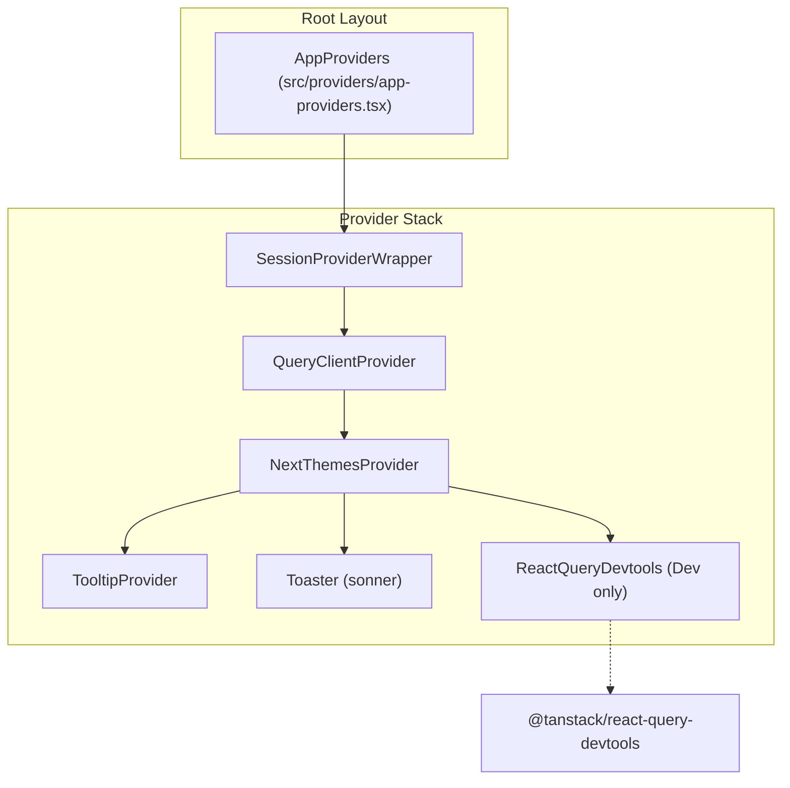
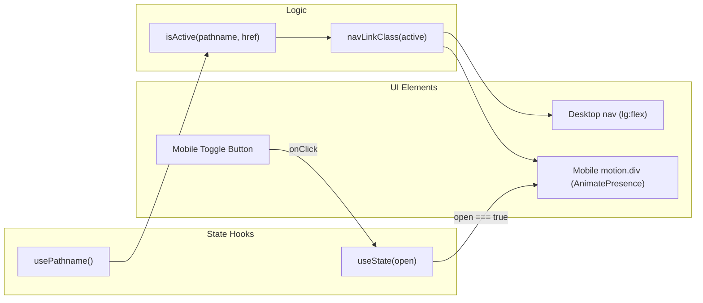

# Layout and Navigation Components
Relevant source files

- [src/components/layout/session-provider.tsx](https://github.com/ravichandola/personal-branding/blob/3a440ccd/src/components/layout/session-provider.tsx)
- [src/components/layout/site-footer.tsx](https://github.com/ravichandola/personal-branding/blob/3a440ccd/src/components/layout/site-footer.tsx)
- [src/components/layout/site-navbar.tsx](https://github.com/ravichandola/personal-branding/blob/3a440ccd/src/components/layout/site-navbar.tsx)
- [src/components/layout/social-icons.tsx](https://github.com/ravichandola/personal-branding/blob/3a440ccd/src/components/layout/social-icons.tsx)
- [src/components/layout/theme-toggle.tsx](https://github.com/ravichandola/personal-branding/blob/3a440ccd/src/components/layout/theme-toggle.tsx)
- [src/providers/app-providers.tsx](https://github.com/ravichandola/personal-branding/blob/3a440ccd/src/providers/app-providers.tsx)

This section provides a technical deep dive into the global UI framework of the personal branding platform. It covers the primary navigation systems, persistent layout elements, and the dependency injection layer that provides global state and context to the application.

## AppProviders and Global Context

The application's root is wrapped in `AppProviders`, which orchestrates the initialization of various client-side contexts. This wrapper ensures that state management, theming, notifications, and authentication sessions are available throughout the component tree [src/providers/app-providers.tsx#38-71](https://github.com/ravichandola/personal-branding/blob/3a440ccd/src/providers/app-providers.tsx#L38-L71)

### Context Stack Composition

| Provider | Library | Purpose |
| --- | --- | --- |
| `SessionProviderWrapper` | `next-auth` | Manages authentication state and JWT session availability [src/components/layout/session-provider.tsx#7-9](https://github.com/ravichandola/personal-branding/blob/3a440ccd/src/components/layout/session-provider.tsx#L7-L9) |
| `QueryClientProvider` | `@tanstack/react-query` | Handles server-state caching with a default `staleTime` of 60 seconds [src/providers/app-providers.tsx#41-51](https://github.com/ravichandola/personal-branding/blob/3a440ccd/src/providers/app-providers.tsx#L41-L51) |
| `NextThemesProvider` | `next-themes` | Manages dark/light mode with system preference syncing and local storage persistence [src/providers/app-providers.tsx#56-61](https://github.com/ravichandola/personal-branding/blob/3a440ccd/src/providers/app-providers.tsx#L56-L61) |
| `TooltipProvider` | `@radix-ui/react-tooltip` | Global configuration for Radix-based tooltips [src/providers/app-providers.tsx#62](https://github.com/ravichandola/personal-branding/blob/3a440ccd/src/providers/app-providers.tsx#L62-L62) |
| `Toaster` | `sonner` | Handles toast notifications with `richColors` enabled [src/providers/app-providers.tsx#63](https://github.com/ravichandola/personal-branding/blob/3a440ccd/src/providers/app-providers.tsx#L63-L63) |

Component Hierarchy Diagram
"Contextual Architecture"

Sources: [src/providers/app-providers.tsx#1-72](https://github.com/ravichandola/personal-branding/blob/3a440ccd/src/providers/app-providers.tsx#L1-L72)[src/components/layout/session-provider.tsx#1-10](https://github.com/ravichandola/personal-branding/blob/3a440ccd/src/components/layout/session-provider.tsx#L1-L10)

---

## SiteNavbar

The `SiteNavbar` is a responsive, sticky header component. It implements complex active-state logic and a mobile-specific overlay using `framer-motion`.

### Navigation Configuration

Navigation links are defined in a central constant `navLinks`, ensuring consistency between the header, mobile menu, and footer [src/components/layout/site-navbar.tsx#17-24](https://github.com/ravichandola/personal-branding/blob/3a440ccd/src/components/layout/site-navbar.tsx#L17-L24)

### Active State Logic

The navbar uses a custom `isActive` utility to determine if a link should be highlighted. A link is considered active if the current `pathname` exactly matches the `href`, or if the current path starts with the `href` (excluding the root `/`) [src/components/layout/site-navbar.tsx#34-36](https://github.com/ravichandola/personal-branding/blob/3a440ccd/src/components/layout/site-navbar.tsx#L34-L36)

### Mobile Overlay

The mobile menu is toggled via a state variable `open`[src/components/layout/site-navbar.tsx#40](https://github.com/ravichandola/personal-branding/blob/3a440ccd/src/components/layout/site-navbar.tsx#L40-L40) It uses `AnimatePresence` and `motion.div` from `framer-motion` to animate the entrance and exit of the navigation drawer [src/components/layout/site-navbar.tsx#135-168](https://github.com/ravichandola/personal-branding/blob/3a440ccd/src/components/layout/site-navbar.tsx#L135-L168)

Navigation Logic Flow
"SiteNavbar State and Routing"

Sources: [src/components/layout/site-navbar.tsx#26-44](https://github.com/ravichandola/personal-branding/blob/3a440ccd/src/components/layout/site-navbar.tsx#L26-L44)[src/components/layout/site-navbar.tsx#135-142](https://github.com/ravichandola/personal-branding/blob/3a440ccd/src/components/layout/site-navbar.tsx#L135-L142)

---

## SiteFooter

The `SiteFooter` provides secondary navigation and brand reinforcement. It uses a gradient background and decorative blur elements to maintain the site's aesthetic [src/components/layout/site-footer.tsx#30-47](https://github.com/ravichandola/personal-branding/blob/3a440ccd/src/components/layout/site-footer.tsx#L30-L47)

### Layout Features

- Dynamic Link Splitting: The `navLinks` array is automatically split into two columns for the footer layout [src/components/layout/site-footer.tsx#23-26](https://github.com/ravichandola/personal-branding/blob/3a440ccd/src/components/layout/site-footer.tsx#L23-L26)
- Contextual CTAs: The "Start a conversation" button is conditionally hidden if the user is already on the `/contact` page [src/components/layout/site-footer.tsx#66-77](https://github.com/ravichandola/personal-branding/blob/3a440ccd/src/components/layout/site-footer.tsx#L66-L77)
- Elsewhere Section: Integrates `SocialIcons` to provide links to external profiles [src/components/layout/site-footer.tsx#139-141](https://github.com/ravichandola/personal-branding/blob/3a440ccd/src/components/layout/site-footer.tsx#L139-L141)

Sources: [src/components/layout/site-footer.tsx#18-155](https://github.com/ravichandola/personal-branding/blob/3a440ccd/src/components/layout/site-footer.tsx#L18-L155)

---

## Shared Layout Utilities

### SocialIcons

A reusable component that renders social media links. It supports two distinct visual styles via the `surface` prop:

1. "default": Larger tiles used in the footer and about sections [src/components/layout/social-icons.tsx#29](https://github.com/ravichandola/personal-branding/blob/3a440ccd/src/components/layout/social-icons.tsx#L29-L29)
2. "header": Compact, square tiles designed for the sticky navigation bar [src/components/layout/social-icons.tsx#27-28](https://github.com/ravichandola/personal-branding/blob/3a440ccd/src/components/layout/social-icons.tsx#L27-L28)

Sources: [src/components/layout/social-icons.tsx#12-32](https://github.com/ravichandola/personal-branding/blob/3a440ccd/src/components/layout/social-icons.tsx#L12-L32)

### ThemeToggle

The `ThemeToggle` component interacts with `next-themes` to cycle through `light`, `dark`, and `system` modes [src/components/layout/theme-toggle.tsx#15-17](https://github.com/ravichandola/personal-branding/blob/3a440ccd/src/components/layout/theme-toggle.tsx#L15-L17)

- Hydration Safety: It uses a `mounted` state check to avoid server-side rendering mismatches of the theme icon [src/components/layout/theme-toggle.tsx#29-34](https://github.com/ravichandola/personal-branding/blob/3a440ccd/src/components/layout/theme-toggle.tsx#L29-L34)
- Cycle Logic: Clicking the button advances the theme index: `modes[(index + 1) % modes.length]`[src/components/layout/theme-toggle.tsx#55-56](https://github.com/ravichandola/personal-branding/blob/3a440ccd/src/components/layout/theme-toggle.tsx#L55-L56)
- Compact Mode: When `compact={true}`, it renders as a small square button suitable for the `SiteNavbar`[src/components/layout/theme-toggle.tsx#73-74](https://github.com/ravichandola/personal-branding/blob/3a440ccd/src/components/layout/theme-toggle.tsx#L73-L74)

Sources: [src/components/layout/theme-toggle.tsx#19-92](https://github.com/ravichandola/personal-branding/blob/3a440ccd/src/components/layout/theme-toggle.tsx#L19-L92)