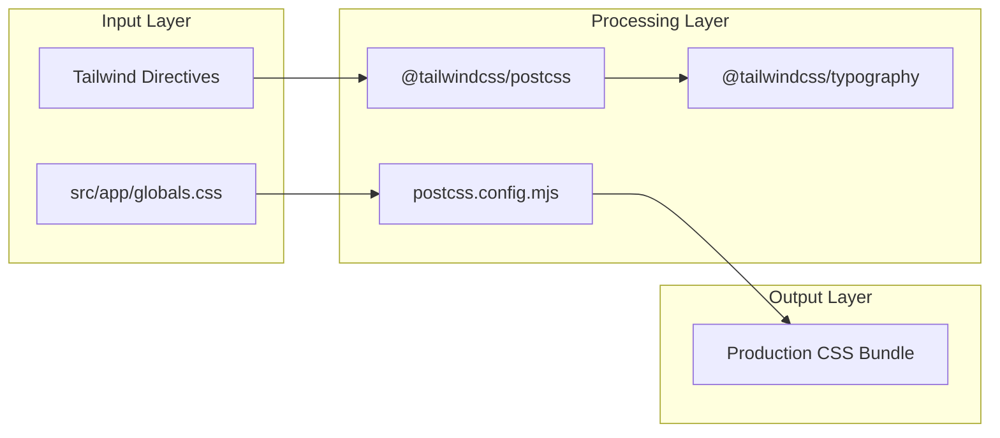
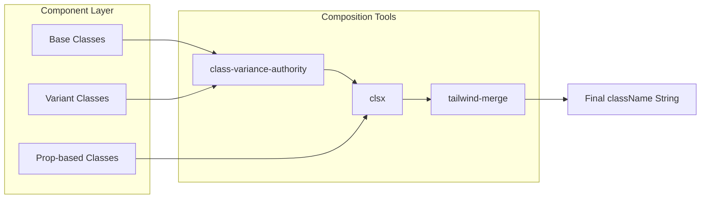

# Styling System
Relevant source files

- [AGENTS.md](https://github.com/ravichandola/personal-branding/blob/3a440ccd/AGENTS.md?plain=1)
- [CLAUDE.md](https://github.com/ravichandola/personal-branding/blob/3a440ccd/CLAUDE.md?plain=1)
- [package-lock.json](https://github.com/ravichandola/personal-branding/blob/3a440ccd/package-lock.json)
- [postcss.config.mjs](https://github.com/ravichandola/personal-branding/blob/3a440ccd/postcss.config.mjs)
- [public/file.svg](https://github.com/ravichandola/personal-branding/blob/3a440ccd/public/file.svg)
- [public/globe.svg](https://github.com/ravichandola/personal-branding/blob/3a440ccd/public/globe.svg)
- [src/app/globals.css](https://github.com/ravichandola/personal-branding/blob/3a440ccd/src/app/globals.css)
- [src/app/layout.tsx](https://github.com/ravichandola/personal-branding/blob/3a440ccd/src/app/layout.tsx)

The styling system for the personal-branding platform is built on Tailwind CSS v4, utilizing a PostCSS pipeline and a modern "charcoal and accent" design language. The system emphasizes performance through native CSS variables, efficient font loading via Next.js Font, and type-safe component styling using `class-variance-authority`.

## PostCSS and Tailwind Pipeline

The project uses the `@tailwindcss/postcss` plugin to process styles [postcss.config.mjs#1-7](https://github.com/ravichandola/personal-branding/blob/3a440ccd/postcss.config.mjs#L1-L7) This integration allows Tailwind to function as a CSS-in-JS alternative while maintaining the performance benefits of a build-time CSS generator. The configuration imports Tailwind and the official typography plugin directly within the global CSS entry point [src/app/globals.css#1-3](https://github.com/ravichandola/personal-branding/blob/3a440ccd/src/app/globals.css#L1-L3)

### Build Pipeline Flow

The following diagram illustrates how raw CSS and configuration are transformed into the final production bundle.

CSS Transformation Pipeline

Sources:[postcss.config.mjs#1-7](https://github.com/ravichandola/personal-branding/blob/3a440ccd/postcss.config.mjs#L1-L7)[src/app/globals.css#1-3](https://github.com/ravichandola/personal-branding/blob/3a440ccd/src/app/globals.css#L1-L3)[package-lock.json#69-70](https://github.com/ravichandola/personal-branding/blob/3a440ccd/package-lock.json#L69-L70)

---

## Global Styles and Variables

The system defines a custom color palette inspired by "Frontend-Masters" aesthetics, characterized by charcoal surfaces and single-accent highlights [src/app/globals.css#5](https://github.com/ravichandola/personal-branding/blob/3a440ccd/src/app/globals.css#L5-L5)

### CSS Variables (Theming)

The design system relies on CSS variables for semantic tokens, which are swapped based on the `.dark` class presence [src/app/globals.css#7-24](https://github.com/ravichandola/personal-branding/blob/3a440ccd/src/app/globals.css#L7-L24)

| Variable | Light Mode (Default) | Dark Mode (`.dark`) | Purpose |
| --- | --- | --- | --- |
| `--fm-bg` | `#fafaf9` | `#0c0d10` | Primary background surface |
| `--fm-fg` | `#18181b` | `#fafafa` | Primary text color |
| `--fm-muted` | `#71717a` | `#a1a1aa` | Muted text and secondary icons |
| `--fm-border` | `rgba(24, 24, 27, 0.12)` | `rgba(255, 255, 255, 0.08)` | Subtle borders and dividers |
| `--fm-accent` | `#c2410c` | `#ea580c` | Brand accent (Orange) |

Sources:[src/app/globals.css#7-24](https://github.com/ravichandola/personal-branding/blob/3a440ccd/src/app/globals.css#L7-L24)

### Global Base Styles

The `@layer base` block defines fundamental behaviors:

- Smooth Scrolling: Enabled globally with a `5.5rem` top padding to account for the fixed navbar [src/app/globals.css#34-35](https://github.com/ravichandola/personal-branding/blob/3a440ccd/src/app/globals.css#L34-L35)
- Background Gradients: A radial gradient is applied to the body to provide depth, subtly shifting in intensity between light and dark modes [src/app/globals.css#51-68](https://github.com/ravichandola/personal-branding/blob/3a440ccd/src/app/globals.css#L51-L68)
- Selection: Custom selection colors using the accent variable with transparency [src/app/globals.css#70-78](https://github.com/ravichandola/personal-branding/blob/3a440ccd/src/app/globals.css#L70-L78)

Sources:[src/app/globals.css#31-79](https://github.com/ravichandola/personal-branding/blob/3a440ccd/src/app/globals.css#L31-L79)

---

## Typography and Fonts

The system utilizes `next/font/google` to optimize font loading and prevent Layout Shift (CLS) by using CSS variables as font-family overrides.

### Font Configuration

Two primary fonts are defined in the root layout:

1. Space Grotesk (`space`): Assigned to the `--font-sans-variable`. Used for headings and primary UI text [src/app/layout.tsx#23-27](https://github.com/ravichandola/personal-branding/blob/3a440ccd/src/app/layout.tsx#L23-L27)
2. JetBrains Mono (`mono`): Assigned to the `--font-mono-variable`. Used for code blocks and technical metadata [src/app/layout.tsx#29-33](https://github.com/ravichandola/personal-branding/blob/3a440ccd/src/app/layout.tsx#L29-L33)

These variables are mapped to Tailwind theme tokens within `globals.css`[src/app/globals.css#26-29](https://github.com/ravichandola/personal-branding/blob/3a440ccd/src/app/globals.css#L26-L29) and applied to the `body` tag in the layout [src/app/layout.tsx#45](https://github.com/ravichandola/personal-branding/blob/3a440ccd/src/app/layout.tsx#L45-L45)

Sources:[src/app/layout.tsx#5-6](https://github.com/ravichandola/personal-branding/blob/3a440ccd/src/app/layout.tsx#L5-L6)[src/app/layout.tsx#23-33](https://github.com/ravichandola/personal-branding/blob/3a440ccd/src/app/layout.tsx#L23-L33)[src/app/globals.css#26-29](https://github.com/ravichandola/personal-branding/blob/3a440ccd/src/app/globals.css#L26-L29)

---

## Utility Patterns

The codebase extends Tailwind with custom `@utility` definitions to maintain consistency across complex UI elements [src/app/globals.css#81-95](https://github.com/ravichandola/personal-branding/blob/3a440ccd/src/app/globals.css#L81-L95)

### Defined Utilities

- `glass-panel`: Applies a backdrop blur, semi-transparent background, and subtle borders for floating UI elements [src/app/globals.css#81-83](https://github.com/ravichandola/personal-branding/blob/3a440ccd/src/app/globals.css#L81-L83)
- `fm-surface`: The standard container style for cards and sections, providing a distinct background from the body [src/app/globals.css#93-95](https://github.com/ravichandola/personal-branding/blob/3a440ccd/src/app/globals.css#L93-L95)
- `text-gradient-accent`: Maps semantic text to the brand's orange accent colors across modes [src/app/globals.css#89-91](https://github.com/ravichandola/personal-branding/blob/3a440ccd/src/app/globals.css#L89-L91)

Sources:[src/app/globals.css#81-96](https://github.com/ravichandola/personal-branding/blob/3a440ccd/src/app/globals.css#L81-L96)

---

## Conditional Class Composition

To manage dynamic styling and component variants, the project uses a combination of `clsx`, `tailwind-merge`, and `class-variance-authority` (CVA).

### The `cn` Utility

The `cn` helper (typically found in `src/lib/utils.ts`, though implemented via dependencies) combines `clsx` for conditional logic and `tailwind-merge` to ensure that the last class provided overrides previous ones (e.g., resolving `px-2 px-4` to `px-4`).

### Component Variants (CVA)

Complex components use `class-variance-authority` to define structured variants. This allows for type-safe props like `size` or `variant` to be mapped directly to Tailwind classes.

Styling Logic Architecture

Sources:[package-lock.json#36](https://github.com/ravichandola/personal-branding/blob/3a440ccd/package-lock.json#L36-L36)[package-lock.json#38](https://github.com/ravichandola/personal-branding/blob/3a440ccd/package-lock.json#L38-L38)[package-lock.json#62](https://github.com/ravichandola/personal-branding/blob/3a440ccd/package-lock.json#L62-L62)