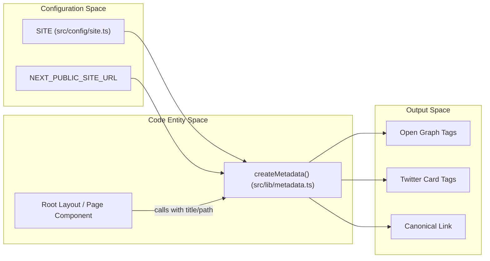
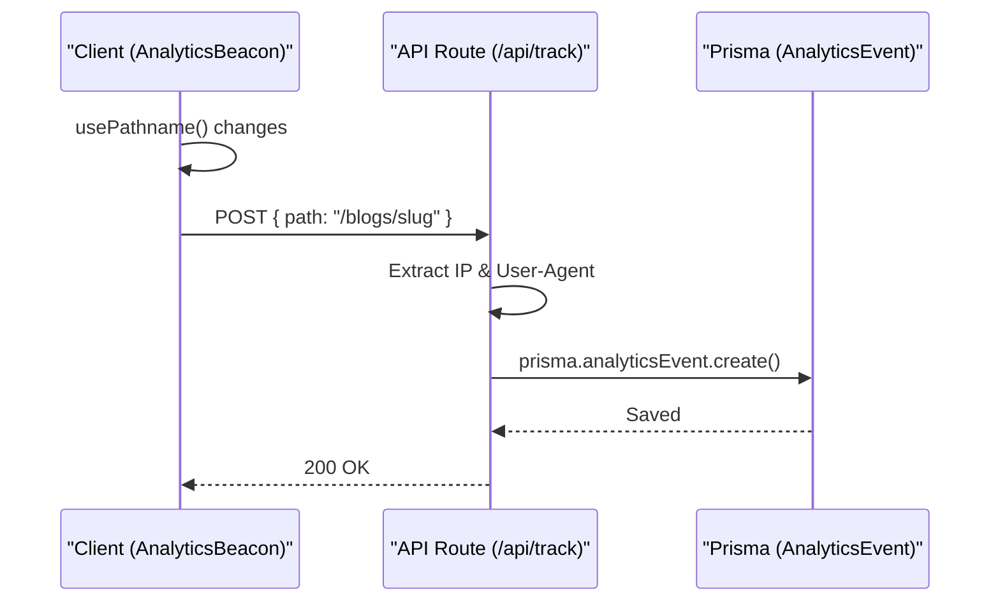

# SEO, Analytics, and Metadata
Relevant source files

- [src/app/api/track/route.ts](https://github.com/ravichandola/personal-branding/blob/3a440ccd/src/app/api/track/route.ts)
- [src/app/robots.ts](https://github.com/ravichandola/personal-branding/blob/3a440ccd/src/app/robots.ts)
- [src/app/sitemap.ts](https://github.com/ravichandola/personal-branding/blob/3a440ccd/src/app/sitemap.ts)
- [src/components/analytics/analytics-beacon.tsx](https://github.com/ravichandola/personal-branding/blob/3a440ccd/src/components/analytics/analytics-beacon.tsx)
- [src/components/seo/json-ld.tsx](https://github.com/ravichandola/personal-branding/blob/3a440ccd/src/components/seo/json-ld.tsx)
- [src/config/site.ts](https://github.com/ravichandola/personal-branding/blob/3a440ccd/src/config/site.ts)
- [src/config/structured-data.ts](https://github.com/ravichandola/personal-branding/blob/3a440ccd/src/config/structured-data.ts)
- [src/lib/metadata.ts](https://github.com/ravichandola/personal-branding/blob/3a440ccd/src/lib/metadata.ts)

This section documents the technical implementation of Search Engine Optimization (SEO), structured data, and the custom analytics tracking system. The platform utilizes Next.js Metadata API for dynamic head management, JSON-LD for semantic search visibility, and a beacon-based tracking system for internal analytics.

## Metadata Management

The platform centralizes metadata generation through the `createMetadata` helper. This function ensures consistent Open Graph (OG) and Twitter card configurations across all public routes.

### `createMetadata` Helper

The `createMetadata` function [src/lib/metadata.ts#6-16](https://github.com/ravichandola/personal-branding/blob/3a440ccd/src/lib/metadata.ts#L6-L16) constructs a `Metadata` object compatible with Next.js. It handles:

- Title Templating: Appends a consistent suffix to page titles [src/lib/metadata.ts#17-18](https://github.com/ravichandola/personal-branding/blob/3a440ccd/src/lib/metadata.ts#L17-L18)
- Canonical URLs: Automatically generates canonical links based on the `NEXT_PUBLIC_SITE_URL`[src/lib/metadata.ts#20-30](https://github.com/ravichandola/personal-branding/blob/3a440ccd/src/lib/metadata.ts#L20-L30)
- Open Graph & Twitter: Configures `summary_large_image` cards and social previews [src/lib/metadata.ts#37-58](https://github.com/ravichandola/personal-branding/blob/3a440ccd/src/lib/metadata.ts#L37-L58)
- Robots Configuration: Defaults to `index: true, follow: true` for public pages [src/lib/metadata.ts#32-35](https://github.com/ravichandola/personal-branding/blob/3a440ccd/src/lib/metadata.ts#L32-L35)

### Metadata Data Flow

The following diagram illustrates how site configuration propagates through the metadata helper to the final HTML output.

Metadata Propagation Diagram

Sources:

- [src/lib/metadata.ts#1-66](https://github.com/ravichandola/personal-branding/blob/3a440ccd/src/lib/metadata.ts#L1-L66)
- [src/config/site.ts#1-28](https://github.com/ravichandola/personal-branding/blob/3a440ccd/src/config/site.ts#L1-L28)

---

## Structured Data (JSON-LD)

To enhance visibility in Search Engine Results Pages (SERP), the platform implements the `Person` schema using JSON-LD.

### Person Schema

The `personStructuredData` object [src/config/structured-data.ts#6-32](https://github.com/ravichandola/personal-branding/blob/3a440ccd/src/config/structured-data.ts#L6-L32) defines the professional identity of the site owner, including:

- `knowsAbout`: A list of technical competencies (e.g., "LangGraph", "Playwright") [src/config/structured-data.ts#18-30](https://github.com/ravichandola/personal-branding/blob/3a440ccd/src/config/structured-data.ts#L18-L30)
- `sameAs`: Social profile links (LinkedIn, GitHub, Medium) [src/config/structured-data.ts#12-17](https://github.com/ravichandola/personal-branding/blob/3a440ccd/src/config/structured-data.ts#L12-L17)

### Implementation

The `JsonLd` component [src/components/seo/json-ld.tsx#5-13](https://github.com/ravichandola/personal-branding/blob/3a440ccd/src/components/seo/json-ld.tsx#L5-L13) is a client-side utility that injects the schema into the document head using a `<script type="application/ld+json">` tag.

Sources:

- [src/config/structured-data.ts#1-32](https://github.com/ravichandola/personal-branding/blob/3a440ccd/src/config/structured-data.ts#L1-L32)
- [src/components/seo/json-ld.tsx#1-14](https://github.com/ravichandola/personal-branding/blob/3a440ccd/src/components/seo/json-ld.tsx#L1-L14)

---

## Analytics and Event Tracking

The platform uses a custom, lightweight analytics system to track page views without relying on third-party scripts.

### Analytics Pipeline

The system consists of a client-side beacon and a server-side API route.

1. `AnalyticsBeacon`: A client component [src/components/analytics/analytics-beacon.tsx#6-24](https://github.com/ravichandola/personal-branding/blob/3a440ccd/src/components/analytics/analytics-beacon.tsx#L6-L24) that uses the `usePathname` hook. Whenever the route changes, it triggers a `POST` request to `/api/track`. It uses the `keepalive: true` flag to ensure the request completes even if the page is unloaded [src/components/analytics/analytics-beacon.tsx#16](https://github.com/ravichandola/personal-branding/blob/3a440ccd/src/components/analytics/analytics-beacon.tsx#L16-L16)
2. `/api/track` Route: A Next.js API route [src/app/api/track/route.ts#10-37](https://github.com/ravichandola/personal-branding/blob/3a440ccd/src/app/api/track/route.ts#L10-L37) that receives the payload. It extracts the visitor's IP address (to generate a `visitorId`), referrer, and user agent [src/app/api/track/route.ts#19-29](https://github.com/ravichandola/personal-branding/blob/3a440ccd/src/app/api/track/route.ts#L19-L29)
3. Prisma Persistence: The event is stored in the `AnalyticsEvent` model [src/app/api/track/route.ts#24-31](https://github.com/ravichandola/personal-branding/blob/3a440ccd/src/app/api/track/route.ts#L24-L31)

Analytics Data Flow Diagram

Sources:

- [src/components/analytics/analytics-beacon.tsx#1-25](https://github.com/ravichandola/personal-branding/blob/3a440ccd/src/components/analytics/analytics-beacon.tsx#L1-L25)
- [src/app/api/track/route.ts#1-38](https://github.com/ravichandola/personal-branding/blob/3a440ccd/src/app/api/track/route.ts#L1-L38)

---

## Search Engine Discovery

The platform provides standard discovery files to guide web crawlers.

### Sitemap

The `sitemap.ts` file [src/app/sitemap.ts#3-20](https://github.com/ravichandola/personal-branding/blob/3a440ccd/src/app/sitemap.ts#L3-L20) dynamically generates a sitemap for the core routes:

- `/` (Home)
- `/about`
- `/experience`
- `/projects`
- `/blogs`
- `/contact`

### Robots.txt

The `robots.ts` file [src/app/robots.ts#1-13](https://github.com/ravichandola/personal-branding/blob/3a440ccd/src/app/robots.ts#L1-L13) configures crawler access. It allows full access to public routes while explicitly disallowing the admin dashboard:

- Allow: `/`
- Disallow: `/admin`, `/admin/login`[src/app/robots.ts#9](https://github.com/ravichandola/personal-branding/blob/3a440ccd/src/app/robots.ts#L9-L9)

Sources:

- [src/app/sitemap.ts#1-21](https://github.com/ravichandola/personal-branding/blob/3a440ccd/src/app/sitemap.ts#L1-L21)
- [src/app/robots.ts#1-14](https://github.com/ravichandola/personal-branding/blob/3a440ccd/src/app/robots.ts#L1-L14)