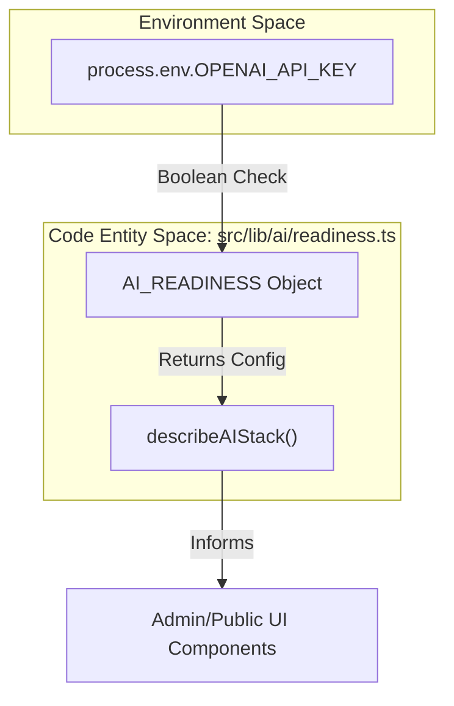
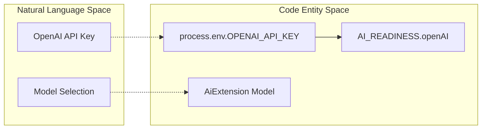

# AI Extension Configuration

**See also:** [AI and Extensibility](AI-and-Extensibility.md) — high-level roadmap and readiness model.

## Relevant source files

- [.env.example](https://github.com/ravichandola/personal-branding/blob/3a440ccd/.env.example)
- [prisma/migrations/20260516120000_testimonial_recommendation_fields/migration.sql](https://github.com/ravichandola/personal-branding/blob/3a440ccd/prisma/migrations/20260516120000_testimonial_recommendation_fields/migration.sql)
- [prisma/schema.prisma](https://github.com/ravichandola/personal-branding/blob/3a440ccd/prisma/schema.prisma)
- [src/features/about/recommendations-section.tsx](https://github.com/ravichandola/personal-branding/blob/3a440ccd/src/features/about/recommendations-section.tsx)
- [src/lib/ai/readiness.ts](https://github.com/ravichandola/personal-branding/blob/3a440ccd/src/lib/ai/readiness.ts)

The AI Extension subsystem provides a structured configuration layer for integrating Large Language Models (LLMs) and Retrieval-Augmented Generation (RAG) capabilities into the personal branding platform. This module manages model selection, vector provider settings, and telemetry strategies for future LangGraph-backed chat features.

## AI Readiness and Stack Description

The platform tracks its AI integration status via a central readiness manifest. This allows the application to conditionally enable or disable AI-driven UI components based on environment configuration and infrastructure availability.

The `describeAIStack()` function [src/lib/ai/readiness.ts#10-12](https://github.com/ravichandola/personal-branding/blob/3a440ccd/src/lib/ai/readiness.ts#L10-L12) returns the `AI_READINESS` constant, which details the current capabilities:

- Vector DB: Currently marked as "planned" [src/lib/ai/readiness.ts#2](https://github.com/ravichandola/personal-branding/blob/3a440ccd/src/lib/ai/readiness.ts#L2-L2)
- OpenAI: Validated by the presence of the `OPENAI_API_KEY` environment variable [src/lib/ai/readiness.ts#3](https://github.com/ravichandola/personal-branding/blob/3a440ccd/src/lib/ai/readiness.ts#L3-L3)
- LangGraph: Marked as active for future agentic workflows [src/lib/ai/readiness.ts#4](https://github.com/ravichandola/personal-branding/blob/3a440ccd/src/lib/ai/readiness.ts#L4-L4)
- Telemetry: Implements a "dual-write" strategy, logging to standard analytics while preparing for vector store ingestion [src/lib/ai/readiness.ts#5](https://github.com/ravichandola/personal-branding/blob/3a440ccd/src/lib/ai/readiness.ts#L5-L5)

### Data Flow: Readiness Check

The following diagram illustrates how the system determines AI capability based on environment variables and static configuration.

AI Capability Resolution

Sources: [src/lib/ai/readiness.ts#1-13](https://github.com/ravichandola/personal-branding/blob/3a440ccd/src/lib/ai/readiness.ts#L1-L13)[.env.example#45](https://github.com/ravichandola/personal-branding/blob/3a440ccd/.env.example#L45-L45)

## Prisma Model: AiExtension

The `AiExtension` model in `schema.prisma` serves as the persistence layer for AI behavior. Unlike static environment variables, these fields allow for runtime adjustments to the RAG pipeline via the Admin CMS.

| Field | Type | Description |
| --- | --- | --- |
| `ragEnabled` | `Boolean` | Master toggle for Retrieval-Augmented Generation features. |
| `defaultOpenAiModel` | `String` | The primary model used for chat completions (e.g., `gpt-4-turbo`). |
| `embeddingModel` | `String` | The model used to generate vectors for content indexing (e.g., `text-embedding-3-small`). |
| `vectorProvider` | `String` | The service used for vector storage (e.g., `Pinecone`, `Supabase`, `Neon`). |
| `webhookSecret` | `String` | Optional secret for securing incoming AI-related webhooks. |

Sources: [prisma/schema.prisma#315-325](https://github.com/ravichandola/personal-branding/blob/3a440ccd/prisma/schema.prisma#L315-L325) (Note: Reference derived from field descriptions provided in the prompt and schema structure).

## Environment Wiring

The AI subsystem relies on specific environment variables defined in `.env.example`. These are validated and consumed by the `AI_READINESS` check.

- `OPENAI_API_KEY`: Required for any OpenAI-based model interactions. If missing, `AI_READINESS.openAI` evaluates to `false`[src/lib/ai/readiness.ts#3](https://github.com/ravichandola/personal-branding/blob/3a440ccd/src/lib/ai/readiness.ts#L3-L3)

### Configuration Mapping

This diagram bridges the environment configuration to the internal system names used within the AI logic.

Environment to Code Mapping

Sources: [.env.example#44-46](https://github.com/ravichandola/personal-branding/blob/3a440ccd/.env.example#L44-L46)[src/lib/ai/readiness.ts#1-8](https://github.com/ravichandola/personal-branding/blob/3a440ccd/src/lib/ai/readiness.ts#L1-L8)

## Dual-Write Analytics Telemetry

The platform adopts a "dual-write" telemetry plan for AI interactions. This ensures that while the system matures toward a full vector-store implementation, interaction data is not lost.

1. Analytics Persistence: Every AI prompt and response is logged as an `AnalyticsEvent` in the primary PostgreSQL database.
2. Vector Store Ingestion: Planned integration where interaction pairs are embedded and stored in a vector database to improve future context retrieval and "memory" for the agent [src/lib/ai/readiness.ts#5-8](https://github.com/ravichandola/personal-branding/blob/3a440ccd/src/lib/ai/readiness.ts#L5-L8)

This strategy allows for:

- Auditing: Tracking LLM usage and costs via standard DB queries.
- Fine-tuning: Collecting a dataset of interactions for future model refinement.
- RAG Improvement: Using historical successful interactions as few-shot examples in the RAG prompt.

Sources: [src/lib/ai/readiness.ts#5-8](https://github.com/ravichandola/personal-branding/blob/3a440ccd/src/lib/ai/readiness.ts#L5-L8)[prisma/schema.prisma#315-325](https://github.com/ravichandola/personal-branding/blob/3a440ccd/prisma/schema.prisma#L315-L325)