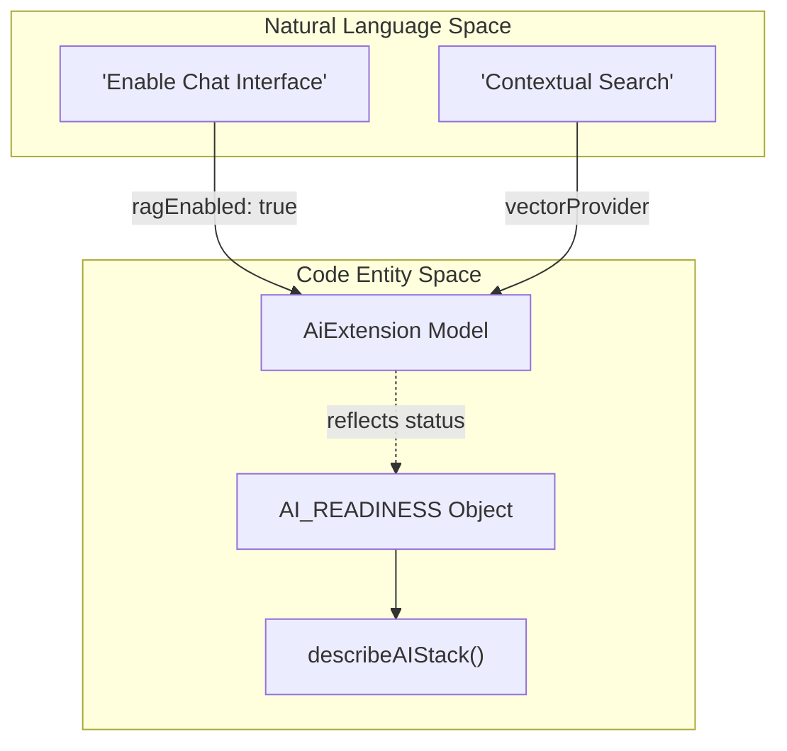
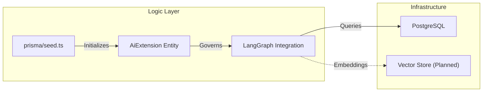

# AI and Extensibility
Relevant source files

- [prisma/migrations/20260516120000_testimonial_recommendation_fields/migration.sql](https://github.com/ravichandola/personal-branding/blob/3a440ccd/prisma/migrations/20260516120000_testimonial_recommendation_fields/migration.sql)
- [prisma/schema.prisma](https://github.com/ravichandola/personal-branding/blob/3a440ccd/prisma/schema.prisma)
- [prisma/seed.ts](https://github.com/ravichandola/personal-branding/blob/3a440ccd/prisma/seed.ts)
- [src/features/about/recommendations-section.tsx](https://github.com/ravichandola/personal-branding/blob/3a440ccd/src/features/about/recommendations-section.tsx)
- [src/lib/ai/readiness.ts](https://github.com/ravichandola/personal-branding/blob/3a440ccd/src/lib/ai/readiness.ts)

This section documents the platform's architectural foundation for integrating Artificial Intelligence and agentic workflows. The system is designed for gradual extensibility, transitioning from a static portfolio to an intelligent, RAG-enabled (Retrieval-Augmented Generation) application using LangGraph and OpenAI.

The extensibility model centers on the `AiExtension` database entity, which governs the runtime behavior of AI features across the site.

### System Readiness and Integration

The platform uses a centralized configuration object, `AI_READINESS`, to track the implementation status of AI subsystems. This object monitors the availability of the `OPENAI_API_KEY` and defines the roadmap for vector database integration and telemetry.

AI Stack Status Overview

| Component | Status | Source |
| --- | --- | --- |
| OpenAI Integration | Dynamic (via Env) | [src/lib/ai/readiness.ts#3](https://github.com/ravichandola/personal-branding/blob/3a440ccd/src/lib/ai/readiness.ts#L3-L3) |
| LangGraph Support | Enabled | [src/lib/ai/readiness.ts#4](https://github.com/ravichandola/personal-branding/blob/3a440ccd/src/lib/ai/readiness.ts#L4-L4) |
| Vector Database | Planned | [src/lib/ai/readiness.ts#2](https://github.com/ravichandola/personal-branding/blob/3a440ccd/src/lib/ai/readiness.ts#L2-L2) |
| Telemetry Plan | Dual-write | [src/lib/ai/readiness.ts#5](https://github.com/ravichandola/personal-branding/blob/3a440ccd/src/lib/ai/readiness.ts#L5-L5) |

Sources:

- [src/lib/ai/readiness.ts#1-13](https://github.com/ravichandola/personal-branding/blob/3a440ccd/src/lib/ai/readiness.ts#L1-L13)

### AI Control Plane

The `AiExtension` model in the Prisma schema acts as a global toggle and configuration store for AI capabilities. It allows the administrator to enable or disable RAG features at runtime without redeploying the application.

AI to Code Entity Mapping
The following diagram illustrates how the `AiExtension` model bridges high-level AI capabilities to the underlying database and configuration logic.

"AI Control Flow"

Sources:

- [prisma/schema.prisma#307-320](https://github.com/ravichandola/personal-branding/blob/3a440ccd/prisma/schema.prisma#L307-L320)
- [src/lib/ai/readiness.ts#10-12](https://github.com/ravichandola/personal-branding/blob/3a440ccd/src/lib/ai/readiness.ts#L10-L12)

### Implementation Roadmap

The platform is currently in a "Pre-RAG" state. The `prisma/seed.ts` script initializes the `AiExtension` with `ragEnabled: false` by default, providing a placeholder for future integration of LangChain and vector backends.

Extensibility Strategy

1. Environment Wiring: Securely inject `OPENAI_API_KEY` to activate basic LLM calls.
2. Vector Store Integration: Transition from simple metadata search to vector-based retrieval for blogs and projects.
3. Agentic Workflows: Deploy LangGraph-backed chat interfaces once the `AiExtension` policies are finalized.

"AI Infrastructure Lifecycle"

Sources:

- [prisma/seed.ts#24-31](https://github.com/ravichandola/personal-branding/blob/3a440ccd/prisma/seed.ts#L24-L31)
- [src/lib/ai/readiness.ts#1-8](https://github.com/ravichandola/personal-branding/blob/3a440ccd/src/lib/ai/readiness.ts#L1-L8)

---

## Related

- **[AI Extension Configuration](AI-Extension-Configuration.md)** — `AiExtension` fields (`ragEnabled`, model names, vector provider, webhook secret), `describeAIStack()`, `OPENAI_API_KEY`, and dual-write telemetry.