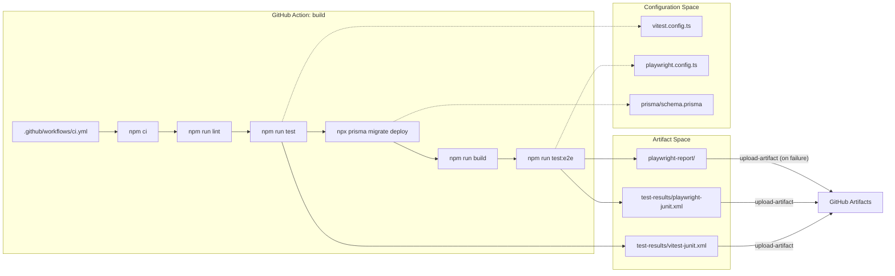
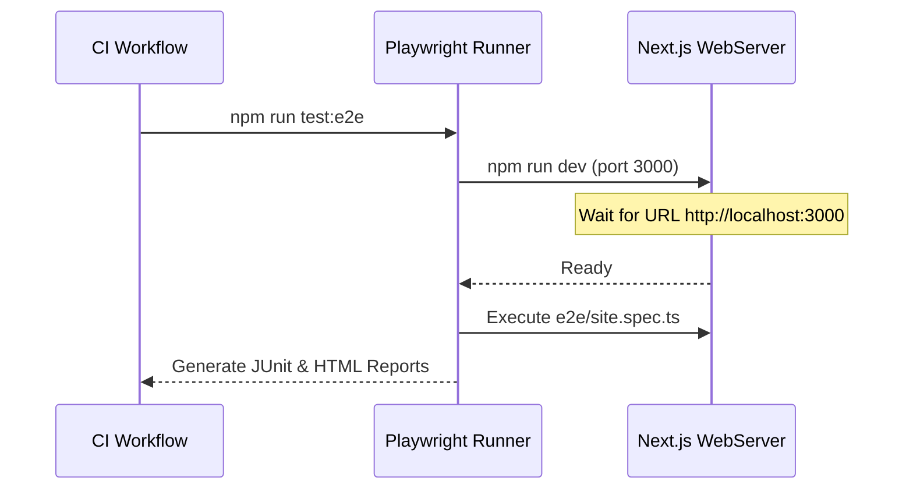

# CI/CD Pipeline
Relevant source files

- [.eslintrc.json](https://github.com/ravichandola/personal-branding/blob/3a440ccd/.eslintrc.json)
- [.github/workflows/ci.yml](https://github.com/ravichandola/personal-branding/blob/3a440ccd/.github/workflows/ci.yml)
- [Dockerfile](https://github.com/ravichandola/personal-branding/blob/3a440ccd/Dockerfile)
- [docker-compose.yml](https://github.com/ravichandola/personal-branding/blob/3a440ccd/docker-compose.yml)
- [playwright.config.ts](https://github.com/ravichandola/personal-branding/blob/3a440ccd/playwright.config.ts)
- [vitest.config.ts](https://github.com/ravichandola/personal-branding/blob/3a440ccd/vitest.config.ts)

The personal-branding platform utilizes GitHub Actions for its Continuous Integration (CI) suite. The workflow ensures code quality through a rigorous sequence of linting, unit testing, production building, and end-to-end (E2E) validation within a containerized environment.

## Workflow Overview

The CI pipeline is defined in `.github/workflows/ci.yml` and triggers on every push to the `main` branch and all pull requests `[.github/workflows/ci.yml:3-7]`. It executes on `ubuntu-latest` and manages a PostgreSQL service container to facilitate database-dependent tests `[.github/workflows/ci.yml:10-18]`.

### Infrastructure Stack

The pipeline initializes a sidecar service for the database, mirroring the production-ready PostgreSQL 16 environment `[.github/workflows/ci.yml:19]`.

| Component | Specification | Purpose |
| --- | --- | --- |
| Runner | `ubuntu-latest` | Primary execution environment |
| Node.js | `v22` | Runtime for Next.js and build tools `[.github/workflows/ci.yml:37]` |
| Database | `postgres:16-alpine` | Transient DB for migrations and E2E tests `[.github/workflows/ci.yml:19]` |
| Cache | `npm` | Persistent storage for `node_modules` between runs `[.github/workflows/ci.yml:38]` |

### Data Flow and Code Entity Mapping

The following diagram illustrates how the GitHub Action workflow interacts with the codebase's configuration files and testing frameworks.

CI Workflow Entity Mapping

Sources: `[.github/workflows/ci.yml:32-76]`, `[vitest.config.ts:8-25]`, `[playwright.config.ts:9-42]`

## Execution Stages

### 1. Environment Initialization

The workflow sets up the environment variables required for the Next.js build and Prisma client, including a mock `AUTH_SECRET` and a local `DATABASE_URL` pointing to the service container `[.github/workflows/ci.yml:11-15]`. The PostgreSQL service uses a health check (`pg_isready`) to ensure the database is accepting connections before the steps proceed `[.github/workflows/ci.yml:26-30]`.

### 2. Static Analysis and Unit Testing

The pipeline runs `npm run lint` to enforce the rules defined in `.eslintrc.json``[.github/workflows/ci.yml:42]`. This is followed by `npm run test`, which invokes Vitest`[.github/workflows/ci.yml:44]`.

Vitest is configured to use the `jsdom` environment and generates JUnit reports when the `CI` environment variable is detected `[vitest.config.ts:11-24]`.

### 3. Database Migration and Build

Before E2E testing, the pipeline applies the Prisma schema to the transient PostgreSQL instance using `npx prisma migrate deploy``[.github/workflows/ci.yml:53]`. This ensures the database schema is in sync with the code before the production build (`npm run build`) is executed `[.github/workflows/ci.yml:55]`.

### 4. End-to-End (E2E) Validation

The final stage involves running Playwright tests. The workflow installs the necessary Chromium binaries and dependencies `[.github/workflows/ci.yml:57]` before executing `npm run test:e2e``[.github/workflows/ci.yml:59]`.

Playwright CI Logic

Sources: `[playwright.config.ts:34-41]`, `[.github/workflows/ci.yml:59-65]`

## Artifact Management

The pipeline captures and uploads several artifacts to assist in debugging failures:

1. Vitest Reports: Uploaded from `test-results/vitest-junit.xml` regardless of success/failure `[.github/workflows/ci.yml:46-51]`.
2. Playwright Reports: Uploaded from `test-results/playwright-junit.xml``[.github/workflows/ci.yml:61-66]`.
3. Failure Debugging: If the E2E tests fail, the entire `playwright-report/` directory (containing screenshots and traces) is uploaded for inspection `[.github/workflows/ci.yml:68-76]`.

In the `playwright.config.ts`, specific CI behaviors are enabled:

- `retries`: Set to 2 on CI to handle flakiness `[playwright.config.ts:13]`.
- `workers`: Restricted to 1 to prevent resource contention on the GitHub runner `[playwright.config.ts:14]`.
- `forbidOnly`: Ensures that `test.only` blocks do not accidentally get committed `[playwright.config.ts:12]`.

Sources: `[.github/workflows/ci.yml:1-76]`, `[playwright.config.ts:1-42]`, `[vitest.config.ts:1-31]`