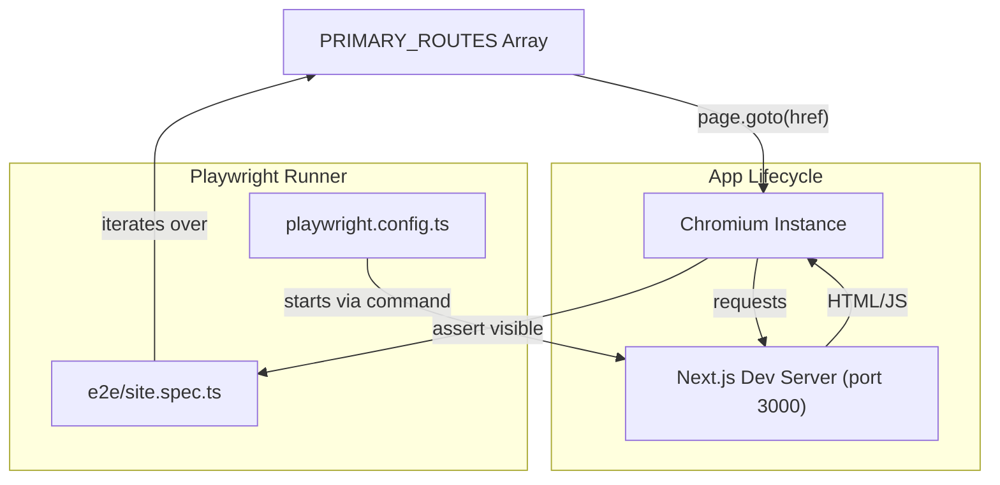
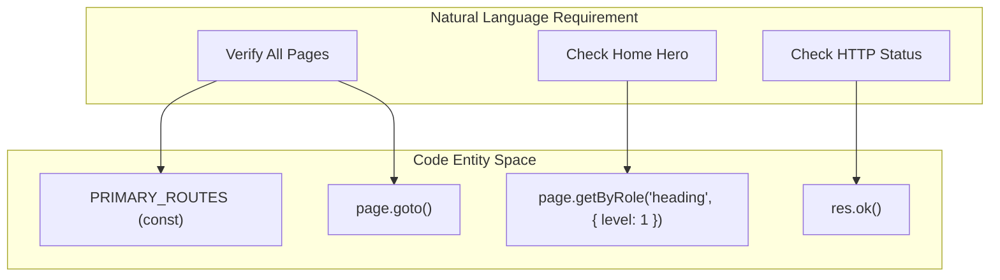

# End-to-End Tests (Playwright)
Relevant source files

- [e2e/site.spec.ts](https://github.com/ravichandola/personal-branding/blob/3a440ccd/e2e/site.spec.ts)
- [playwright.config.ts](https://github.com/ravichandola/personal-branding/blob/3a440ccd/playwright.config.ts)

The personal-branding platform utilizes Playwright for high-level end-to-end (E2E) verification of the public-facing marketing site. These tests ensure that critical user paths—from the landing page to the contact form—are functional, and that the Next.js App Router correctly resolves all primary routes without server-side crashes or hydration failures.

## Playwright Configuration

The testing infrastructure is defined in `playwright.config.ts`, which manages the lifecycle of the application server, browser orchestration, and reporting strategies across local and CI environments.

### WebServer Lifecycle

Playwright is configured to automatically manage the development server during the test run. It uses the `webServer` block to execute `npm run dev` on a specific port (defaulting to 3000) [playwright.config.ts#34-41](https://github.com/ravichandola/personal-branding/blob/3a440ccd/playwright.config.ts#L34-L41)

- Reuse Logic: In local environments, Playwright attempts to reuse an existing server to save time (`reuseExistingServer: true`). In CI, it always starts a fresh instance [playwright.config.ts#37](https://github.com/ravichandola/personal-branding/blob/3a440ccd/playwright.config.ts#L37-L37)
- Timeout: The server is given a 120-second grace period to become healthy before tests begin [playwright.config.ts#38](https://github.com/ravichandola/personal-branding/blob/3a440ccd/playwright.config.ts#L38-L38)

### CI vs. Local Execution

The configuration dynamically adjusts based on the presence of the `CI` environment variable:

| Feature | Local Environment | CI Environment |
| --- | --- | --- |
| Parallelism | Fully Parallel [playwright.config.ts#11](https://github.com/ravichandola/personal-branding/blob/3a440ccd/playwright.config.ts#L11-L11) | Sequential (1 worker) [playwright.config.ts#14](https://github.com/ravichandola/personal-branding/blob/3a440ccd/playwright.config.ts#L14-L14) |
| Retries | 0 [playwright.config.ts#13](https://github.com/ravichandola/personal-branding/blob/3a440ccd/playwright.config.ts#L13-L13) | 2 [playwright.config.ts#13](https://github.com/ravichandola/personal-branding/blob/3a440ccd/playwright.config.ts#L13-L13) |
| Reporters | List, HTML [playwright.config.ts#22](https://github.com/ravichandola/personal-branding/blob/3a440ccd/playwright.config.ts#L22-L22) | GitHub, List, HTML, JUnit [playwright.config.ts#16-21](https://github.com/ravichandola/personal-branding/blob/3a440ccd/playwright.config.ts#L16-L21) |
| Failures | Screenshot on failure [playwright.config.ts#26](https://github.com/ravichandola/personal-branding/blob/3a440ccd/playwright.config.ts#L26-L26) | Trace on first retry [playwright.config.ts#25](https://github.com/ravichandola/personal-branding/blob/3a440ccd/playwright.config.ts#L25-L25) |

### Reporting and Artifacts

In CI, the system generates a JUnit XML report at `test-results/playwright-junit.xml` for integration with GitHub Actions test summaries [playwright.config.ts#20](https://github.com/ravichandola/personal-branding/blob/3a440ccd/playwright.config.ts#L20-L20) Visual artifacts (screenshots) are only captured when a test fails to minimize storage overhead [playwright.config.ts#26](https://github.com/ravichandola/personal-branding/blob/3a440ccd/playwright.config.ts#L26-L26)

Sources:[playwright.config.ts#1-42](https://github.com/ravichandola/personal-branding/blob/3a440ccd/playwright.config.ts#L1-L42)

---

## E2E Test Suite Implementation

The primary test suite is located in `e2e/site.spec.ts`. It focuses on the public-facing "marketing" side of the application, ensuring that the `(site)` route group is healthy.

### Route Verification Logic

The suite defines a constant `PRIMARY_ROUTES` which mirrors the navigation links found in the site's navbar [e2e/site.spec.ts#4-11](https://github.com/ravichandola/personal-branding/blob/3a440ccd/e2e/site.spec.ts#L4-L11) The "Navigation" test block iterates through these routes to ensure every page returns a `2xx` status code and renders the `body` tag [e2e/site.spec.ts#69-77](https://github.com/ravichandola/personal-branding/blob/3a440ccd/e2e/site.spec.ts#L69-L77)

### Core Test Cases

Each major section of the site has a dedicated `test.describe` block:

- Home: Validates the page title and the visibility of the H1 hero heading [e2e/site.spec.ts#14-22](https://github.com/ravichandola/personal-branding/blob/3a440ccd/e2e/site.spec.ts#L14-L22)
- About: Ensures the bio/headline is visible [e2e/site.spec.ts#24-31](https://github.com/ravichandola/personal-branding/blob/3a440ccd/e2e/site.spec.ts#L24-L31)
- Experience: Confirms the career timeline renders [e2e/site.spec.ts#33-40](https://github.com/ravichandola/personal-branding/blob/3a440ccd/e2e/site.spec.ts#L33-L40)
- Projects/Blogs/Contact: Verifies that the respective index pages load their primary headings [e2e/site.spec.ts#42-67](https://github.com/ravichandola/personal-branding/blob/3a440ccd/e2e/site.spec.ts#L42-L67)

### Test Architecture and Data Flow

The following diagram illustrates how the Playwright `test` runner interacts with the `webServer` and the `PRIMARY_ROUTES` configuration.

Playwright Test Execution Flow

Sources:[playwright.config.ts#34-41](https://github.com/ravichandola/personal-branding/blob/3a440ccd/playwright.config.ts#L34-L41)[e2e/site.spec.ts#4-11](https://github.com/ravichandola/personal-branding/blob/3a440ccd/e2e/site.spec.ts#L4-L11)[e2e/site.spec.ts#70-76](https://github.com/ravichandola/personal-branding/blob/3a440ccd/e2e/site.spec.ts#L70-L76)

---

## Code Entity Mapping

This diagram maps the high-level test requirements to the specific code entities and Playwright functions used to validate them.

Test Entity Association

Sources:[e2e/site.spec.ts#4-11](https://github.com/ravichandola/personal-branding/blob/3a440ccd/e2e/site.spec.ts#L4-L11)[e2e/site.spec.ts#18](https://github.com/ravichandola/personal-branding/blob/3a440ccd/e2e/site.spec.ts#L18-L18)[e2e/site.spec.ts#72-73](https://github.com/ravichandola/personal-branding/blob/3a440ccd/e2e/site.spec.ts#L72-L73)

---

## Running and Debugging Tests

### Local Execution

To run the E2E suite locally, use the following commands:

- Standard Run: `npx playwright test`
- Executes tests in headless mode using the `chromium` project [playwright.config.ts#28-33](https://github.com/ravichandola/personal-branding/blob/3a440ccd/playwright.config.ts#L28-L33)
- UI Mode: `npx playwright test --ui`
- Opens the Playwright UI for time-travel debugging and inspecting DOM snapshots.
- Debug Mode: `npx playwright test --debug`
- Steps through the code line-by-line in the Playwright Inspector.

### Debugging Failures

When a test fails:

1. Screenshots: Check the `test-results/` directory for images of the page at the moment of failure [playwright.config.ts#26](https://github.com/ravichandola/personal-branding/blob/3a440ccd/playwright.config.ts#L26-L26)
2. Timeouts: The suite uses an extended 15,000ms timeout for heading visibility to account for slow hydration or server-side data fetching [e2e/site.spec.ts#19-20](https://github.com/ravichandola/personal-branding/blob/3a440ccd/e2e/site.spec.ts#L19-L20)
3. Logs: Playwright pipes the Next.js `stdout` and `stderr` to the console, allowing you to see server-side errors directly in the test output [playwright.config.ts#39-40](https://github.com/ravichandola/personal-branding/blob/3a440ccd/playwright.config.ts#L39-L40)

Sources:[playwright.config.ts#25-27](https://github.com/ravichandola/personal-branding/blob/3a440ccd/playwright.config.ts#L25-L27)[playwright.config.ts#39-40](https://github.com/ravichandola/personal-branding/blob/3a440ccd/playwright.config.ts#L39-L40)[e2e/site.spec.ts#18-20](https://github.com/ravichandola/personal-branding/blob/3a440ccd/e2e/site.spec.ts#L18-L20)