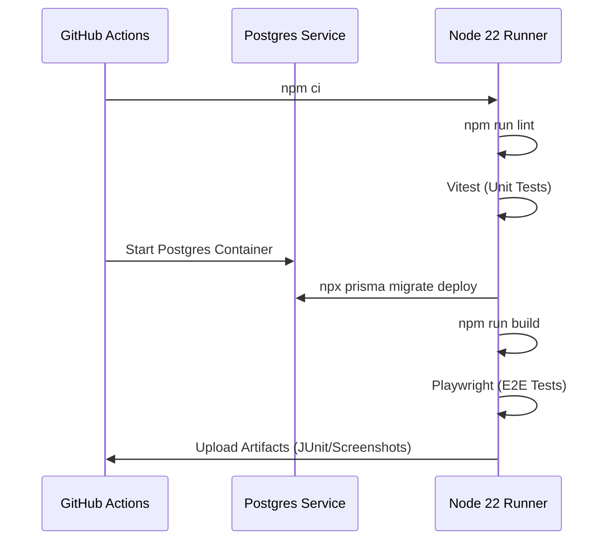

# Testing
Relevant source files

- [.github/workflows/ci.yml](https://github.com/ravichandola/personal-branding/blob/3a440ccd/.github/workflows/ci.yml)
- [playwright.config.ts](https://github.com/ravichandola/personal-branding/blob/3a440ccd/playwright.config.ts)
- [vitest.config.ts](https://github.com/ravichandola/personal-branding/blob/3a440ccd/vitest.config.ts)

The personal-branding platform employs a three-tier testing strategy designed to ensure code quality, UI consistency, and system reliability. The strategy spans from isolated logic verification to full-system integration within a Continuous Integration (CI) pipeline.

### Testing Strategy Overview

The codebase separates concerns into three distinct layers:

1. Unit Tests: Focused on individual functions, React components, and business logic using Vitest.
2. End-to-End (E2E) Tests: Validating user flows across the entire application stack using Playwright.
3. CI/CD Pipeline: Automating the execution of all tests on every pull request and push to the main branch via GitHub Actions.

### System Architecture: Test Flow

The following diagram illustrates how the testing tools interact with the codebase and the CI environment.

Testing Entity Mapping

Sources:[.github/workflows/ci.yml#8-76](https://github.com/ravichandola/personal-branding/blob/3a440ccd/.github/workflows/ci.yml#L8-L76)[vitest.config.ts#8-25](https://github.com/ravichandola/personal-branding/blob/3a440ccd/vitest.config.ts#L8-L25)[playwright.config.ts#9-42](https://github.com/ravichandola/personal-branding/blob/3a440ccd/playwright.config.ts#L9-L42)

---

### 1. Unit Testing (Vitest)

Unit testing is handled by Vitest, configured to use the `jsdom` environment to simulate a browser for React component testing. This layer focuses on verifying the behavior of utility functions, metadata generation, and UI components in isolation.

- Environment: `jsdom` for DOM-related tests [vitest.config.ts#11](https://github.com/ravichandola/personal-branding/blob/3a440ccd/vitest.config.ts#L11-L11)
- Setup: A global `vitest-setup.ts` file initializes the testing environment [vitest.config.ts#12](https://github.com/ravichandola/personal-branding/blob/3a440ccd/vitest.config.ts#L12-L12)
- Path Mapping: Uses the `@/` alias to match the application's TypeScript configuration [vitest.config.ts#27-30](https://github.com/ravichandola/personal-branding/blob/3a440ccd/vitest.config.ts#L27-L30)
- Reporting: In CI, it generates JUnit reports for GitHub Actions integration [vitest.config.ts#18-24](https://github.com/ravichandola/personal-branding/blob/3a440ccd/vitest.config.ts#L18-L24)

For detailed configuration and test suite descriptions, see [Unit Tests (Vitest)](#8.1).

---

### 2. End-to-End Testing (Playwright)

End-to-end tests utilize Playwright to automate a Chromium browser and navigate the actual application. This ensures that the frontend, backend (Server Actions), and database (PostgreSQL) work together correctly.

- Lifecycle: The configuration manages a local web server instance (`npm run dev`) during the test run [playwright.config.ts#34-41](https://github.com/ravichandola/personal-branding/blob/3a440ccd/playwright.config.ts#L34-L41)
- Reliability: Includes automatic retries and trace/screenshot capture on failure for easier debugging [playwright.config.ts#13](https://github.com/ravichandola/personal-branding/blob/3a440ccd/playwright.config.ts#L13-L13)[playwright.config.ts#25-26](https://github.com/ravichandola/personal-branding/blob/3a440ccd/playwright.config.ts#L25-L26)
- Scope: Covers primary user routes including Home, About, Projects, and Blogs [playwright.config.ts#10](https://github.com/ravichandola/personal-branding/blob/3a440ccd/playwright.config.ts#L10-L10)

For instructions on running and debugging E2E tests, see [End-to-End Tests (Playwright)](#8.2).

---

### 3. CI/CD Pipeline (GitHub Actions)

The automation pipeline is defined in `.github/workflows/ci.yml`. It ensures that no breaking changes are merged into the `main` branch by enforcing a strict execution order.

CI Execution Sequence

Sources:[.github/workflows/ci.yml#17-30](https://github.com/ravichandola/personal-branding/blob/3a440ccd/.github/workflows/ci.yml#L17-L30)[.github/workflows/ci.yml#42-60](https://github.com/ravichandola/personal-branding/blob/3a440ccd/.github/workflows/ci.yml#L42-L60)

The pipeline utilizes a PostgreSQL service container to provide a real database environment for integration steps [.github/workflows/ci.yml#17-30](https://github.com/ravichandola/personal-branding/blob/3a440ccd/.github/workflows/ci.yml#L17-L30)

For details on the workflow configuration and environment variables, see [CI/CD Pipeline](#8.3).

---

### Summary of Test Commands

| Command | Purpose | Tool |
| --- | --- | --- |
| `npm run test` | Runs unit and integration tests | Vitest |
| `npm run test:e2e` | Runs full browser automation tests | Playwright |
| `npm run lint` | Checks code style and static analysis | ESLint |
| `npx playwright show-report` | Views the HTML report from the last E2E run | Playwright |

Sources:[vitest.config.ts#10-13](https://github.com/ravichandola/personal-branding/blob/3a440ccd/vitest.config.ts#L10-L13)[playwright.config.ts#9-10](https://github.com/ravichandola/personal-branding/blob/3a440ccd/playwright.config.ts#L9-L10)[.github/workflows/ci.yml#42-59](https://github.com/ravichandola/personal-branding/blob/3a440ccd/.github/workflows/ci.yml#L42-L59)