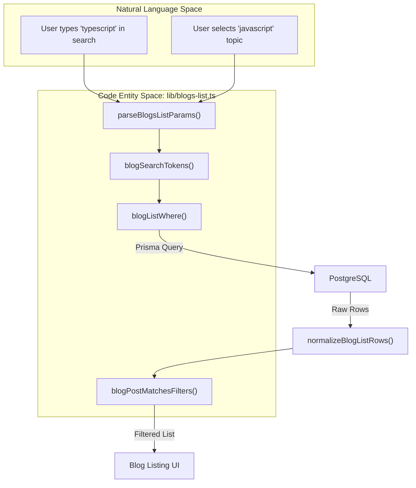
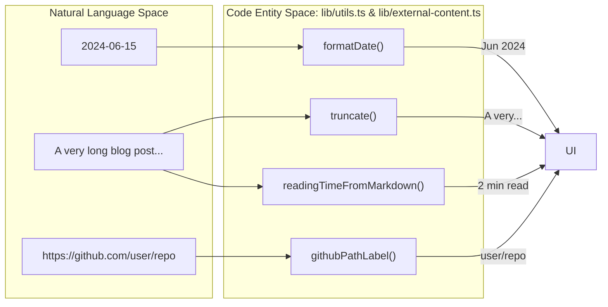

# Unit Tests (Vitest)
Relevant source files

- [tests/setup/vitest-setup.ts](https://github.com/ravichandola/personal-branding/blob/3a440ccd/tests/setup/vitest-setup.ts)
- [tests/unit/app/meta.test.ts](https://github.com/ravichandola/personal-branding/blob/3a440ccd/tests/unit/app/meta.test.ts)
- [tests/unit/components/marketing.test.tsx](https://github.com/ravichandola/personal-branding/blob/3a440ccd/tests/unit/components/marketing.test.tsx)
- [tests/unit/features/site-sections.test.tsx](https://github.com/ravichandola/personal-branding/blob/3a440ccd/tests/unit/features/site-sections.test.tsx)
- [tests/unit/lib/blogs.test.ts](https://github.com/ravichandola/personal-branding/blob/3a440ccd/tests/unit/lib/blogs.test.ts)
- [tests/unit/lib/platform.test.ts](https://github.com/ravichandola/personal-branding/blob/3a440ccd/tests/unit/lib/platform.test.ts)
- [tests/unit/lib/presentation.test.ts](https://github.com/ravichandola/personal-branding/blob/3a440ccd/tests/unit/lib/presentation.test.ts)
- [vitest.config.ts](https://github.com/ravichandola/personal-branding/blob/3a440ccd/vitest.config.ts)

The personal-branding platform utilizes Vitest as its primary unit testing framework. It is configured to provide a fast, isolated environment for verifying business logic, component rendering, and metadata generation. The suite focuses on ensuring that utility functions, data transformations, and UI components behave correctly across various edge cases.

## Configuration and Environment

The Vitest configuration is tailored for a Next.js environment, utilizing `jsdom` to simulate a browser for component testing and supporting TypeScript path aliases for clean imports.

### vitest.config.ts

The configuration file defines the test environment and reporting strategy:

- Environment: Uses `jsdom` to support DOM-related testing via `@testing-library/react`[vitest.config.ts#11](https://github.com/ravichandola/personal-branding/blob/3a440ccd/vitest.config.ts#L11-L11)
- Path Aliases: Resolves the `@/` alias to the `./src` directory, mirroring the `tsconfig.json` setup [vitest.config.ts#27-29](https://github.com/ravichandola/personal-branding/blob/3a440ccd/vitest.config.ts#L27-L29)
- CI Integration: When running in GitHub Actions (`process.env.CI`), it enables the `github-actions` reporter and generates a JUnit XML report for automated test tracking [vitest.config.ts#18-24](https://github.com/ravichandola/personal-branding/blob/3a440ccd/vitest.config.ts#L18-L24)
- Mocking: Automatically restores and clears mocks between tests to ensure test isolation [vitest.config.ts#16-17](https://github.com/ravichandola/personal-branding/blob/3a440ccd/vitest.config.ts#L16-L17)

### Global Setup

The file `tests/setup/vitest-setup.ts` imports `@testing-library/jest-dom/vitest`, which extends Vitest's `expect` with custom matchers like `.toBeInTheDocument()` and `.toHaveTextContent()`[tests/setup/vitest-setup.ts#1](https://github.com/ravichandola/personal-branding/blob/3a440ccd/tests/setup/vitest-setup.ts#L1-L1)

Sources:[vitest.config.ts#1-31](https://github.com/ravichandola/personal-branding/blob/3a440ccd/vitest.config.ts#L1-L31)[tests/setup/vitest-setup.ts#1-2](https://github.com/ravichandola/personal-branding/blob/3a440ccd/tests/setup/vitest-setup.ts#L1-L2)

---

## Test Suite Architecture

The unit tests are organized into several domain-specific suites located in `tests/unit/`.

### Meta and SEO Suite

`meta.test.ts` verifies the generation of search engine discovery files.

- Sitemap: Ensures `freshSitemap` (from `@/app/sitemap`) lists core routes like `/about` and `/contact` with absolute URLs [tests/unit/app/meta.test.ts#7-21](https://github.com/ravichandola/personal-branding/blob/3a440ccd/tests/unit/app/meta.test.ts#L7-L21)
- Robots.txt: Validates that `robots()` allows general crawling while explicitly disallowing `/admin` paths [tests/unit/app/meta.test.ts#25-33](https://github.com/ravichandola/personal-branding/blob/3a440ccd/tests/unit/app/meta.test.ts#L25-L33)

### Marketing and UI Suite

`marketing.test.tsx` and `site-sections.test.tsx` cover the presentation layer.

- JsonLd Component: Confirms that structured data is correctly serialized into a `<script type="application/ld+json">` tag [tests/unit/components/marketing.test.tsx#9-20](https://github.com/ravichandola/personal-branding/blob/3a440ccd/tests/unit/components/marketing.test.tsx#L9-L20)
- ExperienceTimeline: Tests the rendering of career history, including empty states and the "Current" label for roles without an `endDate`[tests/unit/features/site-sections.test.tsx#9-41](https://github.com/ravichandola/personal-branding/blob/3a440ccd/tests/unit/features/site-sections.test.tsx#L9-L41)

### Blog Logic Suite

`blogs.test.ts` handles the complex filtering and tokenization logic used in the blog listing page.

- Tokenization: `blogSearchTokens` and `blogInstantSearchTokens` are tested for minimum character limits and splitting behavior [tests/unit/lib/blogs.test.ts#45-60](https://github.com/ravichandola/personal-branding/blob/3a440ccd/tests/unit/lib/blogs.test.ts#L45-L60)
- Filtering: `blogPostMatchesFilters` verifies that the "AND" logic for search tokens works correctly across titles and excerpts [tests/unit/lib/blogs.test.ts#82-113](https://github.com/ravichandola/personal-branding/blob/3a440ccd/tests/unit/lib/blogs.test.ts#L82-L113)

Sources:[tests/unit/app/meta.test.ts#5-41](https://github.com/ravichandola/personal-branding/blob/3a440ccd/tests/unit/app/meta.test.ts#L5-L41)[tests/unit/components/marketing.test.tsx#7-39](https://github.com/ravichandola/personal-branding/blob/3a440ccd/tests/unit/components/marketing.test.tsx#L7-L39)[tests/unit/features/site-sections.test.tsx#7-55](https://github.com/ravichandola/personal-branding/blob/3a440ccd/tests/unit/features/site-sections.test.tsx#L7-L55)[tests/unit/lib/blogs.test.ts#14-162](https://github.com/ravichandola/personal-branding/blob/3a440ccd/tests/unit/lib/blogs.test.ts#L14-L162)

---

## Data Flow: Blog Search and Normalization

The following diagram illustrates how the `blogs.test.ts` suite validates the transformation of raw search parameters and database rows into a filtered UI state.

### Blog List Logic Flow

Sources:[tests/unit/lib/blogs.test.ts#15-161](https://github.com/ravichandola/personal-branding/blob/3a440ccd/tests/unit/lib/blogs.test.ts#L15-L161)[src/lib/blogs-list.ts](https://github.com/ravichandola/personal-branding/blob/3a440ccd/src/lib/blogs-list.ts)

---

## Platform and Utility Suites

### Admin Platform Integrations

`platform.test.ts` focuses on security and infrastructure helpers:

- Admin Path Guard: `isProtectedAdminRoute` is tested to ensure `/admin/login` remains public while nested paths like `/admin/experience` are protected [tests/unit/lib/platform.test.ts#54-68](https://github.com/ravichandola/personal-branding/blob/3a440ccd/tests/unit/lib/platform.test.ts#L54-L68)
- Error Handling: `prismaAdminErrorDetail` ensures that sensitive database error messages are hidden in production but visible (and truncated) in development [tests/unit/lib/platform.test.ts#12-38](https://github.com/ravichandola/personal-branding/blob/3a440ccd/tests/unit/lib/platform.test.ts#L12-L38)
- Cloudinary: `isCloudinaryConfigured` checks for the presence of all three required environment variables [tests/unit/lib/platform.test.ts#70-104](https://github.com/ravichandola/personal-branding/blob/3a440ccd/tests/unit/lib/platform.test.ts#L70-L104)

### Presentation and External Content

`presentation.test.ts` covers formatting and external API parsing:

- Markdown Reading Time: `readingTimeFromMarkdown` scales based on word count, defaulting to 1 minute [tests/unit/lib/presentation.test.ts#34-44](https://github.com/ravichandola/personal-branding/blob/3a440ccd/tests/unit/lib/presentation.test.ts#L34-L44)
- Medium Integration: `mediumMdxBodyWithoutDuplicateExcerpt` validates the stripping of duplicate content during the Medium import process [tests/unit/lib/presentation.test.ts#72-86](https://github.com/ravichandola/personal-branding/blob/3a440ccd/tests/unit/lib/presentation.test.ts#L72-L86)

### Presentation Utility Mapping

Sources:[tests/unit/lib/platform.test.ts#10-105](https://github.com/ravichandola/personal-branding/blob/3a440ccd/tests/unit/lib/platform.test.ts#L10-L105)[tests/unit/lib/presentation.test.ts#17-138](https://github.com/ravichandola/personal-branding/blob/3a440ccd/tests/unit/lib/presentation.test.ts#L17-L138)

## Test Suite Summary

| Suite | File | Key Functions Tested |
| --- | --- | --- |
| App Meta | `meta.test.ts` | `robots()`, `sitemap()` |
| Marketing | `marketing.test.tsx` | `JsonLd`, `PageIntro` |
| Features | `site-sections.test.tsx` | `ExperienceTimeline`, `AboutSkillsSection` |
| Blogs | `blogs.test.ts` | `parseBlogsListParams`, `blogPostMatchesFilters` |
| Platform | `platform.test.ts` | `isProtectedAdminRoute`, `prismaAdminErrorDetail` |
| Presentation | `presentation.test.ts` | `formatDate`, `createMetadata`, `githubPathLabel` |

Sources:[tests/unit/app/meta.test.ts#1-41](https://github.com/ravichandola/personal-branding/blob/3a440ccd/tests/unit/app/meta.test.ts#L1-L41)[tests/unit/components/marketing.test.tsx#1-39](https://github.com/ravichandola/personal-branding/blob/3a440ccd/tests/unit/components/marketing.test.tsx#L1-L39)[tests/unit/features/site-sections.test.tsx#1-55](https://github.com/ravichandola/personal-branding/blob/3a440ccd/tests/unit/features/site-sections.test.tsx#L1-L55)[tests/unit/lib/blogs.test.ts#1-162](https://github.com/ravichandola/personal-branding/blob/3a440ccd/tests/unit/lib/blogs.test.ts#L1-L162)[tests/unit/lib/platform.test.ts#1-105](https://github.com/ravichandola/personal-branding/blob/3a440ccd/tests/unit/lib/platform.test.ts#L1-L105)[tests/unit/lib/presentation.test.ts#1-138](https://github.com/ravichandola/personal-branding/blob/3a440ccd/tests/unit/lib/presentation.test.ts#L1-L138)