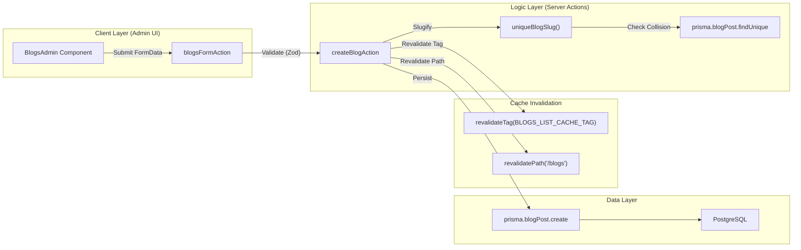
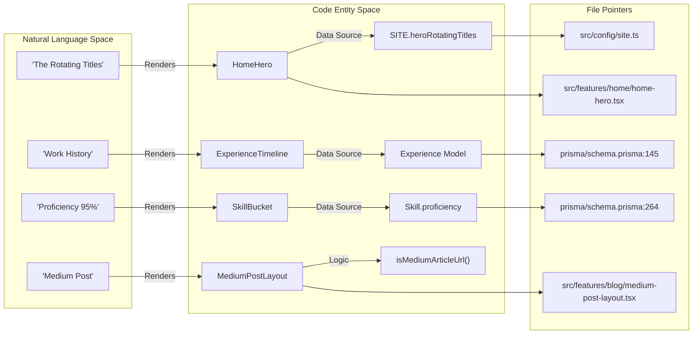

# Glossary
Relevant source files

- [.github/workflows/ci.yml](https://github.com/ravichandola/personal-branding/blob/3a440ccd/.github/workflows/ci.yml)
- [package.json](https://github.com/ravichandola/personal-branding/blob/3a440ccd/package.json)
- [prisma/migrations/20260516120000_testimonial_recommendation_fields/migration.sql](https://github.com/ravichandola/personal-branding/blob/3a440ccd/prisma/migrations/20260516120000_testimonial_recommendation_fields/migration.sql)
- [prisma/schema.prisma](https://github.com/ravichandola/personal-branding/blob/3a440ccd/prisma/schema.prisma)
- [prisma/seed.ts](https://github.com/ravichandola/personal-branding/blob/3a440ccd/prisma/seed.ts)
- [src/app/(site)/blogs/[slug]/page.tsx](https://github.com/ravichandola/personal-branding/blob/3a440ccd/src/app/%28site%29/blogs/%5Bslug%5D/page.tsx)
- [src/app/(site)/blogs/page.tsx](https://github.com/ravichandola/personal-branding/blob/3a440ccd/src/app/%28site%29/blogs/page.tsx)
- [src/config/site.ts](https://github.com/ravichandola/personal-branding/blob/3a440ccd/src/config/site.ts)
- [src/config/structured-data.ts](https://github.com/ravichandola/personal-branding/blob/3a440ccd/src/config/structured-data.ts)
- [src/features/about/recommendations-section.tsx](https://github.com/ravichandola/personal-branding/blob/3a440ccd/src/features/about/recommendations-section.tsx)
- [src/features/admin/actions/blogs.ts](https://github.com/ravichandola/personal-branding/blob/3a440ccd/src/features/admin/actions/blogs.ts)
- [src/features/blog/blogs-page-client.tsx](https://github.com/ravichandola/personal-branding/blob/3a440ccd/src/features/blog/blogs-page-client.tsx)
- [src/features/home/home-hero.tsx](https://github.com/ravichandola/personal-branding/blob/3a440ccd/src/features/home/home-hero.tsx)
- [src/lib/ai/readiness.ts](https://github.com/ravichandola/personal-branding/blob/3a440ccd/src/lib/ai/readiness.ts)
- [src/lib/blogs-list.ts](https://github.com/ravichandola/personal-branding/blob/3a440ccd/src/lib/blogs-list.ts)
- [src/lib/metadata.ts](https://github.com/ravichandola/personal-branding/blob/3a440ccd/src/lib/metadata.ts)
- [src/middleware.ts](https://github.com/ravichandola/personal-branding/blob/3a440ccd/src/middleware.ts)

This glossary provides definitions for codebase-specific terminology, domain concepts, and architectural patterns used within the personal-branding platform.

## Core Domain Terms

| Term | Definition | Relevant Entities/Files |
| --- | --- | --- |
| Sage | An internal autocode-generation layer built on top of Cursor, designed to draft test automation by reasoning about product flows and Jira context. | [prisma/seed.ts#54-58](https://github.com/ravichandola/personal-branding/blob/3a440ccd/prisma/seed.ts#L54-L58) |
| Skill Bucket | A categorical grouping for technical skills (e.g., `AUTOMATION`, `AI_ML`, `FRONTEND`) used for filtering and visual grouping. | [prisma/schema.prisma#19-28](https://github.com/ravichandola/personal-branding/blob/3a440ccd/prisma/schema.prisma#L19-L28)[prisma/seed.ts#133-165](https://github.com/ravichandola/personal-branding/blob/3a440ccd/prisma/seed.ts#L133-L165) |
| Home Spotlight | A curated, high-impact project or narrative pinned to the landing page to showcase specific expertise. | [prisma/schema.prisma#118-131](https://github.com/ravichandola/personal-branding/blob/3a440ccd/prisma/schema.prisma#L118-L131) |
| Medium Sync | The process of importing external articles from Medium.com into the local database via RSS or ZIP exports. | [package.json#21-22](https://github.com/ravichandola/personal-branding/blob/3a440ccd/package.json#L21-L22)[src/features/blog/medium-post-layout.tsx#1-10](https://github.com/ravichandola/personal-branding/blob/3a440ccd/src/features/blog/medium-post-layout.tsx#L1-L10) |
| Deterministic QA | A testing philosophy emphasizing stable, repeatable automation fleets over "flaky" or non-deterministic scripts. | [src/features/home/home-hero.tsx#128-131](https://github.com/ravichandola/personal-branding/blob/3a440ccd/src/features/home/home-hero.tsx#L128-L131) |

## Technical Concepts

### 1. Blog Search Tokenization

The system implements a multi-token search strategy for the blog catalog. Input strings are normalized, trimmed, and split into "tokens" (words) that must all match (AND logic) within the title or excerpt of a post.

- Min Characters: 2 characters required per token to trigger search [src/lib/blogs-list.ts#18](https://github.com/ravichandola/personal-branding/blob/3a440ccd/src/lib/blogs-list.ts#L18-L18)
- Max Tokens: Limited to 6 tokens per query to maintain performance [src/lib/blogs-list.ts#20](https://github.com/ravichandola/personal-branding/blob/3a440ccd/src/lib/blogs-list.ts#L20-L20)
- Implementation: Uses case-insensitive substring matching via Prisma `contains`[src/lib/blogs-list.ts#87-90](https://github.com/ravichandola/personal-branding/blob/3a440ccd/src/lib/blogs-list.ts#L87-L90)

### 2. Authentication & Authorization

The platform uses NextAuth.js (Auth.js) with a dual-provider strategy.

- Role-Based Access Control (RBAC): Users are assigned a `UserRole` (e.g., `ADMIN`), which is embedded in the JWT [prisma/schema.prisma#14-17](https://github.com/ravichandola/personal-branding/blob/3a440ccd/prisma/schema.prisma#L14-L17)
- Route Guarding: Middleware intercepts requests to `/admin/:path*` and verifies the presence of a valid session token [src/middleware.ts#7-33](https://github.com/ravichandola/personal-branding/blob/3a440ccd/src/middleware.ts#L7-L33)

### 3. AI Readiness & RAG

The "AI Readiness" system tracks the configuration state for Retrieval-Augmented Generation (RAG) features.

- AiExtension: A singleton database model storing API keys, model preferences, and vector provider settings [prisma/schema.prisma#315-328](https://github.com/ravichandola/personal-branding/blob/3a440ccd/prisma/schema.prisma#L315-L328)
- RAG Toggle: A runtime boolean (`ragEnabled`) that gates AI-specific UI components and logic [prisma/seed.ts#27](https://github.com/ravichandola/personal-branding/blob/3a440ccd/prisma/seed.ts#L27-L27)

## System Architecture Diagrams

### Data Flow: Content Mutation (Server Actions)

This diagram illustrates how a user interaction in the Admin UI propagates through Server Actions to the PostgreSQL database via the Prisma Client.

Sources:[src/features/admin/actions/blogs.ts#59-118](https://github.com/ravichandola/personal-branding/blob/3a440ccd/src/features/admin/actions/blogs.ts#L59-L118)[src/lib/blogs-list-data.ts#8](https://github.com/ravichandola/personal-branding/blob/3a440ccd/src/lib/blogs-list-data.ts#L8-L8)

### Entity Mapping: Public Site to Code Entities

This diagram bridges natural language concepts on the public site to their corresponding code entities and file locations.

Sources:[src/features/home/home-hero.tsx#45-71](https://github.com/ravichandola/personal-branding/blob/3a440ccd/src/features/home/home-hero.tsx#L45-L71)[src/config/site.ts#1-20](https://github.com/ravichandola/personal-branding/blob/3a440ccd/src/config/site.ts#L1-L20)[prisma/schema.prisma#145-160](https://github.com/ravichandola/personal-branding/blob/3a440ccd/prisma/schema.prisma#L145-L160)[src/lib/external-content.ts#5](https://github.com/ravichandola/personal-branding/blob/3a440ccd/src/lib/external-content.ts#L5-L5)

## Database Enumerations

The following enums are defined in `prisma/schema.prisma` and used throughout the codebase for type safety and logic branching.

| Enum | Values | Usage |
| --- | --- | --- |
| `UserRole` | `ADMIN`, `EDITOR` | Used in `User.role` for NextAuth permission checks. |
| `SkillBucket` | `FRONTEND`, `BACKEND`, `AI_ML`, `AUTOMATION`, `DEVOPS`, `CLOUD`, `DATABASES`, `ARCHITECTURE` | Used in `Skill.category` for filtering on the `/skills` page. |
| `ProjectCategoryCode` | `AI`, `AUTOMATION`, `REACT`, `BACKEND`, `PERFORMANCE`, `OCR`, `LANGGRAPH` | Used in `ProjectOnCategory` for grouping projects in the portfolio. |

Sources:[prisma/schema.prisma#14-38](https://github.com/ravichandola/personal-branding/blob/3a440ccd/prisma/schema.prisma#L14-L38)